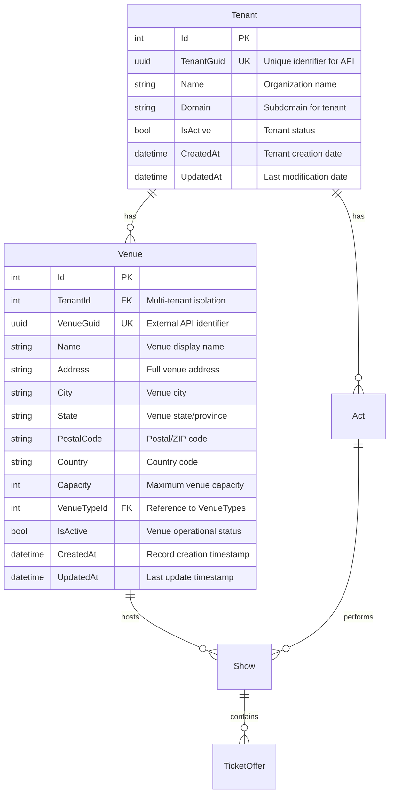
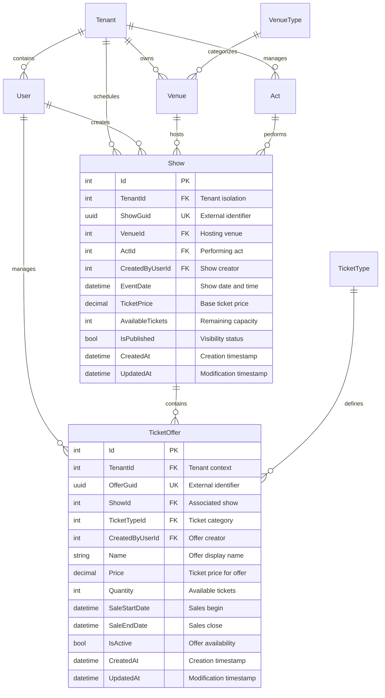
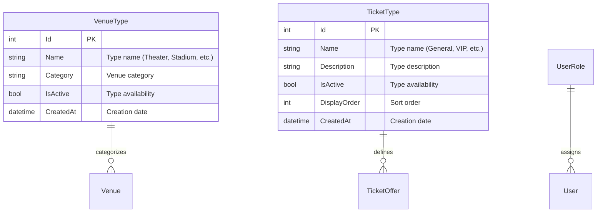

# Database Schema Specification Patterns

Comprehensive patterns for specifying database schemas with Mermaid ER diagrams, table structures, constraints, and indexing strategies for multi-tenant applications.

## Schema Specification Approach

**IMPORTANT**: This specification defines WHAT needs to be built, not HOW to build it.
- Focus on data structure and relationships
- Specify constraints and business rules
- Do NOT include Entity Framework entity classes or fluent configuration code
- Do NOT include implementation details

## Mermaid ER Diagram Patterns

### Basic Entity Relationships


### Complex Multi-Tenant Relationships


### Reference Data Relationships


## Table Structure Specifications

### Multi-Tenant Entity Pattern
```sql
-- Standard multi-tenant entity structure
CREATE TABLE Venues (
    Id INT IDENTITY(1,1) PRIMARY KEY,
    TenantId INT NOT NULL,
    VenueGuid UNIQUEIDENTIFIER NOT NULL DEFAULT NEWID(),
    Name NVARCHAR(200) NOT NULL,
    Address NVARCHAR(500) NOT NULL,
    City NVARCHAR(100) NOT NULL,
    State NVARCHAR(100) NOT NULL,
    PostalCode NVARCHAR(20) NOT NULL,
    Country NVARCHAR(2) NOT NULL DEFAULT 'US',
    Capacity INT NOT NULL CHECK (Capacity > 0 AND Capacity <= 100000),
    VenueTypeId INT NOT NULL,
    IsActive BIT NOT NULL DEFAULT 1,
    CreatedAt DATETIME2 NOT NULL DEFAULT GETUTCDATE(),
    UpdatedAt DATETIME2 NOT NULL DEFAULT GETUTCDATE(),
    
    CONSTRAINT FK_Venues_TenantId FOREIGN KEY (TenantId) REFERENCES Tenants(Id),
    CONSTRAINT FK_Venues_VenueTypeId FOREIGN KEY (VenueTypeId) REFERENCES VenueTypes(Id),
    CONSTRAINT UQ_Venues_TenantGuid UNIQUE (TenantId, VenueGuid),
    CONSTRAINT UQ_Venues_TenantName UNIQUE (TenantId, Name)
);
```

### Child Entity with Navigation Filtering
```sql
-- Child entity that inherits tenant context
CREATE TABLE Shows (
    Id INT IDENTITY(1,1) PRIMARY KEY,
    TenantId INT NOT NULL,
    ShowGuid UNIQUEIDENTIFIER NOT NULL DEFAULT NEWID(),
    VenueId INT NOT NULL,
    ActId INT NOT NULL,
    CreatedByUserId INT NOT NULL,
    EventDate DATETIME2 NOT NULL,
    TicketPrice DECIMAL(10,2) NOT NULL CHECK (TicketPrice >= 0),
    AvailableTickets INT NOT NULL CHECK (AvailableTickets >= 0),
    IsPublished BIT NOT NULL DEFAULT 0,
    CreatedAt DATETIME2 NOT NULL DEFAULT GETUTCDATE(),
    UpdatedAt DATETIME2 NOT NULL DEFAULT GETUTCDATE(),
    
    CONSTRAINT FK_Shows_TenantId FOREIGN KEY (TenantId) REFERENCES Tenants(Id),
    CONSTRAINT FK_Shows_VenueId FOREIGN KEY (VenueId) REFERENCES Venues(Id),
    CONSTRAINT FK_Shows_ActId FOREIGN KEY (ActId) REFERENCES Acts(Id),
    CONSTRAINT FK_Shows_CreatedByUserId FOREIGN KEY (CreatedByUserId) REFERENCES Users(Id),
    CONSTRAINT UQ_Shows_TenantGuid UNIQUE (TenantId, ShowGuid),
    CONSTRAINT CHK_Shows_EventDateFuture CHECK (EventDate > GETUTCDATE())
);
```

## Constraint Specifications

### Data Validation Constraints
```sql
-- Business rule constraints
CONSTRAINT CHK_Venue_Capacity CHECK (Capacity BETWEEN 1 AND 100000)
CONSTRAINT CHK_Venue_Name CHECK (LEN(RTRIM(Name)) >= 3)
CONSTRAINT CHK_Venue_PostalCode CHECK (PostalCode NOT LIKE '%[^0-9A-Z -]%')

-- Date validation constraints
CONSTRAINT CHK_Show_EventDate CHECK (EventDate > GETUTCDATE())
CONSTRAINT CHK_TicketOffer_SaleDates CHECK (SaleEndDate > SaleStartDate)
CONSTRAINT CHK_TicketOffer_SaleStartFuture CHECK (SaleStartDate >= CAST(GETUTCDATE() AS DATE))

-- Price validation constraints
CONSTRAINT CHK_TicketOffer_Price CHECK (Price >= 0 AND Price <= 9999.99)
CONSTRAINT CHK_TicketOffer_Quantity CHECK (Quantity >= 0)
```

### Multi-Tenant Uniqueness Constraints
```sql
-- Composite unique constraints for multi-tenancy
CONSTRAINT UQ_Venues_TenantGuid UNIQUE (TenantId, VenueGuid)
CONSTRAINT UQ_Venues_TenantName UNIQUE (TenantId, Name)
CONSTRAINT UQ_Acts_TenantGuid UNIQUE (TenantId, ActGuid)
CONSTRAINT UQ_Acts_TenantName UNIQUE (TenantId, Name)
CONSTRAINT UQ_Shows_TenantGuid UNIQUE (TenantId, ShowGuid)

-- Global uniqueness where required
CONSTRAINT UQ_Tenants_Domain UNIQUE (Domain)
CONSTRAINT UQ_Users_Email UNIQUE (Email)
```

### Referential Integrity Constraints
```sql
-- Foreign key constraints with cascade rules
CONSTRAINT FK_Shows_VenueId 
    FOREIGN KEY (VenueId) REFERENCES Venues(Id)
    ON DELETE RESTRICT  -- Prevent venue deletion with shows

CONSTRAINT FK_TicketOffers_ShowId 
    FOREIGN KEY (ShowId) REFERENCES Shows(Id)
    ON DELETE CASCADE  -- Remove offers when show deleted

CONSTRAINT FK_Venues_VenueTypeId 
    FOREIGN KEY (VenueTypeId) REFERENCES VenueTypes(Id)
    ON DELETE RESTRICT  -- Protect reference data
```

## Index Specifications

### Performance Indexes
```sql
-- Multi-tenant query optimization
CREATE INDEX IX_Venues_TenantId_IsActive 
    ON Venues (TenantId, IsActive) 
    INCLUDE (Name, City, Capacity);

CREATE INDEX IX_Shows_TenantId_EventDate 
    ON Shows (TenantId, EventDate DESC) 
    INCLUDE (VenueId, ActId, TicketPrice, IsPublished);

-- Search optimization
CREATE INDEX IX_Venues_TenantId_Name 
    ON Venues (TenantId) 
    INCLUDE (Name, City)
    WHERE IsActive = 1;

-- Foreign key optimization
CREATE INDEX IX_Shows_VenueId ON Shows (VenueId);
CREATE INDEX IX_Shows_ActId ON Shows (ActId);
CREATE INDEX IX_TicketOffers_ShowId ON TicketOffers (ShowId);
```

### Unique Constraint Indexes
```sql
-- Support unique constraints
CREATE UNIQUE INDEX UQ_Venues_TenantGuid 
    ON Venues (TenantId, VenueGuid);

CREATE UNIQUE INDEX UQ_Venues_TenantName 
    ON Venues (TenantId, Name)
    WHERE IsActive = 1;  -- Allow reuse of names for inactive venues
```

### Query-Specific Indexes
```sql
-- Dashboard queries
CREATE INDEX IX_Shows_TenantId_IsPublished_EventDate 
    ON Shows (TenantId, IsPublished, EventDate DESC)
    INCLUDE (VenueId, ActId, AvailableTickets);

-- Reporting queries
CREATE INDEX IX_TicketOffers_TenantId_CreatedAt 
    ON TicketOffers (TenantId, CreatedAt DESC)
    INCLUDE (ShowId, Price, Quantity, IsActive);
```

## Database Design Principles

### Multi-Tenancy Requirements
```markdown
**Tenant Isolation:**
- All domain entities must include TenantId foreign key
- Child entities inherit tenant context from parent relationships
- Unique constraints scoped within tenant boundaries
- Indexes optimized for tenant-filtered queries

**Data Integrity:**
- Composite unique keys: (TenantId, BusinessKey)
- Audit timestamps: CreatedAt, UpdatedAt (UTC)
- Soft delete patterns where business requires history
- Cascade delete rules that respect business relationships
```

### Performance Considerations
```markdown
**Query Optimization:**
- Indexes include TenantId as first column
- Include columns for common SELECT projections
- Filtered indexes for active records only
- Covering indexes for frequent query patterns

**Scalability Patterns:**
- Integer primary keys for performance
- GUID alternate keys for external APIs
- Partitioning strategy for large tables
- Archive strategy for historical data
```

### Data Quality Standards
```markdown
**Validation Rules:**
- Check constraints for business rules
- NOT NULL for required business data
- Default values for system fields
- Appropriate data types and lengths

**Audit Requirements:**
- Creation and modification timestamps
- User tracking for data changes
- Soft delete with deletion timestamps
- Change log tables for critical entities
```

## Schema Migration Patterns

### Additive Changes
```sql
-- Adding new optional column
ALTER TABLE Venues 
ADD Description NVARCHAR(1000) NULL;

-- Adding new table with foreign keys
CREATE TABLE VenueAmenities (
    Id INT IDENTITY(1,1) PRIMARY KEY,
    VenueId INT NOT NULL,
    AmenityType NVARCHAR(100) NOT NULL,
    Description NVARCHAR(500) NULL,
    IsAvailable BIT NOT NULL DEFAULT 1,
    
    CONSTRAINT FK_VenueAmenities_VenueId 
        FOREIGN KEY (VenueId) REFERENCES Venues(Id)
);
```

### Breaking Changes
```sql
-- Renaming column (requires data migration)
-- Step 1: Add new column
ALTER TABLE Venues ADD NewColumnName NVARCHAR(200) NULL;

-- Step 2: Migrate data
UPDATE Venues SET NewColumnName = OldColumnName;

-- Step 3: Update application code

-- Step 4: Make new column NOT NULL
ALTER TABLE Venues ALTER COLUMN NewColumnName NVARCHAR(200) NOT NULL;

-- Step 5: Drop old column
ALTER TABLE Venues DROP COLUMN OldColumnName;
```

These database specification patterns ensure robust, performant, and maintainable data structures that support multi-tenant applications with proper isolation, integrity, and scalability characteristics.