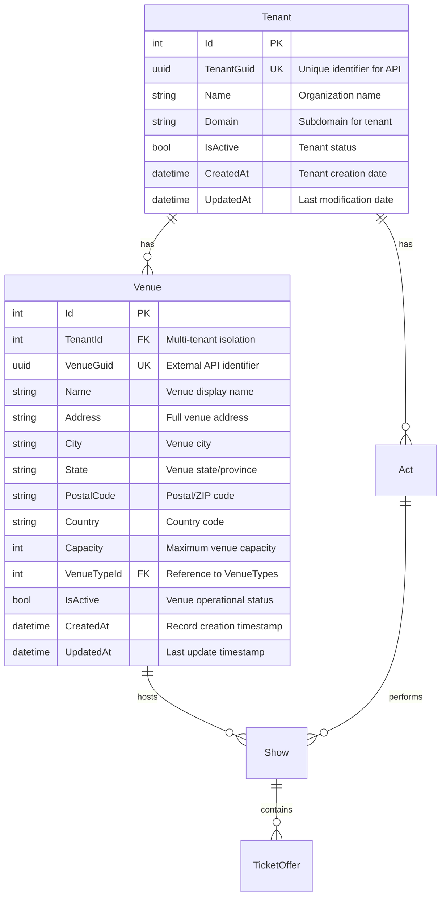
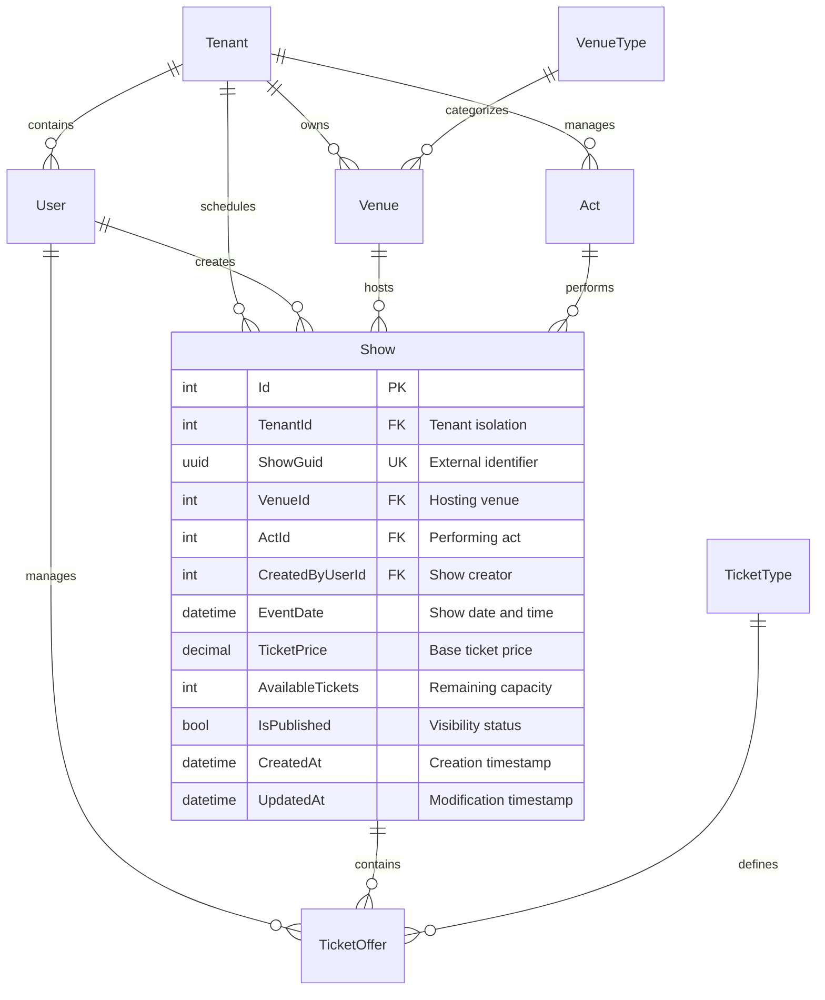

# Mermaid ER Diagrams

Use Mermaid syntax to visualize entities, relationships, and attributes.

## Basic Entity Relationships

## Complex Multi-Tenant Relationships

Include field types (PK, FK, UK), data types, and descriptions for clarity.
