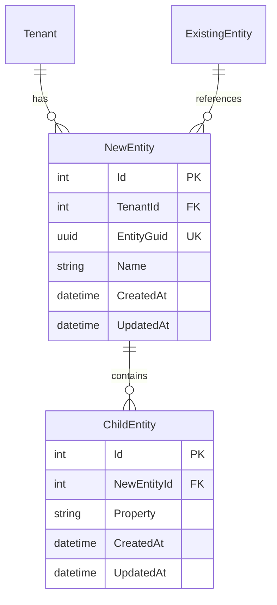

# Database Schema

**IMPORTANT**: This section specifies the database schema design only. Do NOT include Entity Framework entity classes or fluent configuration code. The specification should describe WHAT needs to be built, not HOW to build it.

Provide Entity-Relationship diagram using Mermaid:

List indexes for new or modified tables.

## Database Design Principles

- All domain entities must be directly or indirectly related to Tenant for multi-tenancy
- Define ALL properties with data types, constraints, and nullability
- Use composite alternate keys for multi-tenant entities
- Specify relationships and foreign keys
- Add indexes for frequently queried columns
- Use meaningful table names (plural, PascalCase)
- Show modifications to existing entities if needed

