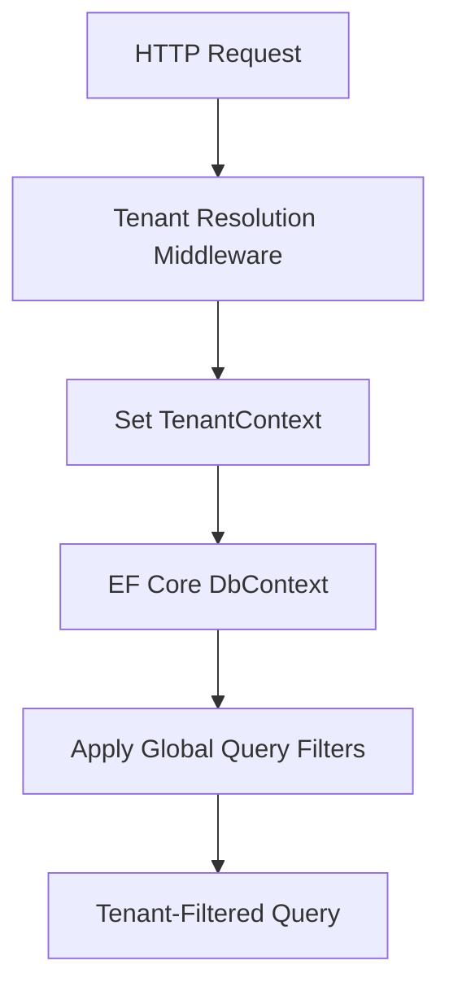
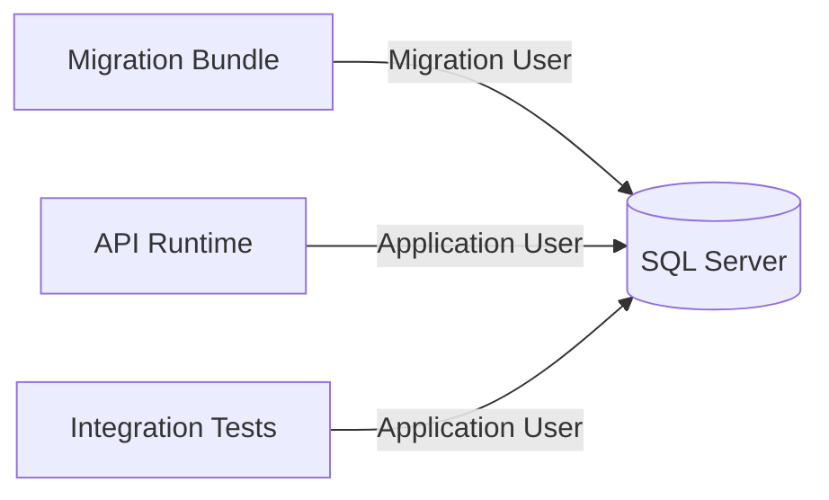
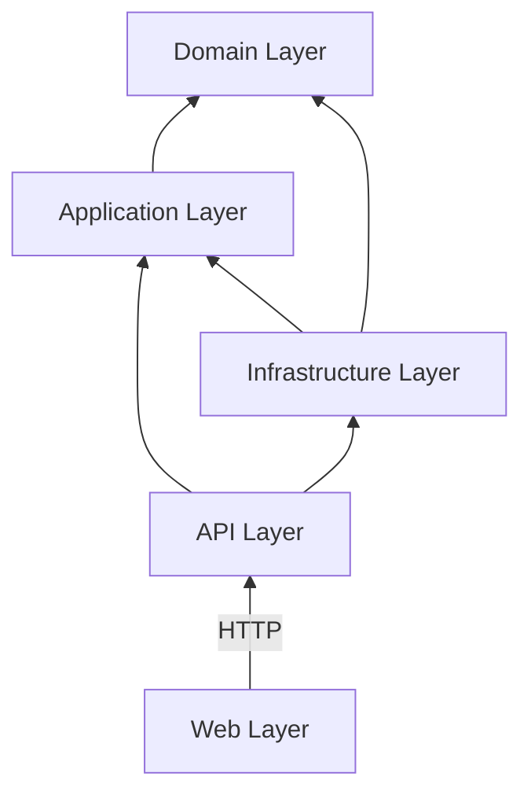
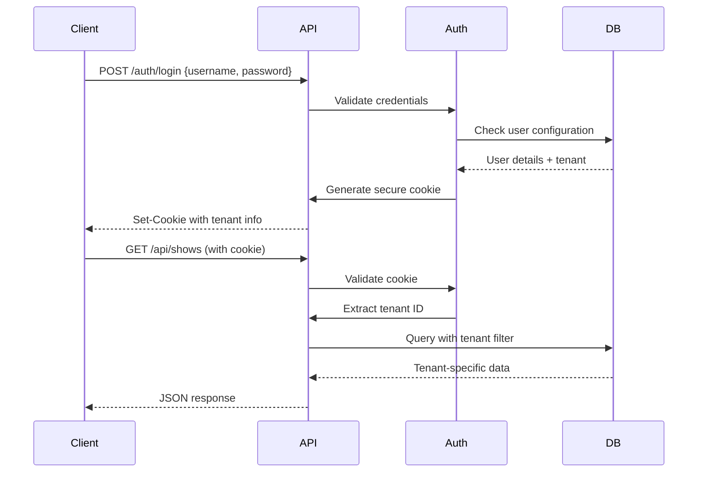
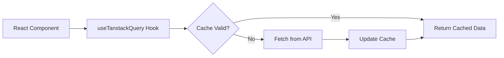
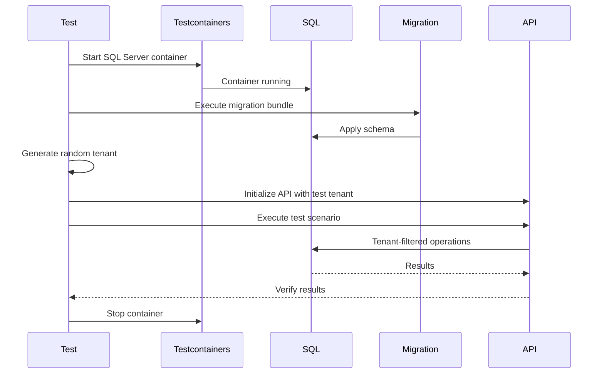
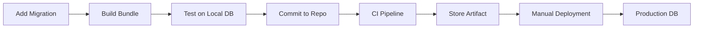
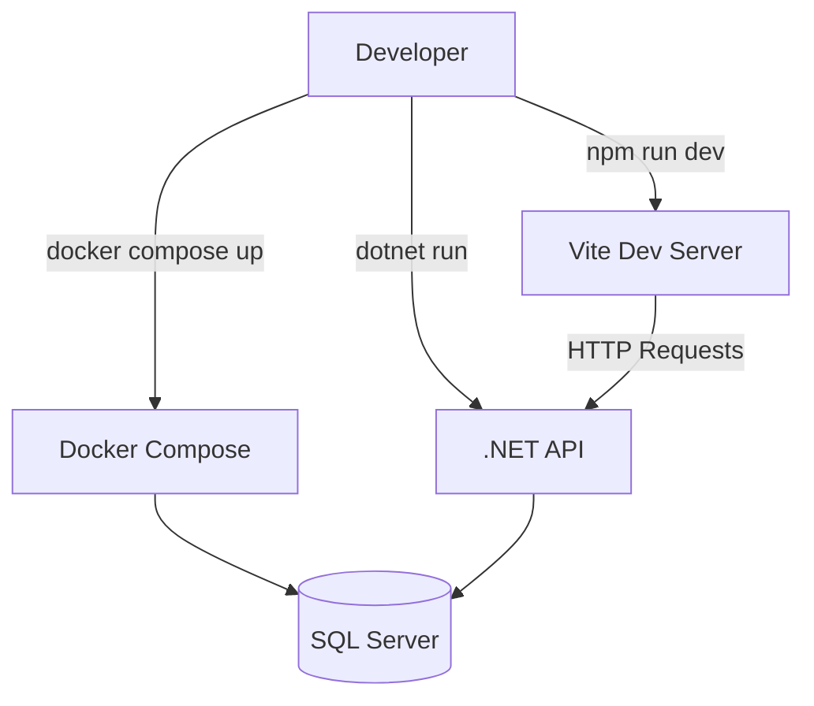
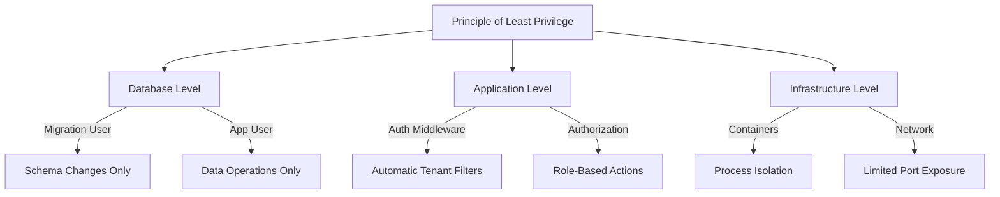

# GloboTicket System Architecture

## 1. Overview

GloboTicket is a multi-tenant event ticketing system built with a modern technology stack emphasizing security, testability, and environment isolation. The architecture follows clean architecture principles with clear separation between domain logic, infrastructure, and presentation layers.

### Design Principles

- **Multi-tenancy by design**: Complete data isolation per tenant using database-level segregation
- **Security first**: Least privilege principle with separate database users for migrations and runtime operations
- **Test isolation**: Random tenant assignment in integration tests ensures true isolation
- **Modern stack**: Leveraging .NET 10, React 19.2, and container-based infrastructure

## 2. Technology Stack

### Backend
- **.NET 10**: Latest framework with performance optimizations
- **ASP.NET Minimal APIs**: Lightweight, focused endpoints without controller overhead
- **Entity Framework Core 10**: ORM with spatial data support via NetTopologySuite
- **EF Migration Bundles**: Self-contained executables for database migrations
- **Microsoft SQL Server**: Primary data store with spatial capabilities

### Frontend
- **React 19.2**: Latest React with concurrent features
- **Tanstack Query 5**: Server state management and caching
- **Vite**: Fast development server and build tool
- **TypeScript**: Type-safe client development

### Infrastructure
- **Docker Compose**: Local development orchestration
- **Testcontainers**: Ephemeral containers for integration testing
- **SQL Server 2022**: Container-based database

## 3. Multi-Tenant Architecture

### Tenant Isolation Strategy

**Row-Level Isolation**: Each record includes a `TenantId` discriminator column that filters all queries and commands.

**Key Characteristics**:
- Single database with logical separation
- `TenantId` column on all domain tables
- Global query filter in EF Core ensures automatic tenant filtering
- No cross-tenant data access possible
- Efficient resource utilization while maintaining strong isolation

**Benefits**:
- Easy backup and restore operations
- Simplified infrastructure management
- Cost-effective scaling
- Perfect for test environment isolation
- Supports unlimited tenants without infrastructure changes

### Implementation Approach



**Tenant Resolution**:
- Cookie-based authentication contains tenant identifier
- Middleware extracts and validates tenant from authenticated user
- Scoped service provides current tenant ID to DbContext
- EF Core global query filters automatically applied

## 4. Database Security Model

### Two-User Architecture

**Migration User** (Privileged):
- **Purpose**: Schema management and structural changes
- **Permissions**: DDL operations (CREATE, ALTER, DROP)
- **Permissions**: Full DML on migration history table
- **Usage**: Migration bundle execution only
- **Credential Storage**: Environment variables, never in code

**Application User** (Restricted):
- **Purpose**: Runtime data operations
- **Permissions**: SELECT, INSERT, UPDATE, DELETE on data tables only
- **Permissions**: No schema modification rights
- **Permissions**: No access to system tables
- **Usage**: API runtime operations

### Security Benefits

- **Defense in Depth**: Compromised application cannot modify schema
- **Audit Trail**: Clear separation of migration vs. operational changes
- **Compliance**: Meets SOC2 and similar security requirements
- **Principle of Least Privilege**: Application has only necessary permissions

### Connection String Management



## 5. Project Structure

### Solution Organization

```
GloboTicket/
├── src/
│   ├── GloboTicket.Domain/          # Core business entities and interfaces
│   ├── GloboTicket.Application/     # Use cases and application services
│   ├── GloboTicket.Infrastructure/  # EF Core, repositories, external services
│   ├── GloboTicket.API/            # Minimal API endpoints and middleware
│   └── GloboTicket.Web/            # React frontend (Vite)
├── tests/
│   ├── GloboTicket.UnitTests/      # Fast, isolated unit tests
│   └── GloboTicket.IntegrationTests/ # Database integration tests
├── database/
│   └── migrations/                  # EF Core migration files
├── docker/
│   ├── docker-compose.yml          # Development infrastructure
│   └── Dockerfile.api              # API container definition
└── docs/
    ├── prd.md                      # Product requirements
    └── architecture.md             # This document
```

### Dependency Flow



**Layer Responsibilities**:
- **Domain**: Entities, value objects, domain services, interfaces
- **Application**: Use cases, DTOs, service interfaces
- **Infrastructure**: EF Core context, repositories, external API clients
- **API**: HTTP endpoints, middleware, authentication
- **Web**: React components, API client, UI state management

## 6. API Architecture

### Minimal API Design

**Endpoint Organization**:
- Feature-based grouping using route groups
- One file per feature area
- Dependency injection for services
- Consistent response patterns

**Key Features**:
- Cookie-based authentication with secure, HTTP-only cookies
- CORS configuration for Vite development server
- Tenant resolution middleware
- Global exception handling
- Request/response validation
- Structured logging with tenant context

### Authentication Flow



### Endpoint Categories

**Public Endpoints**:
- Authentication (login/logout)
- Health checks

**Authenticated Endpoints** (all require valid tenant):
- Show management (CRUD operations)
- Venue management
- Act management
- Ticket sales
- Location-based search

## 7. Frontend Architecture

### React Application Structure

```
GloboTicket.Web/
├── src/
│   ├── components/       # Reusable UI components
│   ├── features/        # Feature-specific components
│   │   ├── shows/
│   │   ├── venues/
│   │   ├── acts/
│   │   └── tickets/
│   ├── hooks/           # Custom React hooks
│   ├── api/             # API client and types
│   ├── stores/          # Client state management
│   └── utils/           # Helper functions
└── vite.config.ts       # Vite configuration
```

### State Management Strategy

**Server State** (Tanstack Query):
- Shows, venues, acts, tickets
- Automatic caching and invalidation
- Optimistic updates
- Background refetching

**Client State** (React Context/Zustand):
- Authentication status
- UI preferences
- Form state
- Navigation state

### Data Fetching Pattern



## 8. Testing Strategy

### Unit Tests

**Scope**: Business logic in isolation
**Technology**: xUnit, FluentAssertions, NSubstitute
**Coverage**: Domain entities, application services, validation logic

**Characteristics**:
- Fast execution (milliseconds)
- No database dependencies
- Mock external dependencies
- Test behavior, not implementation

**Test Organization**:
- Mirror source project structure
- One test class per production class
- Descriptive test method names (Given_When_Then)

### Integration Tests

**Scope**: Full stack including database
**Technology**: xUnit, Testcontainers, FluentAssertions

**Characteristics**:
- Real SQL Server in container
- Automatic migration execution before tests
- Random tenant per test class
- Parallel test execution safe

**Test Lifecycle**:



**Tenant Isolation**:
- Each test class uses unique random tenant ID
- No test data pollution between test runs
- Validates multi-tenant filtering logic
- Simulates production isolation

## 9. Database Migration Strategy

### Migration Bundles

**What are Migration Bundles?**
Self-contained executables that contain:
- All migration files
- EF Core runtime
- Connection string configuration
- Idempotent execution logic

**Benefits**:
- No .NET SDK required on target machine
- Version-controlled as binary artifacts
- Rollback capabilities built-in
- Integration with CI/CD pipelines

### Migration Workflow



**Development Process**:
1. Developer adds EF migration using CLI
2. Build creates migration bundle executable
3. Test bundle against local Testcontainer
4. Commit migration files and bundle reference
5. CI builds and stores bundle as artifact
6. Manual execution against target environment

**Execution**:
- Requires migration user credentials
- Idempotent - safe to run multiple times
- Creates or updates `__EFMigrationsHistory` table
- Transactional - all or nothing

## 10. Docker Compose Infrastructure

### Local Development Stack

**Services**:

**SQL Server Container**:
- Image: mcr.microsoft.com/mssql/server:2022-latest
- Exposed port: 1433
- Persistent volume for data
- Initial setup script for users

**API Container** (optional for testing full stack):
- Built from Dockerfile
- Environment variables for configuration
- Health checks enabled
- Depends on SQL Server

**Frontend Development**:
- Runs natively via Vite (not containerized in dev)
- Hot module replacement for fast iteration
- Proxies API requests to API container

### Development Workflow



**Typical Developer Day**:
1. Start infrastructure: `docker compose up -d`
2. Wait for SQL Server healthy
3. Run migrations: `./migrations/bundle.exe`
4. Start API: `dotnet run` in API project
5. Start frontend: `npm run dev` in Web project
6. Code and test with hot reload

## 11. Security Considerations

### Authentication & Authorization

**Cookie-Based Authentication**:
- Secure, HTTP-only, SameSite=Strict cookies
- No token storage in localStorage (XSS protection)
- Server-side session management
- Automatic CSRF protection

**Configuration-Based Users**:
- Simple username/password list in appsettings.json
- Each user associated with specific tenant
- Suitable for demo and internal tools
- Production would upgrade to proper identity provider

### Data Protection

**At Rest**:
- SQL Server Transparent Data Encryption (TDE) capable
- Encrypted connection strings
- Secrets management via environment variables

**In Transit**:
- HTTPS enforcement in production
- Secure WebSocket connections
- CORS limited to known origins

**Application Level**:
- Parameterized queries via EF Core (SQL injection protection)
- Input validation on all endpoints
- Global query filters prevent tenant leakage
- Audit logging of all data modifications

### Least Privilege Implementation



## 12. Deployment Architecture

### Environment Strategy

**Development**:
- Local Docker Compose
- Hot reload enabled
- Debug logging
- Relaxed CORS

**Testing/CI**:
- Testcontainers for ephemeral databases
- Automated migration execution
- Parallel test execution
- Artifact generation

**Production** (future):
- Managed SQL Server instance
- Container orchestration (Kubernetes/AKS)
- Application Insights monitoring
- Migration bundles manually executed
- Blue-green deployment support

### Configuration Management

**Environment-Specific Settings**:
- Connection strings in environment variables
- Feature flags in appsettings
- Tenant configuration externalized
- Secrets in Azure Key Vault (production)

## 13. Monitoring & Observability

### Logging Strategy

**Structured Logging**:
- Serilog for consistent formatting
- Tenant ID in all log entries
- Correlation IDs for request tracing
- Performance metrics logging

**Log Levels**:
- Trace: EF Core query details
- Debug: Application flow
- Information: Business events
- Warning: Handled exceptions
- Error: Unhandled exceptions
- Critical: System failures

### Health Checks

**API Health Endpoints**:
- `/health`: Basic application status
- `/health/ready`: Database connectivity check
- `/health/live`: Container liveness probe

## 14. Summary

GloboTicket's architecture balances modern development practices with operational simplicity:

**Strengths**:
- Clean separation of concerns enables independent testing and deployment
- Multi-tenant design provides strong isolation with shared infrastructure
- Security-first approach with least privilege and defense in depth
- Developer-friendly local environment with fast feedback loops
- Testcontainers ensure integration tests match production behavior

**Design Trade-offs**:
- Row-level multi-tenancy chosen over separate databases for simplicity
- Cookie authentication suitable for web apps, not mobile clients
- Configuration-based users appropriate for limited user base
- Docker Compose sufficient for local dev, production needs orchestration

The architecture provides a solid foundation for building and maintaining GloboTicket while remaining adaptable to future requirements such as scaling, additional authentication providers, or deployment to cloud platforms.