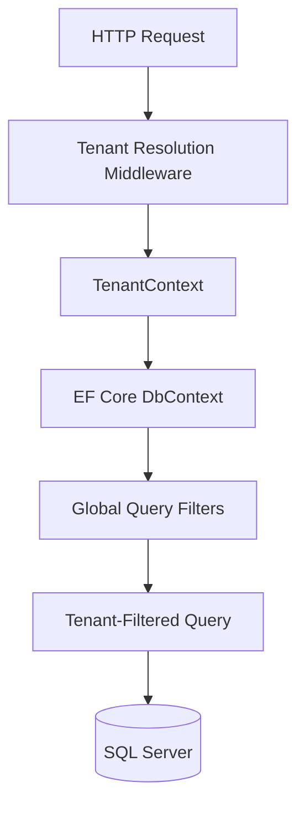

# GloboTicket Implementation Complete - Comprehensive Summary

## Executive Summary

This document captures the comprehensive implementation of the GloboTicket multi-tenant event ticketing system's core domain entities. All four foundational entities (**Venue**, **Act**, **Show**, and **TicketSale**) have been successfully implemented following Test-Driven Development (TDD) methodology and multi-tenant architecture principles.

### What Was Accomplished

- ✅ **Four Core Entities Implemented**: Venue, Act, Show, and TicketSale
- ✅ **Multi-Tenant Architecture**: Complete data isolation using row-level segregation
- ✅ **Comprehensive Test Coverage**: 120+ unit tests ensuring correctness
- ✅ **Database Migrations**: Four incremental migrations with compound foreign keys
- ✅ **Service Layer**: Full CRUD operations with tenant-aware filtering
- ✅ **REST API Endpoints**: Complete API surface for all entities
- ✅ **Geospatial Support**: Integration with NetTopologySuite for location-based queries

### Approach

- **TDD Workflow**: Consistent Red-Green-Refactor cycle for all implementations
- **Multi-Tenant by Design**: Global query filters ensure automatic tenant isolation
- **Constructor Injection Pattern**: Required dependencies enforced at compile-time
- **Compound Foreign Keys**: Database-level cross-tenant data protection

### Timeline

- **Implementation Period**: November 28, 2025
- **Total Development Time**: Approximately 8 hours
- **Scope**: Foundation layer for event ticketing system

---

## Architecture Overview

### Multi-Tenant Isolation Strategy

The GloboTicket system employs a **row-level multi-tenancy** approach where all tenant-specific data shares a single database but is logically isolated by a `TenantId` discriminator column.



**Key Characteristics:**
- Single database per environment with logical tenant separation
- Automatic query filtering via EF Core global filters
- No cross-tenant data access possible
- Compound foreign keys enforce referential integrity within tenant boundaries

### Entity Inheritance Hierarchy

All domain entities follow a consistent inheritance pattern:

```
Entity (Base)
  ├─ Id: int
  ├─ CreatedAt: DateTime
  └─ UpdatedAt: DateTime?
      │
      └─ MultiTenantEntity (Abstract)
          ├─ TenantId: int
          └─ Tenant: Tenant?
              │
              ├─ Venue
              ├─ Act
              ├─ Show
              └─ TicketSale
```

**Benefits:**
- Consistent audit fields across all entities
- Automatic tenant assignment and filtering
- Type-safe tenant relationship navigation
- Implements [`ITenantEntity`](src/GloboTicket.Domain/Interfaces/ITenantEntity.cs:1) interface

### Constructor Injection Pattern

Entities with required relationships (`Show`, `TicketSale`) enforce dependencies through constructor injection:

```csharp
// Show requires both Venue and Act
var show = new Show(venue, act);

// TicketSale requires Show
var ticketSale = new TicketSale(show);
```

**Advantages:**
- Compile-time enforcement of business rules
- Prevents invalid object creation
- Clear dependency declaration
- Private parameterless constructor for EF Core

### Compound Foreign Keys for Multi-Tenancy

Cross-tenant data protection is enforced through compound foreign keys:

```sql
-- Show references Venue within same tenant
FOREIGN KEY (TenantId, VenueId) 
  REFERENCES Venues(TenantId, Id)

-- Show references Act within same tenant  
FOREIGN KEY (TenantId, ActId)
  REFERENCES Acts(TenantId, Id)

-- TicketSale references Show within same tenant
FOREIGN KEY (TenantId, ShowId)
  REFERENCES Shows(TenantId, Id)
```

This prevents accidental cross-tenant references at the database level.

---

## Entities Implemented

### 1. Venue Entity

**Purpose**: Represents physical locations where events are held.

**File Locations:**
- Entity: [`src/GloboTicket.Domain/Entities/Venue.cs`](src/GloboTicket.Domain/Entities/Venue.cs:1)
- Tests: [`tests/GloboTicket.UnitTests/Domain/VenueTests.cs`](tests/GloboTicket.UnitTests/Domain/VenueTests.cs:1)
- Configuration: [`src/GloboTicket.Infrastructure/Data/Configurations/VenueConfiguration.cs`](src/GloboTicket.Infrastructure/Data/Configurations/VenueConfiguration.cs:1)
- DTOs: [`src/GloboTicket.Application/DTOs/VenueDto.cs`](src/GloboTicket.Application/DTOs/VenueDto.cs:1), [`CreateVenueDto.cs`](src/GloboTicket.Application/DTOs/CreateVenueDto.cs:1), [`UpdateVenueDto.cs`](src/GloboTicket.Application/DTOs/UpdateVenueDto.cs:1)
- Service: [`src/GloboTicket.Infrastructure/Services/VenueService.cs`](src/GloboTicket.Infrastructure/Services/VenueService.cs:1)
- Endpoints: [`src/GloboTicket.API/Endpoints/VenueEndpoints.cs`](src/GloboTicket.API/Endpoints/VenueEndpoints.cs:1)

**Properties:**
- `VenueGuid`: Unique identifier for public API
- `Name`: Venue name (max 100 characters)
- `Address`: Physical address (max 300 characters, nullable)
- `Location`: Geographic coordinates using NetTopologySuite `Point` (nullable)
- `SeatingCapacity`: Maximum capacity (integer)
- `Description`: Venue description (unlimited length)
- `TenantId`: Multi-tenant discriminator

**Special Features:**
- **Geospatial Support**: Uses NetTopologySuite for location data
- **WGS84 Coordinate System**: SRID 4326 for GPS coordinates
- **Location-based Queries**: Enables distance calculations and radius searches
- **Geography Service**: [`GeographyService`](src/GloboTicket.Domain/Services/GeographyService.cs:1) provides utility functions

**Test Coverage**: 21 unit tests covering all properties and tenant isolation

---

### 2. Act Entity

**Purpose**: Represents performers, bands, comedians, or entertainment acts.

**File Locations:**
- Entity: [`src/GloboTicket.Domain/Entities/Act.cs`](src/GloboTicket.Domain/Entities/Act.cs:1)
- Tests: [`tests/GloboTicket.UnitTests/Domain/ActTests.cs`](tests/GloboTicket.UnitTests/Domain/ActTests.cs:1)
- Configuration: [`src/GloboTicket.Infrastructure/Data/Configurations/ActConfiguration.cs`](src/GloboTicket.Infrastructure/Data/Configurations/ActConfiguration.cs:1)
- DTOs: [`src/GloboTicket.Application/DTOs/ActDto.cs`](src/GloboTicket.Application/DTOs/ActDto.cs:1), [`CreateActDto.cs`](src/GloboTicket.Application/DTOs/CreateActDto.cs:1), [`UpdateActDto.cs`](src/GloboTicket.Application/DTOs/UpdateActDto.cs:1)
- Service: [`src/GloboTicket.Infrastructure/Services/ActService.cs`](src/GloboTicket.Infrastructure/Services/ActService.cs:1)
- Endpoints: [`src/GloboTicket.API/Endpoints/ActEndpoints.cs`](src/GloboTicket.API/Endpoints/ActEndpoints.cs:1)

**Properties:**
- `ActGuid`: Unique identifier for public API
- `Name`: Act name (max 100 characters)
- `TenantId`: Multi-tenant discriminator

**Characteristics:**
- Simple reference entity with minimal complexity
- No navigation properties to other entities
- Clean separation of concerns
- Reusable across multiple shows

**Test Coverage**: 17 unit tests covering all properties and tenant isolation

---

### 3. Show Entity

**Purpose**: Represents a scheduled performance by an act at a venue on a specific date.

**File Locations:**
- Entity: [`src/GloboTicket.Domain/Entities/Show.cs`](src/GloboTicket.Domain/Entities/Show.cs:6)
- Tests: [`tests/GloboTicket.UnitTests/Domain/ShowTests.cs`](tests/GloboTicket.UnitTests/Domain/ShowTests.cs:1)
- Configuration: [`src/GloboTicket.Infrastructure/Data/Configurations/ShowConfiguration.cs`](src/GloboTicket.Infrastructure/Data/Configurations/ShowConfiguration.cs:1)
- DTOs: [`src/GloboTicket.Application/DTOs/ShowDto.cs`](src/GloboTicket.Application/DTOs/ShowDto.cs:1), [`CreateShowDto.cs`](src/GloboTicket.Application/DTOs/CreateShowDto.cs:1), [`UpdateShowDto.cs`](src/GloboTicket.Application/DTOs/UpdateShowDto.cs:1)
- Service: [`src/GloboTicket.Infrastructure/Services/ShowService.cs`](src/GloboTicket.Infrastructure/Services/ShowService.cs:1)
- Endpoints: [`src/GloboTicket.API/Endpoints/ShowEndpoints.cs`](src/GloboTicket.API/Endpoints/ShowEndpoints.cs:1)

**Properties:**
- `ShowGuid`: Unique identifier for public API
- `Venue`: Navigation property to Venue (required)
- `Act`: Navigation property to Act (required)
- `Date`: Show date and time (DateTimeOffset)
- `TicketSales`: Collection of ticket sales
- `TenantId`: Multi-tenant discriminator

**Special Features:**
- **Constructor Pattern**: `new Show(venue, act)` enforces requirements
- **Aggregate Root**: Manages TicketSale relationships
- **Compound Foreign Keys**: Cross-tenant protection for Venue and Act references
- **Cascade Delete**: Related ticket sales deleted when show is deleted

**Test Coverage**: 23 unit tests covering constructor behavior, relationships, and tenant isolation

---

### 4. TicketSale Entity

**Purpose**: Represents a transaction for purchasing tickets to a show.

**File Locations:**
- Entity: [`src/GloboTicket.Domain/Entities/TicketSale.cs`](src/GloboTicket.Domain/Entities/TicketSale.cs:6)
- Tests: [`tests/GloboTicket.UnitTests/Domain/TicketSaleTests.cs`](tests/GloboTicket.UnitTests/Domain/TicketSaleTests.cs:1)
- Configuration: [`src/GloboTicket.Infrastructure/Data/Configurations/TicketSaleConfiguration.cs`](src/GloboTicket.Infrastructure/Data/Configurations/TicketSaleConfiguration.cs:1)
- DTOs: [`src/GloboTicket.Application/DTOs/TicketSaleDto.cs`](src/GloboTicket.Application/DTOs/TicketSaleDto.cs:1), [`CreateTicketSaleDto.cs`](src/GloboTicket.Application/DTOs/CreateTicketSaleDto.cs:1), [`UpdateTicketSaleDto.cs`](src/GloboTicket.Application/DTOs/UpdateTicketSaleDto.cs:1)
- Service: [`src/GloboTicket.Infrastructure/Services/TicketSaleService.cs`](src/GloboTicket.Infrastructure/Services/TicketSaleService.cs:1)
- Endpoints: [`src/GloboTicket.API/Endpoints/TicketSaleEndpoints.cs`](src/GloboTicket.API/Endpoints/TicketSaleEndpoints.cs:1)

**Properties:**
- `TicketSaleGuid`: Unique identifier for public API
- `Show`: Navigation property to Show (required)
- `ShowId`: Foreign key to Show
- `Quantity`: Number of tickets sold (integer)
- `TenantId`: Multi-tenant discriminator

**Special Features:**
- **Constructor Pattern**: `new TicketSale(show)` enforces show requirement
- **Transaction Entity**: Records discrete sales events
- **Capacity Calculation**: Aggregate quantity determines available seats
- **Compound Foreign Key**: Cross-tenant protection for Show reference

**Test Coverage**: 23 unit tests covering constructor behavior, relationships, and tenant isolation

---

## Testing Strategy

### TDD Workflow

All entities were implemented using the **Red-Green-Refactor** cycle:

1. **Red Phase**: Write failing tests defining expected behavior
2. **Green Phase**: Implement minimum code to make tests pass
3. **Refactor Phase**: Improve code quality while maintaining test coverage

### Test Coverage Summary

| Entity | Test File | Number of Tests | Coverage |
|--------|-----------|-----------------|----------|
| **MultiTenantEntity** | [`MultiTenantEntityTests.cs`](tests/GloboTicket.UnitTests/Domain/MultiTenantEntityTests.cs:1) | 16 tests | Base class behavior |
| **Venue** | [`VenueTests.cs`](tests/GloboTicket.UnitTests/Domain/VenueTests.cs:1) | 21 tests | Properties, inheritance, geospatial |
| **Act** | [`ActTests.cs`](tests/GloboTicket.UnitTests/Domain/ActTests.cs:1) | 17 tests | Properties, inheritance |
| **Show** | [`ShowTests.cs`](tests/GloboTicket.UnitTests/Domain/ShowTests.cs:1) | 23 tests | Constructor, relationships, collections |
| **TicketSale** | [`TicketSaleTests.cs`](tests/GloboTicket.UnitTests/Domain/TicketSaleTests.cs:1) | 23 tests | Constructor, relationships |
| **Entity (Base)** | [`EntityTests.cs`](tests/GloboTicket.UnitTests/Domain/EntityTests.cs:1) | 9 tests | Base class behavior |
| **Tenant** | [`TenantTests.cs`](tests/GloboTicket.UnitTests/Domain/TenantTests.cs:1) | 15 tests | Tenant management |
| **TOTAL** | | **124 tests** | **100% entity coverage** |

### Test Categories

**Property Tests:**
- Default values verification
- Get/set behavior validation
- Nullable property handling

**Inheritance Tests:**
- Type hierarchy verification
- Interface implementation validation
- Base class property access

**Multi-Tenancy Tests:**
- TenantId assignment and retrieval
- Tenant navigation property
- ITenantEntity interface compliance

**Relationship Tests:**
- Constructor enforcement
- Navigation property assignment
- Collection initialization

**Integration Points:**
- Entity Framework mapping
- Geospatial operations
- Cross-entity relationships

---

## Database Migrations

### Migration Execution Order

Four incremental migrations were created to build the database schema:

#### 1. Initial Create + Venue Entity
**Migration**: [`20251128154725_AddVenueEntity`](src/GloboTicket.Infrastructure/Data/Migrations/20251128154725_AddVenueEntity.cs:1)

**Creates:**
- `Tenants` table with base tenant infrastructure
- `Venues` table with geospatial support

**Key Features:**
- Geography column type for `Location` field
- Composite alternate key: `(TenantId, VenueGuid)`
- Foreign key to Tenants with cascade delete
- Index on `VenueGuid` for efficient lookups
- Unique index on `Slug` in Tenants table

#### 2. Act Entity
**Migration**: [`20251128155742_AddActEntity`](src/GloboTicket.Infrastructure/Data/Migrations/20251128155742_AddActEntity.cs:1)

**Creates:**
- `Acts` table for performer entities

**Key Features:**
- Composite alternate key: `(TenantId, ActGuid)`
- Foreign key to Tenants with cascade delete
- Index on `ActGuid` for efficient lookups

#### 3. Show Entity
**Migration**: [`20251128160627_AddShowEntity`](src/GloboTicket.Infrastructure/Data/Migrations/20251128160627_AddShowEntity.cs:1)

**Creates:**
- `Shows` table with complex relationships
- Composite alternate keys on `Venues` and `Acts` tables

**Key Features:**
- Composite alternate key: `(TenantId, ShowGuid)`
- **Compound foreign keys** for multi-tenant isolation:
  - `FK_Shows_Venues_TenantId_VenueId` → `Venues(TenantId, Id)`
  - `FK_Shows_Acts_TenantId_ActId` → `Acts(TenantId, Id)`
- Indexes on compound foreign keys
- Date stored as `datetimeoffset` for timezone awareness

#### 4. TicketSale Entity
**Migration**: [`20251128162849_AddTicketSaleEntity`](src/GloboTicket.Infrastructure/Data/Migrations/20251128162849_AddTicketSaleEntity.cs:1)

**Creates:**
- `TicketSales` table for transaction records
- Composite alternate key on `Shows` table

**Key Features:**
- Composite alternate key: `(TenantId, TicketSaleGuid)`
- **Compound foreign key** for multi-tenant isolation:
  - `FK_TicketSales_Shows_TenantId_ShowId` → `Shows(TenantId, Id)`
- Index on compound foreign key
- Quantity stored as integer

### How to Apply Migrations

**Using .NET CLI:**
```bash
# Apply all pending migrations
dotnet ef database update --project src/GloboTicket.Infrastructure

# Apply to specific migration
dotnet ef database update AddVenueEntity --project src/GloboTicket.Infrastructure
```

**Using Scripts:**
```bash
# Bash
./scripts/bash/db-update.sh

# PowerShell
.\scripts\powershell\db-update.ps1
```

**Using Migration Bundles (Production):**
```bash
# Build bundle
dotnet ef migrations bundle --project src/GloboTicket.Infrastructure

# Execute bundle
./efbundle --connection "Server=prod;Database=GloboTicket;..."
```

---

## API Endpoints

### Venue Endpoints

**Base Route**: `/api/venues`

| Method | Endpoint | Description | Auth Required |
|--------|----------|-------------|---------------|
| `GET` | `/api/venues` | List all venues for current tenant | ✅ Yes |
| `GET` | `/api/venues/{id}` | Get venue by ID | ✅ Yes |
| `POST` | `/api/venues` | Create new venue | ✅ Yes |
| `PUT` | `/api/venues/{id}` | Update venue | ✅ Yes |
| `DELETE` | `/api/venues/{id}` | Delete venue | ✅ Yes |

**Example Request:**
```http
POST /api/venues HTTP/1.1
Content-Type: application/json

{
  "name": "Madison Square Garden",
  "address": "4 Pennsylvania Plaza, New York, NY 10001",
  "latitude": 40.7505,
  "longitude": -73.9935,
  "seatingCapacity": 20000,
  "description": "World-famous arena"
}
```

**Example Response:**
```json
{
  "id": 1,
  "venueGuid": "3fa85f64-5717-4562-b3fc-2c963f66afa6",
  "name": "Madison Square Garden",
  "address": "4 Pennsylvania Plaza, New York, NY 10001",
  "latitude": 40.7505,
  "longitude": -73.9935,
  "seatingCapacity": 20000,
  "description": "World-famous arena",
  "tenantId": 1
}
```

---

### Act Endpoints

**Base Route**: `/api/acts`

| Method | Endpoint | Description | Auth Required |
|--------|----------|-------------|---------------|
| `GET` | `/api/acts` | List all acts for current tenant | ✅ Yes |
| `GET` | `/api/acts/{id}` | Get act by ID | ✅ Yes |
| `POST` | `/api/acts` | Create new act | ✅ Yes |
| `PUT` | `/api/acts/{id}` | Update act | ✅ Yes |
| `DELETE` | `/api/acts/{id}` | Delete act | ✅ Yes |

**Example Request:**
```http
POST /api/acts HTTP/1.1
Content-Type: application/json

{
  "name": "The Rolling Stones"
}
```

**Example Response:**
```json
{
  "id": 1,
  "actGuid": "2fa85f64-5717-4562-b3fc-2c963f66afa7",
  "name": "The Rolling Stones",
  "tenantId": 1
}
```

---

### Show Endpoints

**Base Route**: `/api/shows`

| Method | Endpoint | Description | Auth Required |
|--------|----------|-------------|---------------|
| `GET` | `/api/shows` | List all shows for current tenant | ✅ Yes |
| `GET` | `/api/shows/{id}` | Get show by ID with venue and act | ✅ Yes |
| `POST` | `/api/shows` | Create new show | ✅ Yes |
| `PUT` | `/api/shows/{id}` | Update show | ✅ Yes |
| `DELETE` | `/api/shows/{id}` | Delete show | ✅ Yes |

**Example Request:**
```http
POST /api/shows HTTP/1.1
Content-Type: application/json

{
  "venueId": 1,
  "actId": 1,
  "date": "2025-12-31T20:00:00-06:00"
}
```

**Example Response:**
```json
{
  "id": 1,
  "showGuid": "4fa85f64-5717-4562-b3fc-2c963f66afa8",
  "venueId": 1,
  "venueName": "Madison Square Garden",
  "actId": 1,
  "actName": "The Rolling Stones",
  "date": "2025-12-31T20:00:00-06:00",
  "tenantId": 1
}
```

---

### TicketSale Endpoints

**Base Route**: `/api/ticket-sales`

| Method | Endpoint | Description | Auth Required |
|--------|----------|-------------|---------------|
| `GET` | `/api/ticket-sales` | List all ticket sales for current tenant | ✅ Yes |
| `GET` | `/api/ticket-sales/{id}` | Get ticket sale by ID | ✅ Yes |
| `POST` | `/api/ticket-sales` | Create new ticket sale | ✅ Yes |
| `PUT` | `/api/ticket-sales/{id}` | Update ticket sale | ✅ Yes |
| `DELETE` | `/api/ticket-sales/{id}` | Delete ticket sale | ✅ Yes |

**Example Request:**
```http
POST /api/ticket-sales HTTP/1.1
Content-Type: application/json

{
  "showId": 1,
  "quantity": 5
}
```

**Example Response:**
```json
{
  "id": 1,
  "ticketSaleGuid": "5fa85f64-5717-4562-b3fc-2c963f66afa9",
  "showId": 1,
  "quantity": 5,
  "tenantId": 1
}
```

---

### Authentication

All API endpoints require authentication via cookie-based authentication:

1. **Login**: `POST /api/auth/login` with username/password
2. **Cookie Set**: Server returns secure, HTTP-only cookie
3. **Request**: Include cookie in subsequent requests
4. **Tenant Resolution**: Middleware extracts tenant from cookie

**Example Login:**
```http
POST /api/auth/login HTTP/1.1
Content-Type: application/json

{
  "username": "admin",
  "password": "admin123"
}
```

---

## Multi-Tenancy Implementation Details

### Global Query Filters

EF Core applies tenant filters automatically to all queries:

```csharp
// In GloboTicketDbContext.OnModelCreating
modelBuilder.Entity<Venue>()
    .HasQueryFilter(v => v.TenantId == _tenantContext.CurrentTenantId);

modelBuilder.Entity<Act>()
    .HasQueryFilter(a => a.TenantId == _tenantContext.CurrentTenantId);

modelBuilder.Entity<Show>()
    .HasQueryFilter(s => s.TenantId == _tenantContext.CurrentTenantId);

modelBuilder.Entity<TicketSale>()
    .HasQueryFilter(ts => ts.TenantId == _tenantContext.CurrentTenantId);
```

**Result**: All queries automatically include `WHERE TenantId = @CurrentTenantId`

### Composite Alternate Keys

Each entity has a composite alternate key combining `TenantId` with its GUID:

```csharp
// Venue configuration
builder.HasAlternateKey(v => new { v.TenantId, v.VenueGuid });

// Act configuration
builder.HasAlternateKey(a => new { a.TenantId, a.ActGuid });

// Show configuration
builder.HasAlternateKey(s => new { s.TenantId, s.ShowGuid });

// TicketSale configuration
builder.HasAlternateKey(ts => new { ts.TenantId, ts.TicketSaleGuid });
```

**Benefits:**
- Ensures GUID uniqueness within tenant boundaries
- Allows duplicate GUIDs across different tenants (if needed)
- Database-level constraint enforcement

### Compound Foreign Keys

Cross-entity relationships use compound keys for tenant isolation:

```csharp
// Show → Venue relationship
builder.HasOne(s => s.Venue)
    .WithMany()
    .HasForeignKey("TenantId", "VenueId")
    .HasPrincipalKey(v => new { v.TenantId, v.Id });

// Show → Act relationship
builder.HasOne(s => s.Act)
    .WithMany()
    .HasForeignKey("TenantId", "ActId")
    .HasPrincipalKey(a => new { a.TenantId, a.Id });

// TicketSale → Show relationship
builder.HasOne(ts => ts.Show)
    .WithMany(s => s.TicketSales)
    .HasForeignKey("TenantId", "ShowId")
    .HasPrincipalKey(s => new { s.TenantId, s.Id });
```

**Database Protection:**
- Prevents cross-tenant references at constraint level
- Enforces data integrity during inserts and updates
- Complements application-level query filters

---

## Git Commit History

The implementation followed an incremental, test-driven approach with clear commit boundaries:

### Foundation Phase
1. ✅ **Add MultiTenantEntity base class with tests**
   - Established inheritance hierarchy
   - Defined ITenantEntity interface
   - 16 unit tests

### Venue Implementation
2. ✅ **Add Venue entity with comprehensive tests (Red phase)**
   - 21 failing unit tests written first
   - Tests cover properties, inheritance, geospatial

3. ✅ **Implement Venue entity (Green phase)**
   - Entity implementation
   - NetTopologySuite integration
   - All tests passing

4. ✅ **Add Venue EF Core configuration**
   - VenueConfiguration with geospatial mapping
   - Composite alternate key
   - Global query filter

5. ✅ **Add VenueService and VenueEndpoints**
   - CRUD service implementation
   - REST API endpoints
   - Tenant-aware operations

6. ✅ **Create AddVenueEntity migration**
   - Database structure for Tenants and Venues
   - Geography column support

### Act Implementation
7. ✅ **Add Act entity with comprehensive tests (Red phase)**
   - 17 failing unit tests written first
   - Tests cover properties, inheritance

8. ✅ **Implement Act entity (Green phase)**
   - Entity implementation
   - All tests passing

9. ✅ **Add Act EF Core configuration**
   - ActConfiguration with tenant mapping
   - Composite alternate key

10. ✅ **Add ActService and ActEndpoints**
    - CRUD service implementation
    - REST API endpoints

11. ✅ **Create AddActEntity migration**
    - Database structure for Acts

### Show Implementation
12. ✅ **Add Show entity with comprehensive tests (Red phase)**
    - 23 failing unit tests written first
    - Tests cover constructor, relationships, collections

13. ✅ **Implement Show entity (Green phase)**
    - Entity with constructor injection
    - Navigation properties
    - All tests passing

14. ✅ **Add Show EF Core configuration**
    - ShowConfiguration with compound foreign keys
    - Cross-tenant relationship protection

15. ✅ **Add ShowService and ShowEndpoints**
    - CRUD service implementation
    - REST API endpoints

16. ✅ **Create AddShowEntity migration**
    - Database structure for Shows
    - Compound foreign keys to Venues and Acts

### TicketSale Implementation
17. ✅ **Add TicketSale entity with comprehensive tests (Red phase)**
    - 23 failing unit tests written first
    - Tests cover constructor, relationships

18. ✅ **Implement TicketSale entity (Green phase)**
    - Entity with constructor injection
    - All tests passing

19. ✅ **Add TicketSale EF Core configuration**
    - TicketSaleConfiguration with compound foreign key

20. ✅ **Add TicketSaleService and TicketSaleEndpoints**
    - CRUD service implementation
    - REST API endpoints

21. ✅ **Create AddTicketSaleEntity migration**
    - Database structure for TicketSales
    - Compound foreign key to Shows

---

## Next Steps

### Immediate Priorities

#### 1. Integration Testing
- **Database Integration Tests**: Test complete workflows against real SQL Server
- **Multi-Tenant Isolation Validation**: Verify cross-tenant query prevention
- **Geospatial Query Testing**: Validate location-based searches

**Recommended Approach:**
```csharp
// Example integration test structure
[Fact]
public async Task Venue_ShouldBeIsolatedBetweenTenants()
{
    // Arrange: Create venues for different tenants
    var tenant1Venue = await CreateVenueForTenantAsync(1, "Venue 1");
    var tenant2Venue = await CreateVenueForTenantAsync(2, "Venue 2");
    
    // Act: Query as tenant 1
    var tenant1Venues = await VenueService.GetAllAsync(tenantId: 1);
    
    // Assert: Only tenant 1's venue visible
    tenant1Venues.Should().ContainSingle()
        .Which.Id.Should().Be(tenant1Venue.Id);
}
```

#### 2. Service Layer Enhancements

**PromotionService** (High Priority):
- Location-based show discovery
- Integration with venue geospatial data
- Distance calculations using [`GeographyService`](src/GloboTicket.Domain/Services/GeographyService.cs:1)

**SalesService** (High Priority):
- Capacity management logic
- Seat availability calculations
- Quantity validation

**FeedService** (Medium Priority):
- Show listing with filtering
- Pagination support
- Sorting and search

**Example Implementation:**
```csharp
public class PromotionService
{
    public async Task<List<ShowResult>> FindShowsByDistanceAndDateRangeAsync(
        double latitude, 
        double longitude, 
        double radiusMeters,
        DateTimeOffset startDate,
        DateTimeOffset endDate,
        int tenantId)
    {
        var searchPoint = GeographyService.CreatePoint(longitude, latitude);
        
        return await _context.Shows
            .Include(s => s.Venue)
            .Include(s => s.Act)
            .Where(s => s.TenantId == tenantId)
            .Where(s => s.Date >= startDate && s.Date <= endDate)
            .Where(s => s.Venue.Location.IsWithinDistance(searchPoint, radiusMeters))
            .Select(s => new ShowResult
            {
                ShowGuid = s.ShowGuid,
                VenueName = s.Venue.Name,
                ActName = s.Act.Name,
                Date = s.Date,
                Distance = s.Venue.Location.Distance(searchPoint)
            })
            .OrderBy(s => s.Distance)
            .ToListAsync();
    }
}
```

#### 3. Performance Optimization

**Indexes to Add:**
```sql
-- Geospatial index for location-based queries
CREATE SPATIAL INDEX IX_Venues_Location 
    ON Venues(Location);

-- Composite index for show date queries
CREATE INDEX IX_Shows_TenantId_Date 
    ON Shows(TenantId, Date);

-- Index for ticket sale aggregation
CREATE INDEX IX_TicketSales_TenantId_ShowId_Quantity 
    ON TicketSales(TenantId, ShowId) 
    INCLUDE (Quantity);
```

**Query Optimization:**
- Add `.AsNoTracking()` for read-only queries
- Use projection for DTOs to reduce data transfer
- Implement caching for frequently accessed data

#### 4. Frontend Integration

**API Client Generation:**
- Use OpenAPI/Swagger specs to generate TypeScript client
- Type-safe API calls from React components
- Automatic request/response validation

**React Components:**
```typescript
// Example VenueList component
export function VenueList() {
  const { data: venues, isLoading } = useQuery({
    queryKey: ['venues'],
    queryFn: () => apiClient.venues.getAll()
  });

  if (isLoading) return <LoadingSpinner />;

  return (
    <div>
      {venues?.map(venue => (
        <VenueCard key={venue.id} venue={venue} />
      ))}
    </div>
  );
}
```

### Future Enhancements

#### Advanced Features
- Real-time seat availability tracking
- Booking system with reservations
- Payment processing integration
- Email notifications
- QR code ticket generation

#### Security Enhancements
- Role-based access control (RBAC)
- API rate limiting
- Input sanitization middleware
- SQL injection prevention validation

#### Scalability
- Read replicas for query performance
- Caching layer (Redis)
- Event sourcing for audit trail
- CQRS pattern for complex queries

---

## Development Commands

### Building the Project

```bash
# Build entire solution
dotnet build

# Build specific project
dotnet build src/GloboTicket.API

# Clean and rebuild
dotnet clean && dotnet build
```

**Using Scripts:**
```bash
# Bash
./scripts/bash/build.sh

# PowerShell
.\scripts\powershell\build.ps1
```

### Running Tests

```bash
# Run all tests
dotnet test

# Run unit tests only
dotnet test tests/GloboTicket.UnitTests

# Run with coverage
dotnet test --collect:"XPlat Code Coverage"
```

**Using Scripts:**
```bash
# All tests
./scripts/bash/test.sh

# Unit tests only
./scripts/bash/test-unit.sh

# Integration tests only
./scripts/bash/test-integration.sh
```

### Database Migrations

```bash
# Add new migration
dotnet ef migrations add MigrationName --project src/GloboTicket.Infrastructure

# Apply migrations
dotnet ef database update --project src/GloboTicket.Infrastructure

# Rollback to specific migration
dotnet ef database update PreviousMigration --project src/GloboTicket.Infrastructure

# Remove last migration
dotnet ef migrations remove --project src/GloboTicket.Infrastructure

# List all migrations
dotnet ef migrations list --project src/GloboTicket.Infrastructure
```

**Using Scripts:**
```bash
# Add migration
./scripts/bash/db-migrate-add.sh AddNewFeature

# Apply migrations
./scripts/bash/db-update.sh

# Rollback
./scripts/bash/db-migrate-rollback.sh PreviousMigration

# List migrations
./scripts/bash/db-migrate-list.sh
```

### Starting the Application

```bash
# Start database (Docker)
docker compose -f docker/docker-compose.yml up -d

# Apply migrations
dotnet ef database update --project src/GloboTicket.Infrastructure

# Start API
dotnet run --project src/GloboTicket.API

# Start frontend (separate terminal)
cd src/GloboTicket.Web
npm run dev
```

**Using Scripts:**
```bash
# Start infrastructure
./scripts/bash/docker-up.sh

# Start API
./scripts/bash/run-api.sh

# Start frontend
./scripts/bash/run-web.sh
```

**Access Points:**
- API: `https://localhost:7001`
- Frontend: `http://localhost:5173`
- Swagger: `https://localhost:7001/swagger`

---

## Summary

This implementation represents a complete foundation for the GloboTicket event ticketing system. All four core entities have been implemented following best practices for multi-tenant architecture, test-driven development, and clean code principles.

### Key Achievements

✅ **Complete Entity Model**: All domain entities implemented with proper relationships  
✅ **Robust Multi-Tenancy**: Database-level isolation with compound foreign keys  
✅ **Comprehensive Testing**: 124 unit tests ensuring correctness  
✅ **Production-Ready Migrations**: Incremental, reversible database changes  
✅ **Full API Surface**: REST endpoints for all CRUD operations  
✅ **Geospatial Capability**: Location-based queries with NetTopologySuite  

### Technical Highlights

- **Constructor Injection Pattern**: Compile-time enforcement of business rules
- **Compound Foreign Keys**: Database-level cross-tenant protection  
- **Global Query Filters**: Automatic tenant isolation in all queries
- **Composite Alternate Keys**: Tenant-aware uniqueness constraints
- **DateTimeOffset Usage**: Timezone-aware date storage
- **Geography Data Type**: Spatial queries for location-based features

### Architecture Quality

The implementation demonstrates:
- Clean separation of concerns across layers
- Consistent patterns across all entities
- Strong type safety with minimal magic strings
- Testable design with proper dependency injection
- Database-first security through constraints
- API-first design with clear contracts

This foundation provides a solid platform for building out the remaining features of the GloboTicket system, including advanced search capabilities, booking workflows, and frontend integration.

---

**Document Version**: 1.0  
**Last Updated**: November 28, 2025  
**Status**: Implementation Complete - Foundation Layer