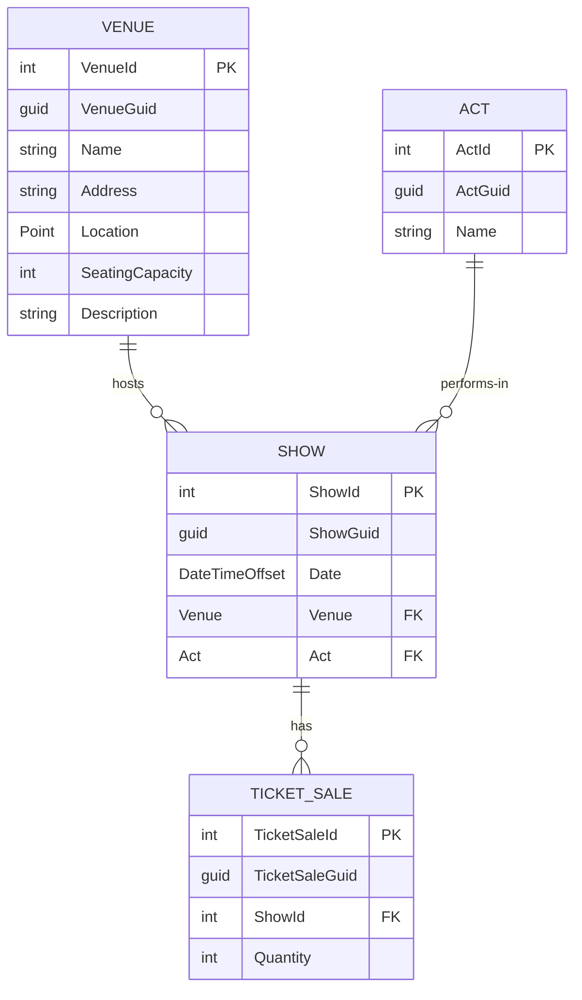
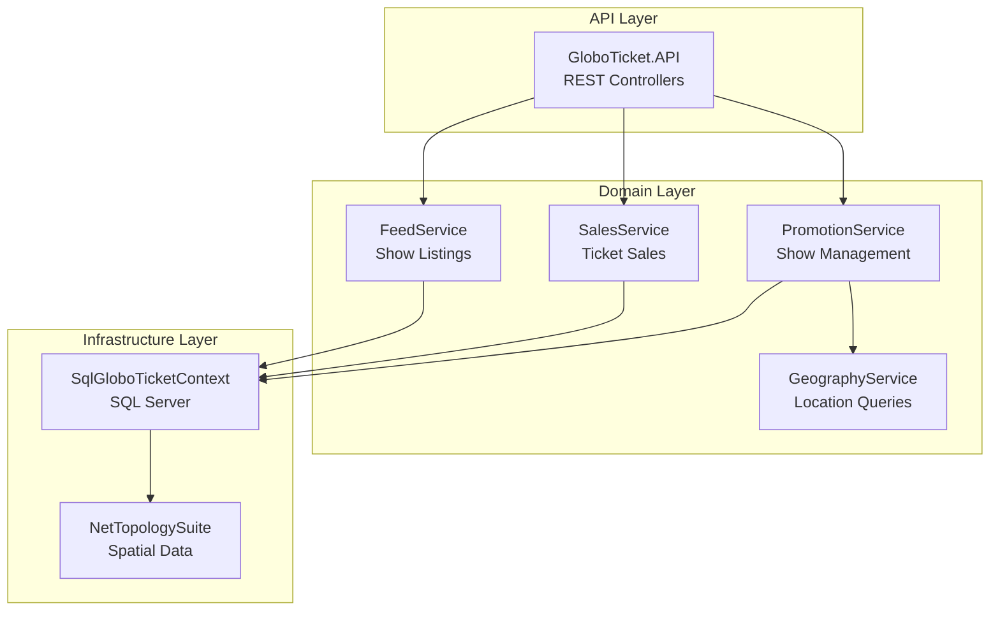
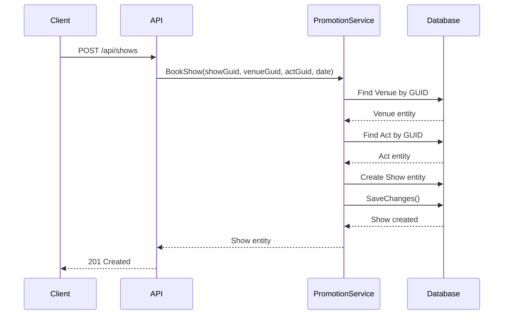
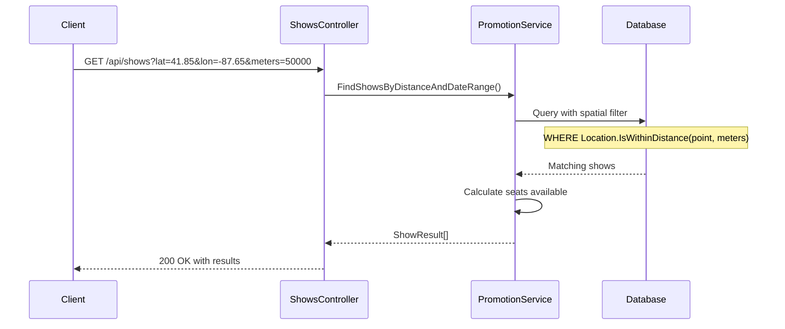
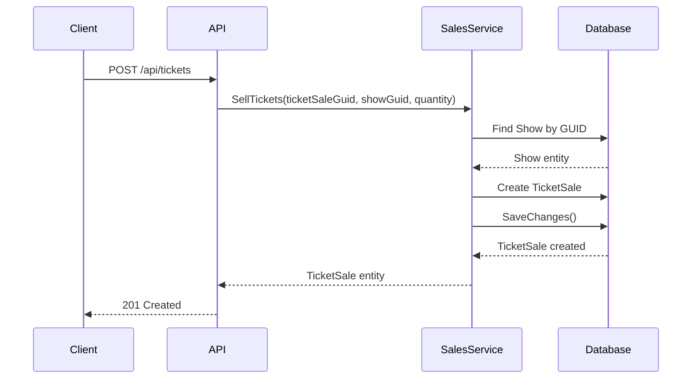

# GloboTicket Application - Comprehensive Overview

## 1. Problem Domain

**GloboTicket** is an **event ticketing and show promotion management system** designed to solve the real-world problem of coordinating live entertainment events across multiple venues. 

### Business Context
The application addresses the needs of:
- **Event Promoters**: Who book acts at venues and need to manage show schedules
- **Ticket Buyers**: Who search for shows in their area and purchase tickets
- **Venue Managers**: Who provide spaces for performances
- **Performers/Acts**: Who schedule appearances at venues

### Scope
The system manages the complete lifecycle of live entertainment events, from booking acts at venues, to scheduling shows, to selling tickets and tracking capacity. It includes geospatial capabilities for location-based show searches, making it easy for customers to find nearby entertainment options.

---

## 2. Key Entities & Domain Model

The application is built around four core domain entities with rich relationships:



### Entity Details

**[`Venue`](GloboTicket.Domain/Entities/Venue.cs:5)**
- Represents physical locations where shows are held
- **Key Attributes**: Name, Address, Geographic Location (Point), Seating Capacity, Description
- **Purpose**: Defines where entertainment events take place and their capacity constraints
- **Special Feature**: Uses NetTopologySuite for geospatial operations (location-based searches)

**[`Act`](GloboTicket.Domain/Entities/Act.cs:3)**
- Represents performers, bands, comedians, or any entertainment act
- **Key Attributes**: Name, ActGuid (unique identifier)
- **Purpose**: Catalogs available performers who can be booked for shows
- **Relationship**: An act can perform at multiple shows

**[`Show`](GloboTicket.Domain/Entities/Show.cs:3)**
- Represents a scheduled performance by an act at a venue
- **Key Attributes**: Date/Time, Venue reference, Act reference, ShowGuid
- **Purpose**: Links an act to a venue at a specific date/time
- **Relationship**: Aggregate entity that brings together venues and acts, and tracks ticket sales
- **Business Rule**: Enforces relationship integrity through constructor requiring both venue and act

**[`TicketSale`](GloboTicket.Domain/Entities/TicketSale.cs:5)**
- Represents a transaction for purchasing tickets to a show
- **Key Attributes**: Quantity, Show reference, TicketSaleGuid
- **Purpose**: Tracks ticket inventory and calculates available capacity
- **Business Logic**: Multiple ticket sales per show; aggregate quantity determines seats available

---

## 3. Core Capabilities & Features

### System Architecture



### Feature Catalog

#### 1. **Show Promotion & Management**
Implemented in [`PromotionService`](GloboTicket.Domain/Services/PromotionService.cs:8)

- **Book Shows** ([`BookShow()`](GloboTicket.Domain/Services/PromotionService.cs:17))
  - Schedule an act to perform at a venue on a specific date
  - Validates venue and act existence
  - Creates show record with unique identifier

- **Create Venues** ([`CreateVenue()`](GloboTicket.Domain/Services/PromotionService.cs:43))
  - Register new performance venues
  - Capture location coordinates for geospatial queries
  - Set seating capacity for ticket availability calculations

- **Create Acts** ([`CreateAct()`](GloboTicket.Domain/Services/PromotionService.cs:60))
  - Register performers/entertainment acts
  - Maintain catalog of available performers

- **Reschedule Shows** ([`RescheduleShow()`](GloboTicket.Domain/Services/PromotionService.cs:119))
  - Update show dates when schedule changes occur
  - Maintains show integrity while allowing flexibility

#### 2. **Location-Based Show Discovery**
Implemented in [`PromotionService.FindShowsByDistanceAndDateRange()`](GloboTicket.Domain/Services/PromotionService.cs:74)

- **Geospatial Search**
  - Find shows within a specified radius (meters) of a location
  - Filter by date range
  - Order results by distance from search point
  - Calculate available seating in real-time

- **Rich Search Results**
  - Venue details (name, address, coordinates)
  - Act information
  - Show date/time
  - Distance from search location
  - Real-time seat availability

**Search Query Example:**
```
GET /api/shows?latitude=41.85&longitude=-87.65&meters=50000&start=2024-01-01&end=2024-12-31
```

#### 3. **Ticket Sales Management**
Implemented in [`SalesService`](GloboTicket.Domain/Services/SalesService.cs:7)

- **Sell Tickets** ([`SellTickets()`](GloboTicket.Domain/Services/SalesService.cs:16))
  - Record ticket purchases for shows
  - Track quantity sold per transaction
  - Validate show existence before sale

- **Capacity Management**
  - Automatic calculation: `SeatsAvailable = Venue.SeatingCapacity - Sum(TicketSales.Quantity)`
  - Real-time availability in search results
  - Prevents overselling through data integrity

#### 4. **Show Feed & Listings**
Implemented in [`FeedService`](GloboTicket.Domain/Services/FeedService.cs:7)

- **List All Shows** ([`ListShows()`](GloboTicket.Domain/Services/FeedService.cs:16))
  - Asynchronous streaming of show data
  - Returns show information with venue and act references
  - Efficient for large datasets

---

## 4. Key Workflows

### Workflow 1: Booking a New Show



### Workflow 2: Finding Shows Near a Location



### Workflow 3: Selling Tickets



---

## Summary

**What GloboTicket Enables:**

For **Event Promoters**:
- Book acts at venues with scheduling
- Manage show lifecycle (create, reschedule)
- Track ticket sales and capacity

For **Customers**:
- Discover shows near their location
- Browse available shows by date
- See real-time ticket availability

For **System Administrators**:
- Maintain venue and act catalogs
- Monitor sales across all shows
- Generate event feeds

**Core Value Proposition**: GloboTicket provides an integrated platform for managing the entire live entertainment event lifecycle, from booking to ticket sales, with sophisticated location-based discovery capabilities that connect customers with nearby entertainment options.