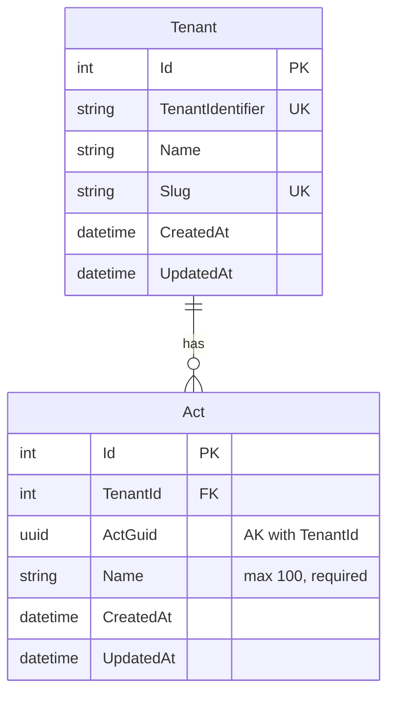

# Add Act

**Status**: Draft
**Created**: 2025-12-26
**Author**: Claude Code (spec-writer agent)
**Related Stories**: [docs/user-stories/add-act.md](../user-stories/add-act.md)

## Executive Summary

This specification defines the technical implementation approach for the Add Act feature, enabling authorized users to create new performing act records. The implementation leverages the existing `Act` multi-tenant entity, cookie-based authentication, and EF Core query filters for tenant isolation. The feature provides a simple form-based React interface for capturing act names with client-side and server-side validation.

## Requirements Reference

**User Story**: See [User Story](../user-stories/add-act.md)

**Acceptance Criteria**: See [Acceptance Criteria](../user-stories/add-act.md#acceptance-criteria)

This specification focuses on the technical implementation details for the requirements defined in the user story.

## Technical Analysis

### Affected Layers

- **Domain**: `Act` entity (existing, inherits from `MultiTenantEntity`)
- **Application**: `IActService` interface, `CreateActDto`, `ActDto` (existing)
- **Infrastructure**: `ActService` implementation, `ActConfiguration` (existing)
- **API**: `POST /api/acts` endpoint (existing in `ActEndpoints.cs`)
- **Web**: `CreateActPage`, `ActForm`, `ActsPage` components (existing)

### Multi-Tenancy Considerations

The `Act` entity inherits from `MultiTenantEntity`, which provides:
- `TenantId` property for tenant isolation
- `Tenant` navigation property

**Query Filter**: Applied in `GloboTicketDbContext.OnModelCreating()`:
```
Act is filtered by: _tenantContext.CurrentTenantId == null || a.TenantId == _tenantContext.CurrentTenantId
```

**Automatic TenantId Assignment**: When `SaveChangesAsync` is called for new `MultiTenantEntity` instances, the `TenantId` is automatically set from `ITenantContext.CurrentTenantId`.

**Uniqueness Constraint**: The composite alternate key `(TenantId, ActGuid)` ensures act GUIDs are unique within each tenant, allowing different tenants to use the same GUID without conflict.

### Security Considerations

- **Authentication**: All act endpoints require authentication via `.RequireAuthorization()`
- **Cookie-Based Auth**: Uses `.GloboTicket.Auth` cookie with secure, HTTP-only, SameSite=Strict settings
- **Tenant Context**: `TenantResolutionMiddleware` sets tenant from authenticated user claims
- **Rate Limiting**: `RateLimitingMiddleware` prevents abuse (note: in-memory, single-server limitation)

### Performance Considerations

**Existing Indexes**:
- Primary key on `Id`
- Index on `ActGuid` for GUID-based lookups
- Composite alternate key on `(TenantId, ActGuid)`

**No Additional Indexes Required**: The existing indexes are sufficient for the create act operation.

## OpenAPI Specification

```yaml
openapi: 3.0.0
info:
  title: GloboTicket API - Add Act
  version: 1.0.0

paths:
  /api/acts:
    post:
      summary: Create a new act
      description: Creates a new performing act in the current tenant's context. The act is automatically associated with the authenticated user's tenant.
      tags:
        - Acts
      security:
        - cookieAuth: []
      requestBody:
        required: true
        content:
          application/json:
            schema:
              $ref: '#/components/schemas/CreateActRequest'
            examples:
              standardAct:
                summary: Standard act creation
                value:
                  actGuid: "550e8400-e29b-41d4-a716-446655440000"
                  name: "The Rolling Stones"
      responses:
        '201':
          description: Act created successfully
          headers:
            Location:
              description: URL of the created act
              schema:
                type: string
                example: "/api/acts/550e8400-e29b-41d4-a716-446655440000"
          content:
            application/json:
              schema:
                $ref: '#/components/schemas/ActResponse'
        '400':
          description: Invalid request - validation failed
          content:
            application/json:
              schema:
                $ref: '#/components/schemas/ValidationErrorResponse'
              examples:
                missingName:
                  summary: Missing required field
                  value:
                    type: "https://tools.ietf.org/html/rfc7231#section-6.5.1"
                    title: "One or more validation errors occurred."
                    status: 400
                    errors:
                      Name: ["The Name field is required."]
                nameTooLong:
                  summary: Name exceeds maximum length
                  value:
                    type: "https://tools.ietf.org/html/rfc7231#section-6.5.1"
                    title: "One or more validation errors occurred."
                    status: 400
                    errors:
                      Name: ["The field Name must be a string with a maximum length of 100."]
        '401':
          description: Unauthorized - user not authenticated
          content:
            application/json:
              schema:
                $ref: '#/components/schemas/ErrorResponse'
        '429':
          description: Rate limit exceeded
          content:
            application/json:
              schema:
                $ref: '#/components/schemas/ErrorResponse'
        '500':
          description: Internal server error
          content:
            application/json:
              schema:
                $ref: '#/components/schemas/ErrorResponse'

components:
  schemas:
    CreateActRequest:
      type: object
      required:
        - actGuid
        - name
      properties:
        actGuid:
          type: string
          format: uuid
          description: Client-generated unique identifier for the act
          example: "550e8400-e29b-41d4-a716-446655440000"
        name:
          type: string
          minLength: 1
          maxLength: 100
          description: Name of the performing act (trimmed of leading/trailing whitespace)
          example: "The Rolling Stones"

    ActResponse:
      type: object
      properties:
        id:
          type: integer
          format: int32
          description: Database-generated unique identifier
          example: 1
        actGuid:
          type: string
          format: uuid
          description: Client-generated unique identifier
          example: "550e8400-e29b-41d4-a716-446655440000"
        name:
          type: string
          description: Name of the act
          example: "The Rolling Stones"
        createdAt:
          type: string
          format: date-time
          description: UTC timestamp when the act was created
          example: "2025-12-26T10:30:00Z"
        updatedAt:
          type: string
          format: date-time
          nullable: true
          description: UTC timestamp when the act was last updated
          example: null

    ValidationErrorResponse:
      type: object
      properties:
        type:
          type: string
          example: "https://tools.ietf.org/html/rfc7231#section-6.5.1"
        title:
          type: string
          example: "One or more validation errors occurred."
        status:
          type: integer
          example: 400
        errors:
          type: object
          additionalProperties:
            type: array
            items:
              type: string

    ErrorResponse:
      type: object
      properties:
        message:
          type: string
          description: Error message
          example: "An error occurred while processing your request."

  securitySchemes:
    cookieAuth:
      type: apiKey
      in: cookie
      name: .GloboTicket.Auth
      description: Cookie-based authentication token
```

## Database Schema

### Entity-Relationship Diagram



### Table: Acts

| Column | Data Type | Constraints | Description |
|--------|-----------|-------------|-------------|
| Id | int | PK, Identity | Auto-generated primary key |
| TenantId | int | FK, Required | Foreign key to Tenants table |
| ActGuid | uniqueidentifier | Required, AK with TenantId | Client-generated unique identifier |
| Name | nvarchar(100) | Required | Act/performer name |
| CreatedAt | datetime2 | Required | Creation timestamp |
| UpdatedAt | datetime2 | Nullable | Last update timestamp |

### Indexes

| Index Name | Columns | Type | Purpose |
|------------|---------|------|---------|
| PK_Acts | Id | Clustered, Unique | Primary key |
| AK_Acts_TenantId_ActGuid | TenantId, ActGuid | Unique | Composite alternate key for tenant isolation |
| IX_Acts_ActGuid | ActGuid | Non-clustered | Fast GUID lookups |
| IX_Acts_TenantId | TenantId | Non-clustered (implicit from FK) | Tenant filtering |

### Relationships

| From | To | Type | On Delete |
|------|-----|------|-----------|
| Acts.TenantId | Tenants.Id | Many-to-One | Cascade |

## User Interface Design

### Page Structure & Navigation

**Pages**:
1. `/acts` - Acts listing page (existing)
2. `/acts/new` - Create act page (existing)

**Navigation Flow**:
1. User navigates to `/acts` (Acts list)
2. User clicks "Add Act" button
3. User is navigated to `/acts/new` (Create Act page)
4. On successful creation, user is redirected to `/acts`
5. On cancel, user is returned to `/acts`

### Component Breakdown

#### CreateActPage

**Location**: `src/GloboTicket.Web/src/pages/acts/CreateActPage.tsx`

**Purpose**: Container page for act creation, providing layout and navigation handlers.

**State Management**: None - delegates to ActForm

**Child Components**:
- `PageHeader`: Displays "Create Act" title and description
- `Card`: Container for the form
- `ActForm`: The actual form component

**Navigation Handlers**:
- `handleSuccess`: Navigate to `/acts` on successful creation
- `handleCancel`: Navigate to `/acts` on cancel

#### ActForm

**Location**: `src/GloboTicket.Web/src/components/organisms/ActForm.tsx`

**Purpose**: Reusable form component for create/edit act operations.

**Props**:
- `act?: Act` - Optional act for edit mode
- `onSuccess?: (act: Act) => void` - Callback on successful submission
- `onCancel?: () => void` - Callback on cancel

**State**:
- `name: string` - Act name input
- `error: string | null` - Error message to display
- `isLoading: boolean` - Loading state during submission

**Validation Rules** (single source of truth for client-side validation):

| Field | Rule | Error Message |
|-------|------|---------------|
| Name | Required, non-whitespace | "Act name is required" |
| Name | Max 100 characters | "Act name must be 100 characters or less" |

**Form Fields**:
1. **Name** (text input)
   - Label: "Act Name *"
   - Placeholder: "Enter act name"
   - maxLength: 100 (enforced at input level)
   - required: true

**Buttons**:
- **Create Act** (primary): Submits the form
- **Cancel** (secondary): Returns to acts list

**API Integration**:
- Create mode: `POST /api/acts` via `createAct()` function
- Uses `crypto.randomUUID()` to generate `actGuid` client-side

#### ActsPage

**Location**: `src/GloboTicket.Web/src/pages/acts/ActsPage.tsx`

**Purpose**: Displays the list of acts with navigation to create new acts.

**Action Button**:
- "Add Act" button navigates to `/acts/new`
- Displays Plus icon with label

### Interaction Flows

#### Create Act Flow

```
1. User clicks "Add Act" on ActsPage
   |
2. Navigate to /acts/new
   |
3. CreateActPage renders ActForm
   |
4. User enters act name
   |
5. User clicks "Create Act"
   |
6. ActForm validates input:
   |-- Validation fails --> Display error message, stay on form
   |
   +-- Validation passes --> Continue
   |
7. ActForm calls createAct() API:
   a. Set isLoading = true
   b. Disable form inputs and buttons
   c. Show loading indicator on submit button
   |
8. API Response:
   |-- Success (201) --> Call onSuccess(), navigate to /acts
   |
   +-- Error --> Display error message, re-enable form
```

#### Cancel Flow

```
1. User clicks "Cancel" button
   |
2. ActForm calls onCancel() callback
   |
3. Navigate to /acts (no data saved)
```

### Accessibility Requirements

- Form input has associated `<label>` element with `htmlFor` attribute
- Required field marked with asterisk (*) in label text
- Error messages announced to screen readers via live region (error container)
- Form input supports keyboard navigation (Tab/Shift+Tab)
- Submit button disabled state communicated via `aria-disabled`
- Loading state indicated visually on submit button
- Focus remains on form after validation error

### Responsive Behavior

- **Desktop (>1024px)**: Form fields full width within card container
- **Tablet (768-1024px)**: Same as desktop
- **Mobile (<768px)**: Single column, stacked layout

## Testing Requirements

### Unit Test Scenarios

#### Domain Layer (ActTests)
- [ ] GivenNewAct_WhenCreated_ThenNameDefaultsToEmptyString
- [ ] GivenNewAct_WhenCreated_ThenActGuidDefaultsToEmptyGuid
- [ ] GivenAct_WhenChecked_ThenInheritsFromMultiTenantEntity
- [ ] GivenAct_WhenChecked_ThenImplementsITenantEntity
- [ ] GivenAct_WhenAllPropertiesSet_ThenAllRetainValues

#### Application Layer (CreateActDtoTests)
- [ ] GivenCreateActDto_WhenNameIsEmpty_ThenValidationFails
- [ ] GivenCreateActDto_WhenNameExceeds100Characters_ThenValidationFails
- [ ] GivenCreateActDto_WhenActGuidIsEmpty_ThenValidationFails
- [ ] GivenCreateActDto_WhenAllFieldsValid_ThenValidationPasses

### Integration Test Scenarios

#### ActService Integration Tests
- [ ] CreateAct_WithValidData_CreatesActInDatabase
- [ ] CreateAct_SetsCreatedAtTimestamp
- [ ] CreateAct_SetsCorrectTenantId
- [ ] CreateAct_ReturnsActDtoWithAllFields

#### Multi-Tenancy Integration Tests
- [ ] CreateAct_InTenantA_NotVisibleToTenantB
- [ ] GetAllActs_ReturnsOnlyCurrentTenantActs
- [ ] CreateAct_WithSameGuidInDifferentTenants_Succeeds
- [ ] CreateAct_WithDuplicateGuidInSameTenant_Fails

#### API Endpoint Integration Tests
- [ ] PostAct_WithValidData_Returns201Created
- [ ] PostAct_WithValidData_ReturnsActInBody
- [ ] PostAct_WithValidData_SetsLocationHeader
- [ ] PostAct_WithMissingName_Returns400BadRequest
- [ ] PostAct_WithMissingActGuid_Returns400BadRequest
- [ ] PostAct_WithNameExceeding100Characters_Returns400BadRequest
- [ ] PostAct_WithoutAuthentication_Returns401Unauthorized
- [ ] PostAct_ExceedsRateLimit_Returns429TooManyRequests

### Frontend Test Scenarios (E2E)

#### ActForm Component Tests
- [ ] GivenActForm_WhenRendered_ThenDisplaysNameField
- [ ] GivenActForm_WhenRendered_ThenNameFieldMarkedWithAsterisk
- [ ] GivenActForm_WhenSubmitWithEmptyName_ThenShowsError
- [ ] GivenActForm_WhenSubmitWithWhitespaceOnlyName_ThenShowsError
- [ ] GivenActForm_WhenSubmitting_ThenDisablesInput
- [ ] GivenActForm_WhenSubmitting_ThenShowsLoadingIndicator
- [ ] GivenActForm_WhenSubmitSucceeds_ThenRedirectsToActsList
- [ ] GivenActForm_WhenCancelClicked_ThenRedirectsToActsList

#### CreateActPage Tests
- [ ] GivenCreateActPage_WhenRendered_ThenDisplaysPageHeader
- [ ] GivenCreateActPage_WhenActCreated_ThenAppearsInActsList

## Implementation Notes

### Whitespace Handling

**Requirement**: Leading and trailing spaces should be automatically removed before saving.

**Current Implementation**: The ActForm component calls `name.trim()` before sending to the API. This satisfies the requirement at the client level.

**Recommendation**: Consider adding server-side trimming in `ActService.CreateAsync()` for defense in depth, in case the API is called directly.

### Existing Implementation

The Add Act feature is already implemented in the codebase. This specification documents the requirements and serves as a reference for:
1. Validation of the existing implementation against acceptance criteria
2. Test coverage verification
3. Future maintenance and modifications
