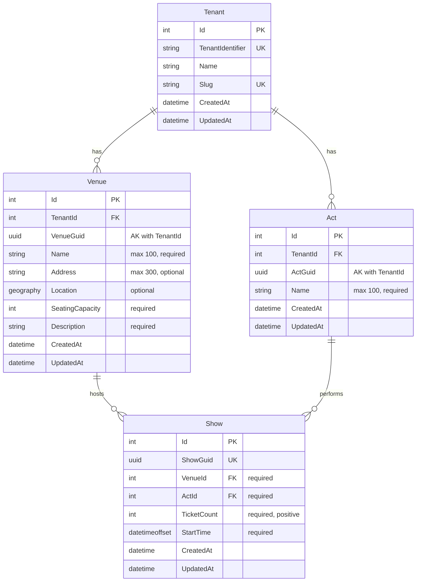

# Add Show to Act

**Status**: Draft
**Created**: 2025-12-27
**Author**: Claude Code (spec-writer agent)
**Related Stories**: [docs/user-stories/add-show-to-act.md](../user-stories/add-show-to-act.md)

## Executive Summary

This specification defines the technical implementation for adding shows (performances) to acts. The implementation introduces a new `Show` entity as a child entity that inherits tenant context through its relationship with `Venue`. Key features include venue capacity display, a "nearby shows" detection system querying shows within 48 hours at the same venue, and proper time zone handling using `DateTimeOffset` for accurate local time representation. The feature requires new API endpoints, a dedicated service layer, and React components with dynamic venue capacity and nearby shows display.

## Requirements Reference

**User Story**: See [User Story](../user-stories/add-show-to-act.md)

**Acceptance Criteria**: See [Acceptance Criteria](../user-stories/add-show-to-act.md#acceptance-criteria)

This specification focuses on the technical implementation details for the requirements defined in the user story.

## Technical Analysis

### Affected Layers

- **Domain**: New `Show` entity (inherits from `Entity`, not `MultiTenantEntity`)
- **Application**: New `IShowService` interface, `ShowDto`, `CreateShowDto`, `NearbyShowDto` DTOs
- **Infrastructure**: New `ShowService` implementation, `ShowConfiguration`
- **API**: New `ShowEndpoints.cs` with endpoints for show management and nearby shows query
- **Web**: New `ShowForm` component, updates to `ActDetailPage` to display shows and add show button

### Multi-Tenancy Considerations

**Show as Child Entity**: The `Show` entity inherits from `Entity` (not `MultiTenantEntity`) because it does NOT store `TenantId` directly. Instead, it inherits tenant context through its relationship with `Venue`, which is a `MultiTenantEntity`.

**Query Filter Pattern**: Shows are filtered through navigation property chain:
```
Show is filtered by: _tenantContext.CurrentTenantId == null || s.Venue.TenantId == _tenantContext.CurrentTenantId
```

**Relationship Chain for Tenant Isolation**:
- Show -> Venue -> Tenant (via Venue.TenantId)
- Show -> Act -> Tenant (via Act.TenantId)

Both paths lead to the same tenant because Acts and Venues within a tenant's context are already filtered. The Venue relationship is the authoritative tenant source since Venue is required and directly contains the TenantId.

**No TenantId on Show**: The `Show` entity does not have its own `TenantId` property. The `DbContext.SaveChangesAsync()` override only sets `TenantId` for `MultiTenantEntity` instances, so no special handling is needed for `Show`.

### Security Considerations

- **Authentication**: All show endpoints require authentication via `.RequireAuthorization()`
- **Tenant Isolation**: Query filters ensure users only see shows from their tenant
- **Act/Venue Validation**: When creating a show, the service must verify that both the Act and Venue belong to the current tenant (enforced by query filters)
- **Rate Limiting**: Existing `RateLimitingMiddleware` applies to show endpoints

### Performance Considerations

**New Indexes Required**:
1. Index on `(VenueId, StartTime)` for efficient nearby shows queries
2. Index on `ActId` for efficient show listing by act
3. Composite index on `(VenueId, StartTime)` supports the 48-hour window query

**Query Optimization**:
- Nearby shows query uses date range: `StartTime >= (selected - 48h) AND StartTime <= (selected + 48h)`
- Include `Act` navigation property when fetching nearby shows to avoid N+1 queries

## OpenAPI Specification

```yaml
openapi: 3.0.0
info:
  title: GloboTicket API - Add Show to Act
  version: 1.0.0

paths:
  /api/acts/{actGuid}/shows:
    get:
      summary: Get all shows for an act
      description: Returns all shows scheduled for the specified act, filtered by current tenant.
      tags:
        - Shows
      security:
        - cookieAuth: []
      parameters:
        - name: actGuid
          in: path
          required: true
          schema:
            type: string
            format: uuid
          description: The GUID of the act
      responses:
        '200':
          description: List of shows for the act
          content:
            application/json:
              schema:
                type: array
                items:
                  $ref: '#/components/schemas/ShowResponse'
        '401':
          description: Unauthorized - user not authenticated
        '404':
          description: Act not found

    post:
      summary: Create a new show for an act
      description: Creates a new show associated with the specified act. The show is validated against venue capacity and the venue/act must belong to the current tenant.
      tags:
        - Shows
      security:
        - cookieAuth: []
      parameters:
        - name: actGuid
          in: path
          required: true
          schema:
            type: string
            format: uuid
          description: The GUID of the act
      requestBody:
        required: true
        content:
          application/json:
            schema:
              $ref: '#/components/schemas/CreateShowRequest'
            examples:
              standardShow:
                summary: Standard show creation
                value:
                  showGuid: "660e8400-e29b-41d4-a716-446655440001"
                  venueGuid: "770e8400-e29b-41d4-a716-446655440002"
                  ticketCount: 500
                  startTime: "2025-07-15T20:00:00-04:00"
      responses:
        '201':
          description: Show created successfully
          headers:
            Location:
              description: URL of the created show
              schema:
                type: string
                example: "/api/shows/660e8400-e29b-41d4-a716-446655440001"
          content:
            application/json:
              schema:
                $ref: '#/components/schemas/ShowResponse'
        '400':
          description: Invalid request - validation failed
          content:
            application/json:
              schema:
                $ref: '#/components/schemas/ValidationErrorResponse'
              examples:
                ticketCountExceedsCapacity:
                  summary: Ticket count exceeds venue capacity
                  value:
                    type: "https://tools.ietf.org/html/rfc7231#section-6.5.1"
                    title: "One or more validation errors occurred."
                    status: 400
                    errors:
                      TicketCount: ["Ticket count cannot exceed venue capacity of 5000"]
                startTimeInPast:
                  summary: Start time is in the past
                  value:
                    type: "https://tools.ietf.org/html/rfc7231#section-6.5.1"
                    title: "One or more validation errors occurred."
                    status: 400
                    errors:
                      StartTime: ["Start time must be in the future"]
        '401':
          description: Unauthorized - user not authenticated
        '404':
          description: Act or Venue not found
        '429':
          description: Rate limit exceeded

  /api/shows/{showGuid}:
    get:
      summary: Get a show by GUID
      description: Returns the show with the specified GUID if it belongs to the current tenant.
      tags:
        - Shows
      security:
        - cookieAuth: []
      parameters:
        - name: showGuid
          in: path
          required: true
          schema:
            type: string
            format: uuid
      responses:
        '200':
          description: Show details
          content:
            application/json:
              schema:
                $ref: '#/components/schemas/ShowResponse'
        '401':
          description: Unauthorized
        '404':
          description: Show not found

    delete:
      summary: Delete a show
      description: Deletes the show with the specified GUID.
      tags:
        - Shows
      security:
        - cookieAuth: []
      parameters:
        - name: showGuid
          in: path
          required: true
          schema:
            type: string
            format: uuid
      responses:
        '204':
          description: Show deleted successfully
        '401':
          description: Unauthorized
        '404':
          description: Show not found

  /api/venues/{venueGuid}/shows/nearby:
    get:
      summary: Get nearby shows at a venue
      description: Returns shows at the specified venue within 48 hours before or after the provided date/time. Used for informational display during show creation.
      tags:
        - Shows
      security:
        - cookieAuth: []
      parameters:
        - name: venueGuid
          in: path
          required: true
          schema:
            type: string
            format: uuid
          description: The GUID of the venue
        - name: startTime
          in: query
          required: true
          schema:
            type: string
            format: date-time
          description: The proposed start time (ISO 8601 format with timezone offset)
          example: "2025-07-15T20:00:00-04:00"
      responses:
        '200':
          description: List of nearby shows
          content:
            application/json:
              schema:
                $ref: '#/components/schemas/NearbyShowsResponse'
        '400':
          description: Invalid startTime parameter
        '401':
          description: Unauthorized
        '404':
          description: Venue not found

components:
  schemas:
    CreateShowRequest:
      type: object
      required:
        - showGuid
        - venueGuid
        - ticketCount
        - startTime
      properties:
        showGuid:
          type: string
          format: uuid
          description: Client-generated unique identifier for the show
        venueGuid:
          type: string
          format: uuid
          description: GUID of the venue where the show will be held
        ticketCount:
          type: integer
          format: int32
          minimum: 1
          description: Number of tickets available (must be <= venue capacity)
          example: 500
        startTime:
          type: string
          format: date-time
          description: Show start time in ISO 8601 format with timezone offset (interpreted as local venue time)
          example: "2025-07-15T20:00:00-04:00"

    ShowResponse:
      type: object
      properties:
        id:
          type: integer
          format: int32
          description: Database-generated unique identifier
        showGuid:
          type: string
          format: uuid
          description: Client-generated unique identifier
        actGuid:
          type: string
          format: uuid
          description: GUID of the associated act
        actName:
          type: string
          description: Name of the associated act
        venueGuid:
          type: string
          format: uuid
          description: GUID of the venue
        venueName:
          type: string
          description: Name of the venue
        venueCapacity:
          type: integer
          description: Maximum capacity of the venue
        ticketCount:
          type: integer
          format: int32
          description: Number of tickets available
        startTime:
          type: string
          format: date-time
          description: Show start time with timezone offset
        createdAt:
          type: string
          format: date-time
          description: UTC timestamp when the show was created
        updatedAt:
          type: string
          format: date-time
          nullable: true
          description: UTC timestamp when the show was last updated

    NearbyShowsResponse:
      type: object
      properties:
        venueGuid:
          type: string
          format: uuid
        venueName:
          type: string
        referenceTime:
          type: string
          format: date-time
          description: The time around which nearby shows were searched
        shows:
          type: array
          items:
            $ref: '#/components/schemas/NearbyShowDto'
        message:
          type: string
          description: Informational message (e.g., "No other shows scheduled at this venue within 48 hours")

    NearbyShowDto:
      type: object
      properties:
        showGuid:
          type: string
          format: uuid
        actName:
          type: string
          description: Name of the act performing
        startTime:
          type: string
          format: date-time
          description: Show start time with timezone offset

    ValidationErrorResponse:
      type: object
      properties:
        type:
          type: string
        title:
          type: string
        status:
          type: integer
        errors:
          type: object
          additionalProperties:
            type: array
            items:
              type: string

  securitySchemes:
    cookieAuth:
      type: apiKey
      in: cookie
      name: .GloboTicket.Auth
      description: Cookie-based authentication token
```

## Database Schema

### Entity-Relationship Diagram



### Table: Shows

| Column | Data Type | Constraints | Description |
|--------|-----------|-------------|-------------|
| Id | int | PK, Identity | Auto-generated primary key |
| ShowGuid | uniqueidentifier | UK, Required | Client-generated unique identifier |
| VenueId | int | FK, Required | Foreign key to Venues table |
| ActId | int | FK, Required | Foreign key to Acts table |
| TicketCount | int | Required, > 0 | Number of tickets available |
| StartTime | datetimeoffset | Required | Show start time with timezone offset |
| CreatedAt | datetime2 | Required | Creation timestamp (UTC) |
| UpdatedAt | datetime2 | Nullable | Last update timestamp (UTC) |

### Indexes

| Index Name | Columns | Type | Purpose |
|------------|---------|------|---------|
| PK_Shows | Id | Clustered, Unique | Primary key |
| IX_Shows_ShowGuid | ShowGuid | Unique | Fast GUID lookups, ensures global uniqueness |
| IX_Shows_VenueId_StartTime | VenueId, StartTime | Non-clustered | Nearby shows query optimization |
| IX_Shows_ActId | ActId | Non-clustered | Fast lookups by act |
| IX_Shows_VenueId | VenueId | Non-clustered | Implicit from FK, tenant filtering via Venue |

### Relationships

| From | To | Type | On Delete |
|------|-----|------|-----------|
| Shows.VenueId | Venues.Id | Many-to-One | Cascade |
| Shows.ActId | Acts.Id | Many-to-One | Cascade |

**Note on Cascade Delete**: When a Venue or Act is deleted, associated Shows are automatically deleted. This maintains referential integrity and prevents orphaned show records.

### Time Zone Storage

**Design Decision**: Use `DateTimeOffset` for `StartTime` to preserve the local timezone context.

**Rationale**:
- `DateTimeOffset` stores both the absolute point in time and the offset from UTC
- This allows reconstructing the local time that was entered by the user
- Correctly handles daylight saving time transitions for the specified date
- The 48-hour nearby shows calculation works on the UTC equivalent, ensuring accurate comparisons

**Example**:
- User enters: July 15, 2025, 8:00 PM for a venue in New York (EDT, UTC-4)
- Stored as: `2025-07-15T20:00:00-04:00`
- UTC equivalent: `2025-07-16T00:00:00Z`
- Nearby shows query: Find shows where StartTime (UTC) is between `2025-07-14T00:00:00Z` and `2025-07-18T00:00:00Z`

## User Interface Design

### Page Structure & Navigation

**New Pages**:
1. `/acts/:id/shows/new` - Create show page (accessed from act detail page)

**Navigation Updates**:
- Add "Add Show" button to `ActDetailPage` in the "Upcoming Shows" section
- Update router to include new show creation route

### Component Breakdown

#### ActDetailPage Updates

**Location**: `src/GloboTicket.Web/src/pages/acts/ActDetailPage.tsx`

**New Features**:
- Fetch and display shows for the act using `GET /api/acts/{actGuid}/shows`
- Add "Add Show" button in the "Upcoming Shows" card header
- Display shows in a list format with venue name, date, time, and ticket count

**API Integration**:
- Query key: `['acts', actGuid, 'shows']`
- Endpoint: `GET /api/acts/{actGuid}/shows`

#### CreateShowPage

**Location**: `src/GloboTicket.Web/src/pages/shows/CreateShowPage.tsx`

**Purpose**: Container page for show creation, providing layout and navigation.

**Route**: `/acts/:id/shows/new`

**State Management**: Delegates to ShowForm

**Child Components**:
- `PageHeader`: Displays "Add Show" title
- `Card`: Container for the form
- `ShowForm`: The actual form component

**Navigation Handlers**:
- `handleSuccess`: Navigate to `/acts/:id` on successful creation
- `handleCancel`: Navigate to `/acts/:id` on cancel

#### ShowForm

**Location**: `src/GloboTicket.Web/src/components/organisms/ShowForm.tsx`

**Purpose**: Form component for creating shows with venue capacity display and nearby shows detection.

**Props**:
- `actGuid: string` - GUID of the act to create show for
- `actName: string` - Name of the act (for display)
- `onSuccess?: (show: Show) => void` - Callback on successful submission
- `onCancel?: () => void` - Callback on cancel

**State**:
- `venueGuid: string` - Selected venue GUID
- `ticketCount: string` - Ticket count input
- `startDate: string` - Start date (YYYY-MM-DD format)
- `startTime: string` - Start time (HH:MM format)
- `error: string | null` - Error message
- `fieldErrors: Record<string, string>` - Per-field validation errors
- `isLoading: boolean` - Loading state
- `nearbyShows: NearbyShow[]` - Nearby shows data

**API Integration**:
- Venues list: `GET /api/venues` (query key: `['venues']`)
- Nearby shows: `GET /api/venues/{venueGuid}/shows/nearby?startTime={iso8601}` (query key: `['venues', venueGuid, 'nearby-shows', isoDateTime]`)
- Create show: `POST /api/acts/{actGuid}/shows`

**Validation Rules** (single source of truth for client-side validation):

| Field | Rule | Error Message |
|-------|------|---------------|
| Venue | Required | "Please select a venue" |
| Ticket Count | Required | "Ticket count is required" |
| Ticket Count | Must be positive integer | "Ticket count must be a positive number" |
| Ticket Count | Must be <= venue capacity | "Ticket count cannot exceed venue capacity of {capacity}" |
| Start Date | Required | "Start date is required" |
| Start Date | Must be in the future | "Start date must be in the future" |
| Start Time | Required | "Start time is required" |
| Start Time | Valid HH:MM format | "Please enter a valid time" |

**Form Fields**:

1. **Venue** (select dropdown)
   - Label: "Venue *"
   - Options: List of venues from current tenant
   - On change: Update displayed capacity, fetch nearby shows
   - If no venues exist: Display message "No venues available. Please create a venue first."

2. **Venue Capacity Display** (read-only)
   - Label: "Venue Capacity"
   - Displays: "{capacity} seats" when venue selected
   - Position: Below venue dropdown, prominently styled

3. **Ticket Count** (number input)
   - Label: "Number of Tickets *"
   - Placeholder: "Enter ticket count"
   - min: 1
   - max: dynamically set to venue capacity
   - Validation tied to selected venue capacity

4. **Start Date** (date input)
   - Label: "Start Date *"
   - min: tomorrow's date
   - On change: Re-fetch nearby shows if venue selected

5. **Start Time** (time input)
   - Label: "Start Time *"
   - Format: HH:MM (24-hour or 12-hour based on locale)
   - On change: Re-fetch nearby shows if venue and date selected

6. **Nearby Shows Display** (informational section)
   - Label: "Other Shows at This Venue"
   - Appears when venue, date, and time are all selected
   - Shows loading state while fetching
   - Displays list of nearby shows with: Act name, date, time
   - If no nearby shows: "No other shows scheduled at this venue within 48 hours"
   - Sorted chronologically

**Buttons**:
- **Create Show** (primary): Submits the form
- **Cancel** (secondary): Returns to act detail page

#### ShowCard

**Location**: `src/GloboTicket.Web/src/components/molecules/ShowCard.tsx`

**Purpose**: Display a show in the act detail page show list.

**Props**:
- `show: Show` - Show data to display

**Displays**:
- Venue name
- Start date and time (formatted for display)
- Ticket count / venue capacity

### Interaction Flows

#### Create Show Flow

```
1. User views ActDetailPage
   |
2. User clicks "Add Show" button
   |
3. Navigate to /acts/:id/shows/new
   |
4. CreateShowPage renders ShowForm
   |
5. User selects venue from dropdown
   |-- API: GET /api/venues (if not cached)
   |-- Display venue capacity
   |
6. User enters ticket count
   |-- Client validation: <= venue capacity
   |
7. User enters start date and time
   |
8. If venue + date + time all provided:
   |-- API: GET /api/venues/{venueGuid}/shows/nearby?startTime=...
   |-- Display nearby shows list (informational)
   |
9. User clicks "Create Show"
   |
10. ShowForm validates all fields:
    |-- Validation fails --> Display inline errors, stay on form
    |
    +-- Validation passes --> Continue
    |
11. ShowForm calls API:
    |-- POST /api/acts/{actGuid}/shows
    |-- Set isLoading = true
    |
12. API Response:
    |-- 201 Created --> Call onSuccess(), navigate to /acts/:id
    |
    |-- 400 Bad Request:
    |   |-- Ticket count > capacity (re-validated) --> Show error
    |   |-- Start time in past --> Show error
    |   |-- Venue not found --> Show error
    |
    +-- 404 Not Found --> Show "Act or Venue not found" error
```

#### Venue Selection Flow

```
1. User opens venue dropdown
   |
2. Dropdown shows venues from GET /api/venues
   |
3. User selects a venue
   |
4. Form updates:
   |-- Display venue capacity prominently
   |-- Set max value for ticket count input
   |-- If date/time already entered, fetch nearby shows
```

#### Nearby Shows Update Flow

```
1. Venue, date, OR time changes
   |
2. Check if all three are provided
   |-- No --> Clear nearby shows display
   |
   +-- Yes --> Continue
   |
3. Construct ISO 8601 datetime with timezone offset
   |
4. API: GET /api/venues/{venueGuid}/shows/nearby?startTime={iso}
   |
5. Display results:
   |-- Loading state while fetching
   |-- List of nearby shows (sorted by time)
   |-- Or "No other shows scheduled" message
```

### Accessibility Requirements

- All form inputs have associated `<label>` elements with `htmlFor` attribute
- Required fields marked with asterisk (*) in label text
- Venue capacity announced to screen readers when venue selection changes
- Nearby shows section uses appropriate ARIA live region for updates
- Error messages announced via ARIA live regions
- Form inputs support keyboard navigation (Tab/Shift+Tab)
- Date and time inputs use native browser controls for accessibility
- Disabled state on submit button communicated via `aria-disabled`
- Loading states have appropriate ARIA labels

### Responsive Behavior

- **Desktop (>1024px)**: Two-column layout for date/time fields; venue capacity inline
- **Tablet (768-1024px)**: Same as desktop
- **Mobile (<768px)**: Single column, stacked layout; venue capacity below dropdown

## Testing Requirements

### Unit Test Scenarios

#### Domain Layer (ShowTests)

- [ ] GivenNewShow_WhenCreated_ThenShowGuidDefaultsToEmptyGuid
- [ ] GivenNewShow_WhenCreated_ThenTicketCountDefaultsToZero
- [ ] GivenNewShow_WhenCreated_ThenStartTimeDefaultsToDefault
- [ ] GivenShow_WhenChecked_ThenInheritsFromEntity
- [ ] GivenShow_WhenChecked_ThenDoesNotInheritFromMultiTenantEntity
- [ ] GivenShow_WhenChecked_ThenHasVenueNavigationProperty
- [ ] GivenShow_WhenChecked_ThenHasActNavigationProperty

#### Application Layer (CreateShowDtoTests)

- [ ] GivenCreateShowDto_WhenShowGuidIsEmpty_ThenValidationFails
- [ ] GivenCreateShowDto_WhenVenueGuidIsEmpty_ThenValidationFails
- [ ] GivenCreateShowDto_WhenTicketCountIsZero_ThenValidationFails
- [ ] GivenCreateShowDto_WhenTicketCountIsNegative_ThenValidationFails
- [ ] GivenCreateShowDto_WhenStartTimeIsDefault_ThenValidationFails
- [ ] GivenCreateShowDto_WhenAllFieldsValid_ThenValidationPasses

### Integration Test Scenarios

#### ShowService Integration Tests

- [ ] CreateShow_WithValidData_CreatesShowInDatabase
- [ ] CreateShow_SetsCreatedAtTimestamp
- [ ] CreateShow_AssociatesWithCorrectActAndVenue
- [ ] CreateShow_WithTicketCountExceedingCapacity_ThrowsValidationException
- [ ] CreateShow_WithPastStartTime_ThrowsValidationException
- [ ] CreateShow_WithNonExistentVenue_ThrowsNotFoundException
- [ ] CreateShow_WithNonExistentAct_ThrowsNotFoundException
- [ ] GetShowsByActGuid_ReturnsShowsForAct
- [ ] GetShowsByActGuid_ReturnsEmptyListWhenNoShows
- [ ] GetNearbyShows_ReturnsShowsWithin48Hours
- [ ] GetNearbyShows_ExcludesShowsOutside48Hours
- [ ] GetNearbyShows_SortsChronologically
- [ ] GetNearbyShows_ReturnsEmptyWhenNoNearbyShows

#### Multi-Tenancy Integration Tests

- [ ] CreateShow_VenueFromDifferentTenant_FailsNotFound
- [ ] CreateShow_ActFromDifferentTenant_FailsNotFound
- [ ] GetShowsByActGuid_ReturnsOnlyCurrentTenantShows
- [ ] GetNearbyShows_ReturnsOnlyCurrentTenantShows
- [ ] DeleteShow_FromDifferentTenant_FailsNotFound

#### API Endpoint Integration Tests

- [ ] PostShow_WithValidData_Returns201Created
- [ ] PostShow_WithValidData_ReturnsShowInBody
- [ ] PostShow_WithValidData_SetsLocationHeader
- [ ] PostShow_WithMissingVenueGuid_Returns400BadRequest
- [ ] PostShow_WithMissingTicketCount_Returns400BadRequest
- [ ] PostShow_WithTicketCountExceedingCapacity_Returns400BadRequest
- [ ] PostShow_WithPastStartTime_Returns400BadRequest
- [ ] PostShow_WithoutAuthentication_Returns401Unauthorized
- [ ] PostShow_WithNonExistentAct_Returns404NotFound
- [ ] PostShow_WithNonExistentVenue_Returns404NotFound
- [ ] GetNearbyShows_WithValidParams_Returns200Ok
- [ ] GetNearbyShows_WithMissingStartTime_Returns400BadRequest
- [ ] GetNearbyShows_WithInvalidStartTimeFormat_Returns400BadRequest
- [ ] DeleteShow_WithValidGuid_Returns204NoContent
- [ ] DeleteShow_WithNonExistentGuid_Returns404NotFound

### Frontend Test Scenarios (E2E)

#### ShowForm Component Tests

- [ ] GivenShowForm_WhenRendered_ThenDisplaysVenueDropdown
- [ ] GivenShowForm_WhenRendered_ThenDisplaysTicketCountField
- [ ] GivenShowForm_WhenRendered_ThenDisplaysDateAndTimeFields
- [ ] GivenShowForm_WhenNoVenuesExist_ThenShowsNoVenuesMessage
- [ ] GivenShowForm_WhenVenueSelected_ThenDisplaysCapacity
- [ ] GivenShowForm_WhenVenueChanged_ThenUpdatesCapacityDisplay
- [ ] GivenShowForm_WhenTicketCountExceedsCapacity_ThenShowsError
- [ ] GivenShowForm_WhenAllFieldsFilled_ThenFetchesNearbyShows
- [ ] GivenShowForm_WhenNearbyShowsExist_ThenDisplaysList
- [ ] GivenShowForm_WhenNoNearbyShows_ThenDisplaysMessage
- [ ] GivenShowForm_WhenSubmitSucceeds_ThenRedirectsToActDetail
- [ ] GivenShowForm_WhenCancelClicked_ThenRedirectsToActDetail

#### ActDetailPage Tests

- [ ] GivenActDetailPage_WhenShowsExist_ThenDisplaysShowsList
- [ ] GivenActDetailPage_WhenNoShows_ThenDisplaysEmptyMessage
- [ ] GivenActDetailPage_WhenAddShowClicked_ThenNavigatesToCreateShowPage

## Implementation Notes

### Time Zone Handling

**Client-Side**:
1. User enters date and time in local time (as displayed in their browser)
2. Client constructs ISO 8601 string with the appropriate offset based on venue timezone
3. For MVP, use the browser's local timezone offset; future enhancement could use venue's timezone

**Server-Side**:
1. Parse the `startTime` as `DateTimeOffset` to preserve offset information
2. Store as-is in the database (SQL Server `datetimeoffset` type)
3. For nearby shows query, use `DateTimeOffset.UtcDateTime` for comparison
4. Return `DateTimeOffset` in responses for client to display appropriately

**48-Hour Window Calculation**:
```csharp
var startUtc = proposedStartTime.UtcDateTime;
var windowStart = startUtc.AddHours(-48);
var windowEnd = startUtc.AddHours(48);

var nearbyShows = await _dbContext.Shows
    .Where(s => s.VenueId == venueId)
    .Where(s => s.StartTime.UtcDateTime >= windowStart)
    .Where(s => s.StartTime.UtcDateTime <= windowEnd)
    .Include(s => s.Act)
    .OrderBy(s => s.StartTime)
    .ToListAsync();
```

### Venue Capacity Validation

**Server-Side Validation** (authoritative):
1. Fetch venue by GUID within tenant context
2. Compare `ticketCount` against `venue.SeatingCapacity`
3. If exceeded, return 400 with specific error message including capacity value

This ensures that even if venue capacity changes between form load and submission, the current capacity is always enforced.

### Entity Configuration Notes

**Show Entity Configuration Order**:
1. Table name (`ToTable`)
2. Primary key configuration
3. Index on ShowGuid (unique)
4. Property configurations
5. Foreign key relationships (VenueId, ActId)
6. Timestamp properties

**Note**: Show does NOT have a composite alternate key with TenantId because it doesn't store TenantId directly. The ShowGuid is globally unique.

### Frontend TypeScript Types

New types to add to `src/GloboTicket.Web/src/types/show.ts`:

```typescript
export interface Show {
  id: number;
  showGuid: string;
  actGuid: string;
  actName: string;
  venueGuid: string;
  venueName: string;
  venueCapacity: number;
  ticketCount: number;
  startTime: string; // ISO 8601 with offset
  createdAt: string;
  updatedAt?: string;
}

export interface CreateShowDto {
  showGuid: string;
  venueGuid: string;
  ticketCount: number;
  startTime: string; // ISO 8601 with offset
}

export interface NearbyShow {
  showGuid: string;
  actName: string;
  startTime: string;
}

export interface NearbyShowsResponse {
  venueGuid: string;
  venueName: string;
  referenceTime: string;
  shows: NearbyShow[];
  message: string;
}
```

### Router Updates

Add to `src/GloboTicket.Web/src/router/routes.ts`:

```typescript
// Shows
SHOW_CREATE: '/acts/:id/shows/new',
```

Add route helper:
```typescript
showCreate: (actId: string) => `/acts/${actId}/shows/new`,
```
