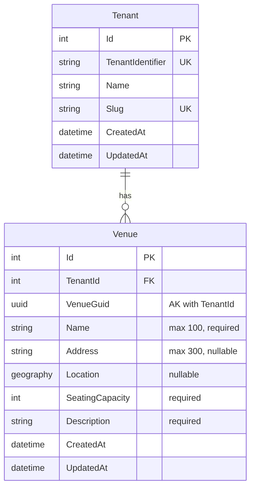

# Add Venue

**Status**: Draft
**Created**: 2025-12-26
**Author**: Claude Code (spec-writer agent)
**Related Stories**: [docs/user-stories/add-venue.md](../user-stories/add-venue.md)

## Executive Summary

This specification defines the technical implementation approach for the Add Venue feature, leveraging the existing `Venue` multi-tenant entity with `Address` complex type and geospatial `Location` property. The implementation uses a form-based React interface integrated with Mapbox for location selection, cookie-based authentication, and EF Core query filters for tenant isolation.

## Requirements Reference

**User Story**: See [User Story](../user-stories/add-venue.md)

**Acceptance Criteria**: See [Acceptance Criteria](../user-stories/add-venue.md#acceptance-criteria)

This specification focuses on the technical implementation details for the requirements defined in the user story.

## Technical Analysis

### Affected Layers

- **Domain**: `Venue` entity (existing, inherits from `MultiTenantEntity`)
- **Application**: `IVenueService` interface, `CreateVenueDto`, `VenueDto` (existing)
- **Infrastructure**: `VenueService` implementation, `VenueConfiguration` (existing)
- **API**: `POST /api/venues` endpoint (existing in `VenueEndpoints.cs`)
- **Web**: `CreateVenuePage`, `VenueForm`, `VenueLocationPicker` components (existing)

### Multi-Tenancy Considerations

The `Venue` entity inherits from `MultiTenantEntity`, which provides:
- `TenantId` property for tenant isolation
- `Tenant` navigation property

**Query Filter**: Applied in `GloboTicketDbContext.OnModelCreating()`:
```
Venue is filtered by: _tenantContext.CurrentTenantId == null || v.TenantId == _tenantContext.CurrentTenantId
```

**Automatic TenantId Assignment**: When `SaveChangesAsync` is called for new `MultiTenantEntity` instances, the `TenantId` is automatically set from `ITenantContext.CurrentTenantId`.

**Uniqueness Constraint**: The composite alternate key `(TenantId, VenueGuid)` ensures venue GUIDs are unique within each tenant.

### Security Considerations

- **Authentication**: All venue endpoints require authentication via `.RequireAuthorization()`
- **Cookie-Based Auth**: Uses `.GloboTicket.Auth` cookie with secure, HTTP-only, SameSite=Strict settings
- **Tenant Context**: `TenantResolutionMiddleware` sets tenant from authenticated user claims
- **Rate Limiting**: `RateLimitingMiddleware` prevents abuse (note: in-memory, single-server limitation)

### Performance Considerations

**Existing Indexes**:
- Primary key on `Id`
- Index on `VenueGuid` for GUID-based lookups
- Composite alternate key on `(TenantId, VenueGuid)`

**No Additional Indexes Required**: The existing indexes are sufficient for the create venue operation.

## OpenAPI Specification

```yaml
openapi: 3.0.0
info:
  title: GloboTicket API - Add Venue
  version: 1.0.0

paths:
  /api/venues:
    post:
      summary: Create a new venue
      description: Creates a new venue in the current tenant's context. The venue is automatically associated with the authenticated user's tenant.
      tags:
        - Venues
      security:
        - cookieAuth: []
      requestBody:
        required: true
        content:
          application/json:
            schema:
              $ref: '#/components/schemas/CreateVenueRequest'
            examples:
              fullVenue:
                summary: Complete venue with location
                value:
                  venueGuid: "550e8400-e29b-41d4-a716-446655440000"
                  name: "Madison Square Garden"
                  address: "4 Pennsylvania Plaza, New York, NY 10001"
                  seatingCapacity: 20000
                  description: "World-famous multi-purpose indoor arena"
                  latitude: 40.7505
                  longitude: -73.9935
              minimalVenue:
                summary: Venue with required fields only
                value:
                  venueGuid: "550e8400-e29b-41d4-a716-446655440001"
                  name: "Community Hall"
                  seatingCapacity: 500
                  description: "Local community gathering space"
      responses:
        '201':
          description: Venue created successfully
          headers:
            Location:
              description: URL of the created venue
              schema:
                type: string
                example: "/api/venues/550e8400-e29b-41d4-a716-446655440000"
          content:
            application/json:
              schema:
                $ref: '#/components/schemas/VenueResponse'
        '400':
          description: Invalid request - validation failed
          content:
            application/json:
              schema:
                $ref: '#/components/schemas/ValidationErrorResponse'
              examples:
                missingName:
                  summary: Missing required field
                  value:
                    type: "https://tools.ietf.org/html/rfc7231#section-6.5.1"
                    title: "One or more validation errors occurred."
                    status: 400
                    errors:
                      Name: ["The Name field is required."]
                invalidCapacity:
                  summary: Invalid seating capacity
                  value:
                    type: "https://tools.ietf.org/html/rfc7231#section-6.5.1"
                    title: "One or more validation errors occurred."
                    status: 400
                    errors:
                      SeatingCapacity: ["Seating capacity must be a positive number."]
        '401':
          description: Unauthorized - user not authenticated
          content:
            application/json:
              schema:
                $ref: '#/components/schemas/ErrorResponse'
        '429':
          description: Rate limit exceeded
          content:
            application/json:
              schema:
                $ref: '#/components/schemas/ErrorResponse'
        '500':
          description: Internal server error
          content:
            application/json:
              schema:
                $ref: '#/components/schemas/ErrorResponse'

components:
  schemas:
    CreateVenueRequest:
      type: object
      required:
        - venueGuid
        - name
        - seatingCapacity
        - description
      properties:
        venueGuid:
          type: string
          format: uuid
          description: Client-generated unique identifier for the venue
          example: "550e8400-e29b-41d4-a716-446655440000"
        name:
          type: string
          minLength: 1
          maxLength: 100
          description: Name of the venue
          example: "Madison Square Garden"
        address:
          type: string
          maxLength: 300
          nullable: true
          description: Physical address of the venue
          example: "4 Pennsylvania Plaza, New York, NY 10001"
        seatingCapacity:
          type: integer
          format: int32
          minimum: 1
          description: Maximum seating capacity (must be positive)
          example: 20000
        description:
          type: string
          minLength: 1
          maxLength: 2000
          description: Description of the venue
          example: "World-famous multi-purpose indoor arena"
        latitude:
          type: number
          format: double
          minimum: -90
          maximum: 90
          nullable: true
          description: Latitude coordinate (WGS84)
          example: 40.7505
        longitude:
          type: number
          format: double
          minimum: -180
          maximum: 180
          nullable: true
          description: Longitude coordinate (WGS84)
          example: -73.9935

    VenueResponse:
      type: object
      properties:
        id:
          type: integer
          format: int32
          description: Database-generated unique identifier
          example: 1
        venueGuid:
          type: string
          format: uuid
          description: Client-generated unique identifier
          example: "550e8400-e29b-41d4-a716-446655440000"
        name:
          type: string
          description: Name of the venue
          example: "Madison Square Garden"
        address:
          type: string
          nullable: true
          description: Physical address of the venue
          example: "4 Pennsylvania Plaza, New York, NY 10001"
        seatingCapacity:
          type: integer
          format: int32
          description: Maximum seating capacity
          example: 20000
        description:
          type: string
          description: Description of the venue
          example: "World-famous multi-purpose indoor arena"
        latitude:
          type: number
          format: double
          nullable: true
          description: Latitude coordinate
          example: 40.7505
        longitude:
          type: number
          format: double
          nullable: true
          description: Longitude coordinate
          example: -73.9935
        createdAt:
          type: string
          format: date-time
          description: UTC timestamp when the venue was created
          example: "2025-12-26T10:30:00Z"
        updatedAt:
          type: string
          format: date-time
          nullable: true
          description: UTC timestamp when the venue was last updated
          example: null

    ValidationErrorResponse:
      type: object
      properties:
        type:
          type: string
          example: "https://tools.ietf.org/html/rfc7231#section-6.5.1"
        title:
          type: string
          example: "One or more validation errors occurred."
        status:
          type: integer
          example: 400
        errors:
          type: object
          additionalProperties:
            type: array
            items:
              type: string

    ErrorResponse:
      type: object
      properties:
        message:
          type: string
          description: Error message
          example: "An error occurred while processing your request."

  securitySchemes:
    cookieAuth:
      type: apiKey
      in: cookie
      name: .GloboTicket.Auth
      description: Cookie-based authentication token
```

## Database Schema

### Entity-Relationship Diagram



### Table: Venues

| Column | Data Type | Constraints | Description |
|--------|-----------|-------------|-------------|
| Id | int | PK, Identity | Auto-generated primary key |
| TenantId | int | FK, Required | Foreign key to Tenants table |
| VenueGuid | uniqueidentifier | Required, AK with TenantId | Client-generated unique identifier |
| Name | nvarchar(100) | Required | Venue name |
| Address | nvarchar(300) | Nullable | Physical address |
| Location | geography | Nullable | Geospatial point (SRID 4326) |
| SeatingCapacity | int | Required | Maximum capacity |
| Description | nvarchar(max) | Required | Venue description |
| CreatedAt | datetime2 | Required | Creation timestamp |
| UpdatedAt | datetime2 | Nullable | Last update timestamp |

### Indexes

| Index Name | Columns | Type | Purpose |
|------------|---------|------|---------|
| PK_Venues | Id | Clustered, Unique | Primary key |
| AK_Venues_TenantId_VenueGuid | TenantId, VenueGuid | Unique | Composite alternate key for tenant isolation |
| IX_Venues_VenueGuid | VenueGuid | Non-clustered | Fast GUID lookups |
| IX_Venues_TenantId | TenantId | Non-clustered (implicit from FK) | Tenant filtering |

### Relationships

| From | To | Type | On Delete |
|------|-----|------|-----------|
| Venues.TenantId | Tenants.Id | Many-to-One | Cascade |

## User Interface Design

### Page Structure & Navigation

**Pages**:
1. `/venues` - Venues listing page (existing)
2. `/venues/new` - Create venue page (existing)

**Navigation Flow**:
1. User navigates to `/venues` (Venues list)
2. User clicks "Add Venue" button
3. User is navigated to `/venues/new` (Create Venue page)
4. On successful creation, user is redirected to `/venues`
5. On cancel, user is returned to `/venues`

### Component Breakdown

#### CreateVenuePage

**Location**: `src/GloboTicket.Web/src/pages/venues/CreateVenuePage.tsx`

**Purpose**: Container page for venue creation, providing layout and navigation handlers.

**State Management**: None - delegates to VenueForm

**Child Components**:
- `PageHeader`: Displays "Create Venue" title and description
- `Card`: Container for the form
- `VenueForm`: The actual form component

**Navigation Handlers**:
- `handleSuccess`: Navigate to `/venues` on successful creation
- `handleCancel`: Navigate to `/venues` on cancel

#### VenueForm

**Location**: `src/GloboTicket.Web/src/components/organisms/VenueForm.tsx`

**Purpose**: Reusable form component for create/edit venue operations.

**Props**:
- `venue?: Venue` - Optional venue for edit mode
- `onSuccess?: (venue: Venue) => void` - Callback on successful submission
- `onCancel?: () => void` - Callback on cancel

**State**:
- `name: string` - Venue name input
- `address: string` - Address input
- `seatingCapacity: string` - Capacity input (string for form handling)
- `description: string` - Description input
- `latitude: string` - Latitude input (string for form handling)
- `longitude: string` - Longitude input (string for form handling)
- `error: string | null` - Error message to display
- `isLoading: boolean` - Loading state during submission

**Validation Rules**:
| Field | Rule | Error Message |
|-------|------|---------------|
| Name | Required, non-whitespace | "Venue name is required" |
| Name | Max 100 characters | "Venue name must be 100 characters or less" |
| Description | Required, non-whitespace | "Description is required" |
| Description | Max 2000 characters | "Description must be 2000 characters or less" |
| Seating Capacity | Required, positive integer | "Seating capacity must be a positive number" |
| Address | Max 300 characters | "Address must be 300 characters or less" |
| Latitude | -90 to 90 | "Latitude must be between -90 and 90" |
| Longitude | -180 to 180 | "Longitude must be between -180 and 180" |

**Form Fields**:
1. **Name** (text input)
   - Label: "Venue Name *"
   - Placeholder: "Enter venue name"
   - maxLength: 100
   - required: true

2. **Address** (text input)
   - Label: "Address"
   - Placeholder: "Enter venue address"
   - maxLength: 300
   - required: false

3. **Location Picker** (VenueLocationPicker component)
   - Allows address search and map-based location selection
   - Updates latitude, longitude, and address fields

4. **Seating Capacity** (number input)
   - Label: "Seating Capacity *"
   - Placeholder: "Enter seating capacity"
   - min: 0
   - required: true

5. **Description** (textarea)
   - Label: "Description *"
   - Placeholder: "Enter venue description"
   - rows: 4
   - maxLength: 2000
   - required: true

6. **Latitude** (number input)
   - Label: "Latitude"
   - Placeholder: "e.g., 40.7128"
   - min: -90, max: 90
   - step: any
   - required: false

7. **Longitude** (number input)
   - Label: "Longitude"
   - Placeholder: "e.g., -74.0060"
   - min: -180, max: 180
   - step: any
   - required: false

**Buttons**:
- **Create Venue** (primary): Submits the form
- **Cancel** (secondary): Returns to venues list

**API Integration**:
- Create mode: `POST /api/venues` via `createVenue()` function
- Uses `crypto.randomUUID()` to generate `venueGuid` client-side

#### VenueLocationPicker

**Location**: `src/GloboTicket.Web/src/components/organisms/VenueLocationPicker.tsx`

**Purpose**: Interactive map and address search for selecting venue location.

**Props**:
- `initialLatitude?: number` - Initial latitude for map center
- `initialLongitude?: number` - Initial longitude for map center
- `initialAddress?: string` - Initial address value
- `onLocationSelect: (lat: number, lng: number, address: string) => void` - Callback when location is selected

**Features**:
- Address search input with autocomplete (via Mapbox Geocoding API)
- Interactive map display (via Mapbox GL JS)
- Click-to-select location on map
- Reverse geocoding to get address from coordinates

### Interaction Flows

#### Create Venue Flow

```
1. User clicks "Add Venue" on VenuesPage
   |
2. Navigate to /venues/new
   |
3. CreateVenuePage renders VenueForm
   |
4. User fills form fields:
   a. Enter venue name (required)
   b. Enter address (optional)
   c. Use location picker (optional)
   d. Enter seating capacity (required)
   e. Enter description (required)
   |
5. User clicks "Create Venue"
   |
6. VenueForm validates inputs:
   |-- Validation fails --> Display error message, stay on form
   |
   +-- Validation passes --> Continue
   |
7. VenueForm calls createVenue() API:
   a. Set isLoading = true
   b. Disable form inputs and buttons
   c. Show loading indicator on submit button
   |
8. API Response:
   |-- Success (201) --> Call onSuccess(), navigate to /venues
   |
   +-- Error --> Display error message, re-enable form
```

#### Cancel Flow

```
1. User clicks "Cancel" button
   |
2. VenueForm calls onCancel() callback
   |
3. Navigate to /venues (no data saved)
```

### Accessibility Requirements

- All form inputs have associated `<label>` elements with `htmlFor` attribute
- Required fields marked with asterisk (*) in label text
- Error messages announced to screen readers via live region
- Form inputs support keyboard navigation (Tab/Shift+Tab)
- Submit button disabled state communicated via `aria-disabled`
- Loading state communicated via `aria-busy` on form
- Map component has `aria-label` for screen readers
- Focus management: focus moves to error summary on validation failure

### Responsive Behavior

- **Desktop (>1024px)**: Form fields full width, latitude/longitude in 2-column grid
- **Tablet (768-1024px)**: Same as desktop
- **Mobile (<768px)**: All fields single column, stacked layout

## Testing Requirements

### Unit Test Scenarios

#### Domain Layer (VenueTests)
- [ ] GivenNewVenue_WhenCreated_ThenNameDefaultsToEmptyString
- [ ] GivenNewVenue_WhenCreated_ThenAddressDefaultsToNull
- [ ] GivenNewVenue_WhenCreated_ThenLocationDefaultsToNull
- [ ] GivenNewVenue_WhenCreated_ThenSeatingCapacityDefaultsToZero
- [ ] GivenNewVenue_WhenCreated_ThenDescriptionDefaultsToEmptyString
- [ ] GivenVenue_WhenChecked_ThenInheritsFromMultiTenantEntity
- [ ] GivenVenue_WhenChecked_ThenImplementsITenantEntity
- [ ] GivenVenue_WhenAllPropertiesSet_ThenAllRetainValues

#### Application Layer (CreateVenueDtoTests)
- [ ] GivenCreateVenueDto_WhenNameIsEmpty_ThenValidationFails
- [ ] GivenCreateVenueDto_WhenNameExceeds100Characters_ThenValidationFails
- [ ] GivenCreateVenueDto_WhenDescriptionIsEmpty_ThenValidationFails
- [ ] GivenCreateVenueDto_WhenDescriptionExceeds2000Characters_ThenValidationFails
- [ ] GivenCreateVenueDto_WhenSeatingCapacityIsNegative_ThenValidationFails
- [ ] GivenCreateVenueDto_WhenAddressExceeds300Characters_ThenValidationFails
- [ ] GivenCreateVenueDto_WhenLatitudeOutOfRange_ThenValidationFails
- [ ] GivenCreateVenueDto_WhenLongitudeOutOfRange_ThenValidationFails
- [ ] GivenCreateVenueDto_WhenAllFieldsValid_ThenValidationPasses

### Integration Test Scenarios

#### VenueService Integration Tests
- [ ] CreateVenue_WithValidData_CreatesVenueInDatabase
- [ ] CreateVenue_WithLocationCoordinates_StoresGeographyPoint
- [ ] CreateVenue_WithoutLocationCoordinates_StoresNullLocation
- [ ] CreateVenue_SetsCreatedAtTimestamp
- [ ] CreateVenue_SetsCorrectTenantId

#### Multi-Tenancy Integration Tests
- [ ] CreateVenue_InTenantA_NotVisibleToTenantB
- [ ] GetAllVenues_ReturnsOnlyCurrentTenantVenues
- [ ] CreateVenue_WithSameGuidInDifferentTenants_Succeeds
- [ ] CreateVenue_WithDuplicateGuidInSameTenant_Fails

#### API Endpoint Integration Tests
- [ ] PostVenue_WithValidData_Returns201Created
- [ ] PostVenue_WithValidData_ReturnsVenueInBody
- [ ] PostVenue_WithValidData_SetsLocationHeader
- [ ] PostVenue_WithMissingName_Returns400BadRequest
- [ ] PostVenue_WithMissingDescription_Returns400BadRequest
- [ ] PostVenue_WithInvalidCapacity_Returns400BadRequest
- [ ] PostVenue_WithInvalidLatitude_Returns400BadRequest
- [ ] PostVenue_WithInvalidLongitude_Returns400BadRequest
- [ ] PostVenue_WithoutAuthentication_Returns401Unauthorized
- [ ] PostVenue_ExceedsRateLimit_Returns429TooManyRequests

### Frontend Test Scenarios (E2E)

#### VenueForm Component Tests
- [ ] GivenVenueForm_WhenRendered_ThenDisplaysAllFields
- [ ] GivenVenueForm_WhenRendered_ThenRequiredFieldsMarkedWithAsterisk
- [ ] GivenVenueForm_WhenSubmitWithEmptyName_ThenShowsError
- [ ] GivenVenueForm_WhenSubmitWithEmptyDescription_ThenShowsError
- [ ] GivenVenueForm_WhenSubmitWithInvalidCapacity_ThenShowsError
- [ ] GivenVenueForm_WhenSubmitting_ThenDisablesInputs
- [ ] GivenVenueForm_WhenSubmitting_ThenShowsLoadingIndicator
- [ ] GivenVenueForm_WhenSubmitSucceeds_ThenRedirectsToVenuesList
- [ ] GivenVenueForm_WhenCancelClicked_ThenRedirectsToVenuesList

#### CreateVenuePage Tests
- [ ] GivenCreateVenuePage_WhenRendered_ThenDisplaysPageHeader
- [ ] GivenCreateVenuePage_WhenVenueCreated_ThenAppearsInVenuesList

## Implementation Notes

### Validation Discrepancy

**Issue**: The existing `CreateVenueDto` has a `seatingCapacity` range of `[Range(0, int.MaxValue)]`, but the user story requires "positive number greater than zero."

**Resolution**: Update the validation to `[Range(1, int.MaxValue)]` to match the user story requirement.

### Coordinate Validation

**Issue**: The user story states "Both coordinates must be provided together, or neither." This validation is not currently enforced in the backend.

**Resolution**: Add custom validation attribute or service-level validation to enforce that latitude and longitude are either both provided or both null.

### Existing Implementation

The Add Venue feature is already implemented in the codebase. This specification documents the requirements and serves as a reference for:
1. Validation of the existing implementation against acceptance criteria
2. Test coverage verification
3. Future maintenance and modifications
