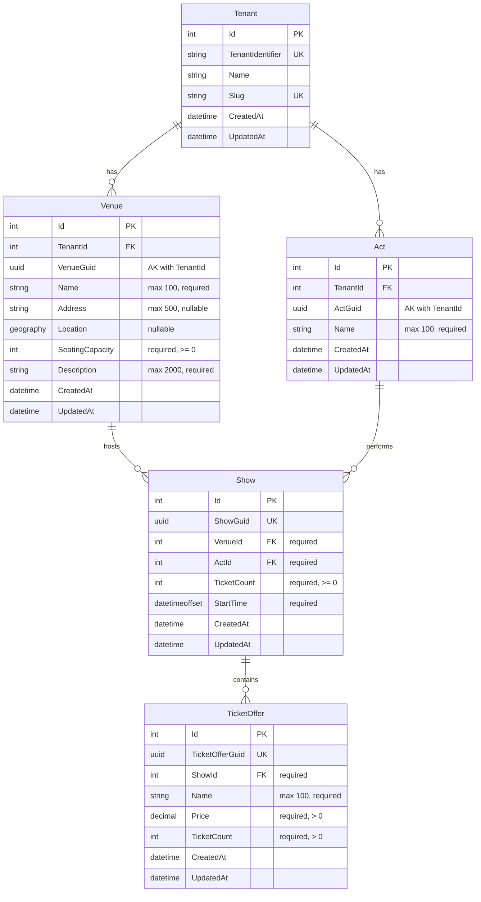

# Create Ticket Offer

**Status**: Approved
**Created**: 2026-01-03
**Author**: Claude Code (spec-writer agent)
**Related Stories**: [docs/user-stories/create-ticket-offer.md](../user-stories/create-ticket-offer.md)

## Executive Summary

This specification defines the technical implementation for creating ticket offers for shows. Ticket offers represent distinct ticket types (e.g., "General Admission", "VIP", "Early Bird") with specific pricing and inventory allocation. The implementation introduces a new [`TicketOffer`](../../src/GloboTicket.Domain/Entities/TicketOffer.cs) entity as a child entity that inherits tenant context through its relationship with [`Show`](../../src/GloboTicket.Domain/Entities/Show.cs). A critical business rule enforces that the total ticket count across all offers for a show cannot exceed the show's available capacity. The feature includes API endpoints for creating offers and listing offers by show, plus UI components integrated into the show detail page for offer creation and display.

## Requirements Reference

**User Story**: See [User Story](../user-stories/create-ticket-offer.md)

**Acceptance Criteria**: See [Acceptance Criteria](../user-stories/create-ticket-offer.md#acceptance-criteria)

This specification focuses on the technical implementation details for the requirements defined in the user story.

## Technical Analysis

### Affected Layers

- **Domain**: New [`TicketOffer`](../../src/GloboTicket.Domain/Entities/TicketOffer.cs) entity (inherits tenant context through Show relationship)
- **Application**: New `ITicketOfferService` interface, `TicketOfferDto`, `CreateTicketOfferDto` DTOs
- **Infrastructure**: New `TicketOfferService` implementation, `TicketOfferConfiguration`
- **API**: New `TicketOfferEndpoints.cs` with endpoints for offer creation and listing
- **Web**: New `TicketOfferForm` component, updates to `ShowDetailPage` to display offers and capacity information

### Multi-Tenancy Considerations

**TicketOffer as Child Entity**: The [`TicketOffer`](../../src/GloboTicket.Domain/Entities/TicketOffer.cs) entity inherits from `Entity` (not `MultiTenantEntity`) because it does NOT store `TenantId` directly. Instead, it inherits tenant context through its relationship with [`Show`](../../src/GloboTicket.Domain/Entities/Show.cs), which in turn inherits tenant context through [`Venue`](../../src/GloboTicket.Domain/Entities/Venue.cs).

**Query Filter Pattern**: Ticket offers are filtered through navigation property chain:
```
TicketOffer is filtered by: _tenantContext.CurrentTenantId == null || to.Show.Venue.TenantId == _tenantContext.CurrentTenantId
```

**Relationship Chain for Tenant Isolation**:
- TicketOffer → Show → Venue → Tenant (via Venue.TenantId)

The Venue relationship is the authoritative tenant source since Venue is required and directly contains the TenantId.

**No TenantId on TicketOffer**: The [`TicketOffer`](../../src/GloboTicket.Domain/Entities/TicketOffer.cs) entity does not have its own `TenantId` property. The `DbContext.SaveChangesAsync()` override only sets `TenantId` for `MultiTenantEntity` instances, so no special handling is needed for `TicketOffer`.

### Security Considerations

- **Authentication**: All ticket offer endpoints require authentication via `.RequireAuthorization()`
- **Tenant Isolation**: Query filters ensure users only see ticket offers from their tenant
- **Show Validation**: When creating a ticket offer, the service must verify that the Show belongs to the current tenant (enforced by query filters)
- **Rate Limiting**: Existing `RateLimitingMiddleware` applies to ticket offer endpoints

### Performance Considerations

**New Indexes Required**:
1. Index on `ShowId` for efficient ticket offer listing by show
2. Composite index on `(ShowId, CreatedAt)` for chronological ordering

**Query Optimization**:
- Capacity calculation query: `SUM(TicketCount)` aggregation on ticket offers filtered by ShowId
- Include `Show` navigation property when fetching ticket offers to avoid N+1 queries

### Business Rule: Capacity Validation

**Critical Constraint**: The sum of ticket counts across all offers for a show cannot exceed the show's total ticket count.

**Validation Logic**:
```csharp
var show = await GetShowWithOffersAsync(showGuid);
var allocatedTickets = show.TicketOffers.Sum(o => o.TicketCount);
var availableCapacity = show.TicketCount - allocatedTickets;

if (newOfferTicketCount > availableCapacity)
{
    throw new ValidationException($"Ticket count exceeds available capacity. Only {availableCapacity} tickets remain available.");
}
```

**Transaction Requirement**: Capacity validation and offer creation must occur within a single database transaction to prevent race conditions when multiple offers are created simultaneously.

## OpenAPI Specification

```yaml
openapi: 3.0.0
info:
  title: GloboTicket API - Create Ticket Offer
  version: 1.0.0

paths:
  /api/shows/{showGuid}/ticket-offers:
    get:
      summary: Get all ticket offers for a show
      description: Returns all ticket offers for the specified show, filtered by current tenant.
      tags:
        - TicketOffers
      security:
        - cookieAuth: []
      parameters:
        - name: showGuid
          in: path
          required: true
          schema:
            type: string
            format: uuid
          description: The GUID of the show
          example: "550e8400-e29b-41d4-a716-446655440000"
      responses:
        '200':
          description: List of ticket offers for the show
          content:
            application/json:
              schema:
                type: array
                items:
                  $ref: '#/components/schemas/TicketOfferResponse'
              examples:
                multipleOffers:
                  summary: Show with multiple ticket offers
                  value:
                    - id: 1
                      ticketOfferGuid: "aa0e8400-e29b-41d4-a716-446655440001"
                      showGuid: "550e8400-e29b-41d4-a716-446655440000"
                      name: "General Admission"
                      price: 50.00
                      ticketCount: 600
                      createdAt: "2026-01-03T10:00:00Z"
                      updatedAt: null
                    - id: 2
                      ticketOfferGuid: "bb0e8400-e29b-41d4-a716-446655440002"
                      showGuid: "550e8400-e29b-41d4-a716-446655440000"
                      name: "VIP"
                      price: 150.00
                      ticketCount: 200
                      createdAt: "2026-01-03T11:00:00Z"
                      updatedAt: null
                emptyList:
                  summary: Show with no ticket offers
                  value: []
        '401':
          description: Unauthorized - user not authenticated
          content:
            application/json:
              schema:
                $ref: '#/components/schemas/ErrorResponse'
              example:
                message: "Unauthorized"
        '404':
          description: Show not found (or belongs to different tenant)
          content:
            application/json:
              schema:
                $ref: '#/components/schemas/ErrorResponse'
              example:
                message: "Show with GUID 550e8400-e29b-41d4-a716-446655440000 not found"
        '429':
          description: Rate limit exceeded
          content:
            application/json:
              schema:
                $ref: '#/components/schemas/ErrorResponse'
              example:
                message: "Rate limit exceeded"

    post:
      summary: Create a new ticket offer for a show
      description: Creates a new ticket offer with specified name, price, and ticket count. Validates that ticket count does not exceed available capacity.
      tags:
        - TicketOffers
      security:
        - cookieAuth: []
      parameters:
        - name: showGuid
          in: path
          required: true
          schema:
            type: string
            format: uuid
          description: The GUID of the show
          example: "550e8400-e29b-41d4-a716-446655440000"
      requestBody:
        required: true
        content:
          application/json:
            schema:
              $ref: '#/components/schemas/CreateTicketOfferRequest'
            examples:
              generalAdmission:
                summary: General admission ticket offer
                value:
                  ticketOfferGuid: "aa0e8400-e29b-41d4-a716-446655440001"
                  name: "General Admission"
                  price: 50.00
                  ticketCount: 600
              vipOffer:
                summary: VIP ticket offer
                value:
                  ticketOfferGuid: "bb0e8400-e29b-41d4-a716-446655440002"
                  name: "VIP"
                  price: 150.00
                  ticketCount: 200
      responses:
        '201':
          description: Ticket offer created successfully
          headers:
            Location:
              description: URL of the created ticket offer
              schema:
                type: string
                example: "/api/ticket-offers/aa0e8400-e29b-41d4-a716-446655440001"
          content:
            application/json:
              schema:
                $ref: '#/components/schemas/TicketOfferResponse'
              example:
                id: 1
                ticketOfferGuid: "aa0e8400-e29b-41d4-a716-446655440001"
                showGuid: "550e8400-e29b-41d4-a716-446655440000"
                name: "General Admission"
                price: 50.00
                ticketCount: 600
                createdAt: "2026-01-03T10:00:00Z"
                updatedAt: null
        '400':
          description: Invalid request - validation failed
          content:
            application/json:
              schema:
                $ref: '#/components/schemas/ValidationErrorResponse'
              examples:
                exceedsCapacity:
                  summary: Ticket count exceeds available capacity
                  value:
                    type: "https://tools.ietf.org/html/rfc7231#section-6.5.1"
                    title: "One or more validation errors occurred."
                    status: 400
                    errors:
                      TicketCount: ["Ticket count exceeds available capacity. Only 150 tickets remain available."]
                missingName:
                  summary: Offer name is required
                  value:
                    type: "https://tools.ietf.org/html/rfc7231#section-6.5.1"
                    title: "One or more validation errors occurred."
                    status: 400
                    errors:
                      Name: ["Offer name is required"]
                invalidPrice:
                  summary: Price must be positive
                  value:
                    type: "https://tools.ietf.org/html/rfc7231#section-6.5.1"
                    title: "One or more validation errors occurred."
                    status: 400
                    errors:
                      Price: ["Price must be greater than zero"]
        '401':
          description: Unauthorized - user not authenticated
        '404':
          description: Show not found (or belongs to different tenant)
          content:
            application/json:
              schema:
                $ref: '#/components/schemas/ErrorResponse'
              example:
                message: "Show with GUID 550e8400-e29b-41d4-a716-446655440000 not found"
        '429':
          description: Rate limit exceeded

  /api/shows/{showGuid}/capacity:
    get:
      summary: Get capacity information for a show
      description: Returns the show's total ticket count, allocated tickets across all offers, and remaining available capacity.
      tags:
        - TicketOffers
      security:
        - cookieAuth: []
      parameters:
        - name: showGuid
          in: path
          required: true
          schema:
            type: string
            format: uuid
          description: The GUID of the show
          example: "550e8400-e29b-41d4-a716-446655440000"
      responses:
        '200':
          description: Capacity information
          content:
            application/json:
              schema:
                $ref: '#/components/schemas/ShowCapacityResponse'
              examples:
                partiallyAllocated:
                  summary: Show with partial capacity allocated
                  value:
                    showGuid: "550e8400-e29b-41d4-a716-446655440000"
                    totalTickets: 1000
                    allocatedTickets: 800
                    availableCapacity: 200
                fullyAllocated:
                  summary: Show at full capacity
                  value:
                    showGuid: "550e8400-e29b-41d4-a716-446655440000"
                    totalTickets: 1000
                    allocatedTickets: 1000
                    availableCapacity: 0
                noOffers:
                  summary: Show with no offers yet
                  value:
                    showGuid: "550e8400-e29b-41d4-a716-446655440000"
                    totalTickets: 1000
                    allocatedTickets: 0
                    availableCapacity: 1000
        '401':
          description: Unauthorized
        '404':
          description: Show not found

components:
  schemas:
    CreateTicketOfferRequest:
      type: object
      required:
        - ticketOfferGuid
        - name
        - price
        - ticketCount
      properties:
        ticketOfferGuid:
          type: string
          format: uuid
          description: Client-generated unique identifier for the ticket offer
          example: "aa0e8400-e29b-41d4-a716-446655440001"
        name:
          type: string
          minLength: 1
          maxLength: 100
          description: Name of the ticket offer (e.g., "General Admission", "VIP")
          example: "General Admission"
        price:
          type: number
          format: decimal
          minimum: 0.01
          description: Price per ticket in currency units (must be positive)
          example: 50.00
        ticketCount:
          type: integer
          format: int32
          minimum: 1
          description: Number of tickets allocated to this offer (must not exceed available capacity)
          example: 600

    TicketOfferResponse:
      type: object
      properties:
        id:
          type: integer
          format: int32
          description: Database-generated unique identifier
          example: 1
        ticketOfferGuid:
          type: string
          format: uuid
          description: Client-generated unique identifier
          example: "aa0e8400-e29b-41d4-a716-446655440001"
        showGuid:
          type: string
          format: uuid
          description: GUID of the associated show
          example: "550e8400-e29b-41d4-a716-446655440000"
        name:
          type: string
          description: Name of the ticket offer
          example: "General Admission"
        price:
          type: number
          format: decimal
          description: Price per ticket
          example: 50.00
        ticketCount:
          type: integer
          format: int32
          description: Number of tickets allocated to this offer
          example: 600
        createdAt:
          type: string
          format: date-time
          description: UTC timestamp when the offer was created
          example: "2026-01-03T10:00:00Z"
        updatedAt:
          type: string
          format: date-time
          nullable: true
          description: UTC timestamp when the offer was last updated
          example: null

    ShowCapacityResponse:
      type: object
      properties:
        showGuid:
          type: string
          format: uuid
          description: GUID of the show
          example: "550e8400-e29b-41d4-a716-446655440000"
        totalTickets:
          type: integer
          format: int32
          description: Total ticket count for the show
          example: 1000
        allocatedTickets:
          type: integer
          format: int32
          description: Sum of ticket counts across all offers
          example: 800
        availableCapacity:
          type: integer
          format: int32
          description: Remaining tickets available for new offers (totalTickets - allocatedTickets)
          example: 200

    ValidationErrorResponse:
      type: object
      properties:
        type:
          type: string
          example: "https://tools.ietf.org/html/rfc7231#section-6.5.1"
        title:
          type: string
          example: "One or more validation errors occurred."
        status:
          type: integer
          example: 400
        errors:
          type: object
          additionalProperties:
            type: array
            items:
              type: string

    ErrorResponse:
      type: object
      properties:
        message:
          type: string
          description: Error message
          example: "An error occurred while processing your request."

  securitySchemes:
    cookieAuth:
      type: apiKey
      in: cookie
      name: .GloboTicket.Auth
      description: Cookie-based authentication token
```

## Database Schema

### Entity-Relationship Diagram



### Table: TicketOffers

| Column | Data Type | Constraints | Description |
|--------|-----------|-------------|-------------|
| Id | int | PK, Identity | Auto-generated primary key |
| TicketOfferGuid | uniqueidentifier | UK, Required | Client-generated unique identifier |
| ShowId | int | FK, Required | Foreign key to Shows table |
| Name | nvarchar(100) | Required | Name of the ticket offer |
| Price | decimal(18,2) | Required, > 0 | Price per ticket |
| TicketCount | int | Required, > 0 | Number of tickets allocated |
| CreatedAt | datetime2 | Required | Creation timestamp (UTC) |
| UpdatedAt | datetime2 | Nullable | Last update timestamp (UTC) |

### Indexes

| Index Name | Columns | Type | Purpose |
|------------|---------|------|---------|
| PK_TicketOffers | Id | Clustered, Unique | Primary key |
| IX_TicketOffers_TicketOfferGuid | TicketOfferGuid | Unique | Fast GUID lookups, ensures global uniqueness |
| IX_TicketOffers_ShowId | ShowId | Non-clustered | Fast lookups by show, tenant filtering via Show |
| IX_TicketOffers_ShowId_CreatedAt | ShowId, CreatedAt | Non-clustered | Chronological ordering of offers per show |

### Relationships

| From | To | Type | On Delete |
|------|-----|------|-----------|
| TicketOffers.ShowId | Shows.Id | Many-to-One | Cascade |

**Note on Cascade Delete**: When a Show is deleted, associated TicketOffers are automatically deleted. This maintains referential integrity and prevents orphaned ticket offer records.

### Constraints

**Business Rule Constraint**: The sum of `TicketCount` across all `TicketOffers` for a given `ShowId` must not exceed the `TicketCount` of the associated `Show`. This is enforced at the application layer during ticket offer creation.

**Database-Level Constraints**:
- `Price` must be greater than zero (CHECK constraint)
- `TicketCount` must be greater than zero (CHECK constraint)
- `Name` cannot be empty string (CHECK constraint)

## User Interface Design

### Page Structure & Navigation

**Updated Pages**:
1. `/shows/:showId` - Show detail page (add ticket offer creation form and offers list)

**Navigation Flow**:
1. User navigates to show detail page
2. Show detail page displays existing ticket offers and capacity information
3. User fills out ticket offer creation form
4. User submits form to create new offer
5. New offer appears in the list, capacity information updates

### Component Breakdown

#### ShowDetailPage (Enhancement)

**Location**: `src/GloboTicket.Web/src/pages/shows/ShowDetailPage.tsx`

**New Features**:
- Fetch and display ticket offers for the show using `GET /api/shows/{showGuid}/ticket-offers`
- Fetch and display capacity information using `GET /api/shows/{showGuid}/capacity`
- Add ticket offer creation form section
- Display list of existing ticket offers

**API Integration**:
- Ticket offers query key: `['shows', showGuid, 'ticket-offers']`
- Capacity query key: `['shows', showGuid, 'capacity']`
- Endpoints: `GET /api/shows/{showGuid}/ticket-offers`, `GET /api/shows/{showGuid}/capacity`

**Layout Structure**:
```
ShowDetailPage
├── Stack (gap="xl")
│   ├── Button (Back to Acts)
│   ├── Page Header Section
│   │   ├── Icon Container (Calendar icon)
│   │   ├── Show Title (Act name at Venue name)
│   │   └── Subtitle (Start date/time)
│   ├── Card (Show Information)
│   │   └── Stack (gap="md")
│   │       ├── Act Name field
│   │       ├── Venue Name field
│   │       ├── Start Date field
│   │       ├── Start Time field
│   │       ├── Tickets Available field
│   │       ├── Created field
│   │       └── Last Updated field (if exists)
│   ├── Card (Capacity Information) [NEW]
│   │   └── Stack (gap="sm")
│   │       ├── Total Tickets display
│   │       ├── Allocated Tickets display
│   │       ├── Available Capacity display (highlighted)
│   │       └── Capacity bar visualization
│   ├── Card (Create Ticket Offer) [NEW]
│   │   └── TicketOfferForm component
│   └── Card (Ticket Offers) [NEW]
│       └── Stack (gap="md")
│           ├── Heading ("Ticket Offers")
│           └── TicketOffersList component
```

#### TicketOfferForm (New)

**Location**: `src/GloboTicket.Web/src/components/organisms/TicketOfferForm.tsx`

**Purpose**: Form component for creating ticket offers with capacity validation.

**Props**:
- `showGuid: string` - GUID of the show to create offer for
- `availableCapacity: number` - Remaining capacity for validation
- `onSuccess?: (offer: TicketOffer) => void` - Callback on successful submission
- `onCancel?: () => void` - Callback on cancel

**State**:
- `name: string` - Offer name input
- `price: string` - Price input (as string for controlled input)
- `ticketCount: string` - Ticket count input (as string for controlled input)
- `error: string | null` - General error message
- `fieldErrors: Record<string, string>` - Per-field validation errors
- `isLoading: boolean` - Loading state during submission

**Validation Rules** (single source of truth for client-side validation):

| Field | Rule | Error Message |
|-------|------|---------------|
| Name | Required | "Offer name is required" |
| Name | Max 100 characters | "Offer name cannot exceed 100 characters" |
| Price | Required | "Price is required" |
| Price | Must be positive number | "Price must be greater than zero" |
| Price | Valid decimal format | "Please enter a valid price" |
| Ticket Count | Required | "Ticket count is required" |
| Ticket Count | Must be positive integer | "Ticket count must be a positive number" |
| Ticket Count | Must be <= available capacity | "Ticket count exceeds available capacity. Only {availableCapacity} tickets remain available." |

**Form Fields**:

1. **Offer Name** (text input)
   - Label: "Offer Name *"
   - Placeholder: "e.g., General Admission, VIP, Early Bird"
   - maxLength: 100
   - Required

2. **Price** (number input)
   - Label: "Price per Ticket *"
   - Placeholder: "0.00"
   - Currency symbol: "$" (prefix)
   - step: 0.01
   - min: 0.01
   - Required

3. **Ticket Count** (number input)
   - Label: "Number of Tickets *"
   - Placeholder: "Enter ticket count"
   - min: 1
   - max: dynamically set to available capacity
   - Helper text: "Available capacity: {availableCapacity} tickets"
   - Required

**Buttons**:
- **Create Offer** (primary): Submits the form
- **Cancel** (secondary): Clears the form

**API Integration**:
- Create offer: `POST /api/shows/{showGuid}/ticket-offers`
- On success: Invalidate queries `['shows', showGuid, 'ticket-offers']` and `['shows', showGuid, 'capacity']`

#### TicketOffersList (New)

**Location**: `src/GloboTicket.Web/src/components/organisms/TicketOffersList.tsx`

**Purpose**: Display list of ticket offers for a show.

**Props**:
- `offers: TicketOffer[]` - Array of ticket offers to display
- `isLoading: boolean` - Loading state
- `error: string | null` - Error message if fetch fails

**Display Format**:
- Each offer displayed as a card or list item
- Shows: Offer name, price (formatted as currency), ticket count
- Sorted by creation date (oldest first)
- Empty state: "No ticket offers have been created yet."

#### CapacityDisplay (New)

**Location**: `src/GloboTicket.Web/src/components/molecules/CapacityDisplay.tsx`

**Purpose**: Visual display of show capacity allocation.

**Props**:
- `totalTickets: number` - Total ticket count for the show
- `allocatedTickets: number` - Sum of tickets across all offers
- `availableCapacity: number` - Remaining capacity

**Display Elements**:
- Total tickets (label + value)
- Allocated tickets (label + value)
- Available capacity (label + value, highlighted)
- Progress bar showing allocation percentage
- Warning indicator when capacity is low (< 10%)
- Success indicator when capacity is fully allocated

### Interaction Flows

#### Create Ticket Offer Flow

```
1. User views ShowDetailPage
   |
2. ShowDetailPage fetches:
   a. Show details
   b. Ticket offers list
   c. Capacity information
   |
3. User sees capacity information:
   - Total tickets: 1000
   - Allocated: 600
   - Available: 400
   |
4. User fills out TicketOfferForm:
   a. Enter name: "VIP"
   b. Enter price: "150.00"
   c. Enter ticket count: "200"
   |
5. Client-side validation:
   |-- Name valid? --> Continue
   |-- Price valid? --> Continue
   |-- Ticket count <= 400? --> Continue
   |
6. User clicks "Create Offer"
   |
7. Form submits:
   a. Set isLoading = true
   b. POST /api/shows/{showGuid}/ticket-offers
   |
8. API Response:
   |-- 201 Created:
   |   |-- Invalidate ticket offers query
   |   |-- Invalidate capacity query
   |   |-- Show success message
   |   |-- Clear form
   |   |-- New offer appears in list
   |   |-- Capacity updates: Available now 200
   |
   |-- 400 Bad Request (capacity exceeded):
   |   |-- Display error: "Ticket count exceeds available capacity. Only 150 tickets remain available."
   |   |-- Keep form data for correction
   |
   +-- 404 Not Found:
       |-- Display error: "Show not found"
```

#### Capacity Exceeded Flow

```
1. User attempts to create offer with 300 tickets
   |
2. Available capacity is only 200 tickets
   |
3. Client-side validation catches:
   |-- Display error: "Ticket count exceeds available capacity. Only 200 tickets remain available."
   |-- Prevent form submission
   |
4. User corrects ticket count to 200
   |
5. Form submits successfully
```

#### Concurrent Offer Creation Flow

```
1. User A loads form: Available capacity = 400
   |
2. User B loads form: Available capacity = 400
   |
3. User A creates offer with 300 tickets
   |-- Server validates: 400 available, 300 requested --> OK
   |-- Offer created, capacity now 100
   |
4. User B submits offer with 200 tickets
   |-- Server validates: 100 available, 200 requested --> FAIL
   |-- Returns 400: "Ticket count exceeds available capacity. Only 100 tickets remain available."
   |
5. User B sees error message
   |-- Capacity display refreshes automatically
   |-- Shows updated available capacity: 100
   |-- User corrects ticket count to 100
   |-- Resubmits successfully
```

### Accessibility Requirements

- All form inputs have associated `<label>` elements with `htmlFor` attribute
- Required fields marked with asterisk (*) in label text
- Capacity information announced to screen readers when it changes
- Error messages announced via ARIA live regions
- Form inputs support keyboard navigation (Tab/Shift+Tab)
- Disabled state on submit button communicated via `aria-disabled`
- Loading states have appropriate ARIA labels
- Capacity progress bar has `role="progressbar"` with `aria-valuenow`, `aria-valuemin`, `aria-valuemax`
- Empty state for offers list announced to screen readers

### Responsive Behavior

- **Desktop (>1024px)**: Two-column layout for form fields; capacity display inline
- **Tablet (768-1024px)**: Same as desktop
- **Mobile (<768px)**: Single column, stacked layout; capacity display below form

## Testing Requirements

### Unit Test Scenarios

#### Domain Layer (TicketOfferTests)

- [ ] GivenNewTicketOffer_WhenCreated_ThenTicketOfferGuidDefaultsToEmptyGuid
- [ ] GivenNewTicketOffer_WhenCreated_ThenNameDefaultsToEmptyString
- [ ] GivenNewTicketOffer_WhenCreated_ThenPriceDefaultsToZero
- [ ] GivenNewTicketOffer_WhenCreated_ThenTicketCountDefaultsToZero
- [ ] GivenTicketOffer_WhenChecked_ThenInheritsFromEntity
- [ ] GivenTicketOffer_WhenChecked_ThenDoesNotInheritFromMultiTenantEntity
- [ ] GivenTicketOffer_WhenChecked_ThenHasShowNavigationProperty

#### Application Layer (CreateTicketOfferDtoTests)

- [ ] GivenCreateTicketOfferDto_WhenTicketOfferGuidIsEmpty_ThenValidationFails (validates AC: Ticket offer has unique identifier)
- [ ] GivenCreateTicketOfferDto_WhenNameIsEmpty_ThenValidationFails (validates AC: Offer name is required)
- [ ] GivenCreateTicketOfferDto_WhenNameExceedsMaxLength_ThenValidationFails (validates AC: Offer name max 100 characters)
- [ ] GivenCreateTicketOfferDto_WhenPriceIsZero_ThenValidationFails (validates AC: Price must be greater than zero)
- [ ] GivenCreateTicketOfferDto_WhenPriceIsNegative_ThenValidationFails (validates AC: Price must be positive)
- [ ] GivenCreateTicketOfferDto_WhenTicketCountIsZero_ThenValidationFails (validates AC: Ticket count must be greater than zero)
- [ ] GivenCreateTicketOfferDto_WhenTicketCountIsNegative_ThenValidationFails (validates AC: Ticket count must be positive)
- [ ] GivenCreateTicketOfferDto_WhenAllFieldsValid_ThenValidationPasses

### Integration Test Scenarios

#### TicketOfferService Integration Tests

- [ ] CreateTicketOffer_WithValidData_CreatesOfferInDatabase (validates AC: Ticket offers can be created)
- [ ] CreateTicketOffer_SetsCreatedAtTimestamp (validates AC: CreatedAt timestamp is set)
- [ ] CreateTicketOffer_AssociatesWithCorrectShow (validates AC: Each offer is associated with exactly one show)
- [ ] CreateTicketOffer_WithTicketCountExceedingCapacity_ThrowsValidationException (validates AC: Ticket count must not exceed available capacity)
- [ ] CreateTicketOffer_WithExactRemainingCapacity_CreatesSuccessfully (validates AC: Can use all remaining capacity)
- [ ] CreateTicketOffer_WithNonExistentShow_ThrowsNotFoundException
- [ ] CreateTicketOffer_StoresPriceWithTwoDecimalPlaces (validates AC: Price stored with two decimal places)
- [ ] GetTicketOffersByShowGuid_ReturnsOffersForShow (validates AC: Show page displays all ticket offers)
- [ ] GetTicketOffersByShowGuid_ReturnsEmptyListWhenNoOffers
- [ ] GetTicketOffersByShowGuid_SortsByCreatedDate
- [ ] GetShowCapacity_CalculatesCorrectAllocatedTickets (validates AC: System calculates total tickets allocated)
- [ ] GetShowCapacity_CalculatesCorrectAvailableCapacity (validates AC: System calculates remaining available capacity)
- [ ] GetShowCapacity_WithNoOffers_ReturnsFullCapacity

#### Multi-Tenancy Integration Tests

- [ ] CreateTicketOffer_ShowFromDifferentTenant_FailsNotFound (validates AC: Users can only create offers for shows in their tenant)
- [ ] GetTicketOffersByShowGuid_ReturnsOnlyCurrentTenantOffers (validates AC: Offers list only displays offers for current show within user's tenant)
- [ ] GetTicketOffersByShowGuid_ShowFromDifferentTenant_FailsNotFound

#### API Endpoint Integration Tests

- [ ] PostTicketOffer_WithValidData_Returns201Created (validates AC: Successfully created offers appear in the list)
- [ ] PostTicketOffer_WithValidData_ReturnsOfferInBody
- [ ] PostTicketOffer_WithValidData_SetsLocationHeader
- [ ] PostTicketOffer_WithMissingName_Returns400BadRequest (validates AC: Offer name is required)
- [ ] PostTicketOffer_WithEmptyName_Returns400BadRequest (validates AC: Offer name cannot be empty)
- [ ] PostTicketOffer_WithNameTooLong_Returns400BadRequest (validates AC: Offer name max 100 characters)
- [ ] PostTicketOffer_WithZeroPrice_Returns400BadRequest (validates AC: Price must be greater than zero)
- [ ] PostTicketOffer_WithNegativePrice_Returns400BadRequest (validates AC: Price must be positive)
- [ ] PostTicketOffer_WithZeroTicketCount_Returns400BadRequest (validates AC: Ticket count must be greater than zero)
- [ ] PostTicketOffer_WithNegativeTicketCount_Returns400BadRequest (validates AC: Ticket count must be positive)
- [ ] PostTicketOffer_WithTicketCountExceedingCapacity_Returns400BadRequest (validates AC: Validation error displays when capacity exceeded)
- [ ] PostTicketOffer_WithTicketCountExceedingCapacity_ReturnsSpecificErrorMessage (validates AC: Error message shows remaining capacity)
- [ ] PostTicketOffer_WithoutAuthentication_Returns401Unauthorized (validates AC: Only authenticated users can create offers)
- [ ] PostTicketOffer_WithNonExistentShow_Returns404NotFound
- [ ] GetTicketOffers_WithValidShowGuid_Returns200Ok
- [ ] GetTicketOffers_WithValidShowGuid_ReturnsOffersList (validates AC: Show page displays all ticket offers)
- [ ] GetTicketOffers_WithNonExistentShow_Returns404NotFound
- [ ] GetShowCapacity_WithValidShowGuid_Returns200Ok
- [ ] GetShowCapacity_WithValidShowGuid_ReturnsCapacityInfo (validates AC: Show page displays capacity information)

### Frontend Test Scenarios (E2E)

#### TicketOfferForm Component Tests

- [ ] GivenTicketOfferForm_WhenRendered_ThenDisplaysNameField (validates AC: Form provides clear labels)
- [ ] GivenTicketOfferForm_WhenRendered_ThenDisplaysPriceField (validates AC: Price field includes currency symbol)
- [ ] GivenTicketOfferForm_WhenRendered_ThenDisplaysTicketCountField
- [ ] GivenTicketOfferForm_WhenRendered_ThenDisplaysAvailableCapacity (validates AC: Available capacity is displayed)
- [ ] GivenTicketOfferForm_WhenNameEmpty_ThenShowsValidationError (validates AC: Validation errors displayed inline)
- [ ] GivenTicketOfferForm_WhenPriceZero_ThenShowsValidationError (validates AC: Price must be greater than zero)
- [ ] GivenTicketOfferForm_WhenTicketCountExceedsCapacity_ThenShowsValidationError (validates AC: Client-side validation prevents exceeding capacity)
- [ ] GivenTicketOfferForm_WhenValidationErrors_ThenSubmitPrevented (validates AC: Form submission prevented when validation errors exist)
- [ ] GivenTicketOfferForm_WhenSubmitSucceeds_ThenClearsForm (validates AC: Form clears after successful creation)
- [ ] GivenTicketOfferForm_WhenSubmitSucceeds_ThenShowsConfirmation (validates AC: Confirmation message displayed)
- [ ] GivenTicketOfferForm_WhenSubmitFails_ThenRetainsData (validates AC: Form data retained on error)
- [ ] GivenTicketOfferForm_WhenCancelClicked_ThenClearsForm (validates AC: Cancel action available)

#### ShowDetailPage Tests

- [ ] GivenShowDetailPage_WhenOffersExist_ThenDisplaysOffersList (validates AC: Show page displays all ticket offers)
- [ ] GivenShowDetailPage_WhenOffersExist_ThenDisplaysOfferDetails (validates AC: Each offer shows name, price, ticket count)
- [ ] GivenShowDetailPage_WhenNoOffers_ThenDisplaysEmptyMessage
- [ ] GivenShowDetailPage_WhenRendered_ThenDisplaysCapacityInfo (validates AC: Show page displays capacity information)
- [ ] GivenShowDetailPage_WhenRendered_ThenDisplaysTotalTickets (validates AC: Total ticket count displayed)
- [ ] GivenShowDetailPage_WhenRendered_ThenDisplaysAllocatedTickets (validates AC: Total allocated tickets displayed)
- [ ] GivenShowDetailPage_WhenRendered_ThenDisplaysAvailableCapacity (validates AC: Remaining capacity displayed)
- [ ] GivenShowDetailPage_WhenOfferCreated_ThenListUpdates (validates AC: New offers appear in list)
- [ ] GivenShowDetailPage_WhenOfferCreated_ThenCapacityUpdates (validates AC: Capacity information updates immediately)
- [ ] GivenShowDetailPage_WhenCapacityZero_ThenShowsFullyAllocatedIndicator (validates AC: Clear indicator when capacity reaches zero)

#### End-to-End Create Flow Tests

- [ ] GivenUserOnShowPage_WhenCreateFirstOffer_ThenOfferAppearsInList (validates AC: Successfully created offers appear in list)
- [ ] GivenUserOnShowPage_WhenCreateMultipleOffers_ThenAllAppearInList (validates AC: Multiple offers can be created)
- [ ] GivenUserOnShowPage_WhenCreateOfferExceedingCapacity_ThenShowsError (validates AC: Validation error when capacity exceeded)
- [ ] GivenUserOnShowPage_WhenCreateOfferWithExactCapacity_ThenSucceeds (validates AC: Can use all remaining capacity)
- [ ] GivenUserOnShowPage_WhenCapacityFull_ThenCannotCreateMore (validates AC: Cannot exceed capacity)

#### Accessibility Tests

- [ ] GivenTicketOfferForm_WhenRendered_ThenAllFieldsHaveLabels
- [ ] GivenTicketOfferForm_WhenRendered_ThenRequiredFieldsMarked (validates AC: Required fields visually indicated)
- [ ] GivenTicketOfferForm_WhenError_ThenErrorAnnounced
- [ ] GivenTicketOfferForm_WhenRendered_ThenSupportsKeyboardNavigation
- [ ] GivenCapacityDisplay_WhenRendered_ThenProgressBarAccessible

## Implementation Notes

### Capacity Validation Strategy

**Server-Side Validation** (authoritative):
1. Fetch show with all ticket offers within a transaction
2. Calculate allocated tickets: `SUM(TicketOffer.TicketCount)`
3. Calculate available capacity: `Show.TicketCount - allocatedTickets`
4. Compare new offer ticket count against available capacity
5. If exceeded, return 400 with specific error message including remaining capacity

**Transaction Isolation**: Use a database transaction to ensure capacity validation and offer creation are atomic. This prevents race conditions when multiple offers are created simultaneously.

```csharp
using var transaction = await _dbContext.Database.BeginTransactionAsync(cancellationToken);
try
{
    var show = await _dbContext.Shows
        .Include(s => s.TicketOffers)
        .FirstOrDefaultAsync(s => s.ShowGuid == showGuid, cancellationToken);
    
    var allocatedTickets = show.TicketOffers.Sum(o => o.TicketCount);
    var availableCapacity = show.TicketCount - allocatedTickets;
    
    if (dto.TicketCount > availableCapacity)
    {
        throw new ValidationException($"Ticket count exceeds available capacity. Only {availableCapacity} tickets remain available.");
    }
    
    var ticketOffer = new TicketOffer { /* ... */ };
    _dbContext.TicketOffers.Add(ticketOffer);
    await _dbContext.SaveChangesAsync(cancellationToken);
    await transaction.CommitAsync(cancellationToken);
}
catch
{
    await transaction.RollbackAsync(cancellationToken);
    throw;
}
```

### Price Storage

**Decimal Precision**: Store price as `decimal(18,2)` to ensure two decimal places for currency values.

**Validation**: Ensure price is greater than zero at both client and server levels.

### Entity Configuration Notes

**TicketOffer Entity Configuration Order**:
1. Table name (`ToTable`)
2. Primary key configuration
3. Index on TicketOfferGuid (unique)
4. Index on ShowId
5. Composite index on (ShowId, CreatedAt)
6. Property configurations (Name, Price, TicketCount)
7. Foreign key relationship (ShowId)
8. Timestamp properties

**Note**: TicketOffer does NOT have a composite alternate key with TenantId because it doesn't store TenantId directly. The TicketOfferGuid is globally unique.

### Frontend TypeScript Types

New types to add to `src/GloboTicket.Web/src/types/ticketOffer.ts`:

```typescript
export interface TicketOffer {
  id: number;
  ticketOfferGuid: string;
  showGuid: string;
  name: string;
  price: number;
  ticketCount: number;
  createdAt: string;
  updatedAt?: string;
}

export interface CreateTicketOfferDto {
  ticketOfferGuid: string;
  name: string;
  price: number;
  ticketCount: number;
}

export interface ShowCapacity {
  showGuid: string;
  totalTickets: number;
  allocatedTickets: number;
  availableCapacity: number;
}
```

### API Client Functions

Add to `src/GloboTicket.Web/src/api/client.ts`:

```typescript
/**
 * Get all ticket offers for a show
 */
export async function getTicketOffers(showGuid: string): Promise<TicketOffer[]> {
  const response = await fetch(`${API_BASE_URL}/api/shows/${showGuid}/ticket-offers`, {
    method: 'GET',
    credentials: 'include',
  });
  return handleResponse<TicketOffer[]>(response);
}

/**
 * Create a new ticket offer for a show
 */
export async function createTicketOffer(showGuid: string, dto: CreateTicketOfferDto): Promise<TicketOffer> {
  const response = await fetch(`${API_BASE_URL}/api/shows/${showGuid}/ticket-offers`, {
    method: 'POST',
    headers: { 'Content-Type': 'application/json' },
    credentials: 'include',
    body: JSON.stringify(dto),
  });
  return handleResponse<TicketOffer>(response);
}

/**
 * Get capacity information for a show
 */
export async function getShowCapacity(showGuid: string): Promise<ShowCapacity> {
  const response = await fetch(`${API_BASE_URL}/api/shows/${showGuid}/capacity`, {
    method: 'GET',
    credentials: 'include',
  });
  return handleResponse<ShowCapacity>(response);
}
```

### Tanstack Query Integration

**Query Keys**:
- Ticket offers: `['shows', showGuid, 'ticket-offers']`
- Capacity: `['shows', showGuid, 'capacity']`

**Invalidation Strategy**:
- After creating a ticket offer, invalidate both `ticket-offers` and `capacity` queries
- This ensures the UI updates with the new offer and updated capacity information

### Error Handling Strategy

**API Error Responses**:
- 400 Bad Request: Validation failed → Display specific field errors inline
- 401 Unauthorized: User not authenticated → Redirect to login
- 404 Not Found: Show not found or cross-tenant access → Display "Show not found" error
- 429 Rate Limit: Too many requests → Display "Please try again later" error
- 500 Server Error: Internal error → Display "Failed to create ticket offer" error

**Frontend Error Display**:
- Use consistent error display patterns (same as other forms)
- Provide clear error messages
- Retain form data on error for correction
- Log errors to console for debugging

### Implementation Priority

**Phase 1: Backend Foundation**
1. Create `TicketOffer` entity
2. Create `TicketOfferConfiguration`
3. Add migration for TicketOffers table
4. Create `ITicketOfferService` interface
5. Implement `TicketOfferService` with capacity validation
6. Create DTOs (`TicketOfferDto`, `CreateTicketOfferDto`, `ShowCapacityDto`)

**Phase 2: API Layer**
1. Create `TicketOfferEndpoints.cs`
2. Implement `POST /api/shows/{showGuid}/ticket-offers`
3. Implement `GET /api/shows/{showGuid}/ticket-offers`
4. Implement `GET /api/shows/{showGuid}/capacity`
5. Add endpoint registration in `Program.cs`

**Phase 3: Frontend Components**
1. Create TypeScript types
2. Add API client functions
3. Create `CapacityDisplay` component
4. Create `TicketOffersList` component
5. Create `TicketOfferForm` component
6. Update `ShowDetailPage` to integrate new components

**Phase 4: Testing & Polish**
1. Write unit tests for domain and application layers
2. Write integration tests for service and API layers
3. Write E2E tests for UI components
4. Verify multi-tenancy isolation
5. Test concurrent offer creation scenarios
6. Implement accessibility features
7. Add loading and error states

### Existing Implementation Status

**Backend**: Not implemented
- `TicketOffer` entity does not exist
- `ITicketOfferService` does not exist
- `TicketOfferService` does not exist
- Ticket offer endpoints do not exist

**Frontend**: Not implemented
- `TicketOffer` type definition does not exist
- Ticket offer API client functions do not exist
- `TicketOfferForm` component does not exist
- `TicketOffersList` component does not exist
- `CapacityDisplay` component does not exist
- Show detail page does not display ticket offers

This specification documents the requirements and serves as a reference for:
1. Full-stack implementation of the create ticket offer feature
2. Test coverage verification
3. Future maintenance and modifications
