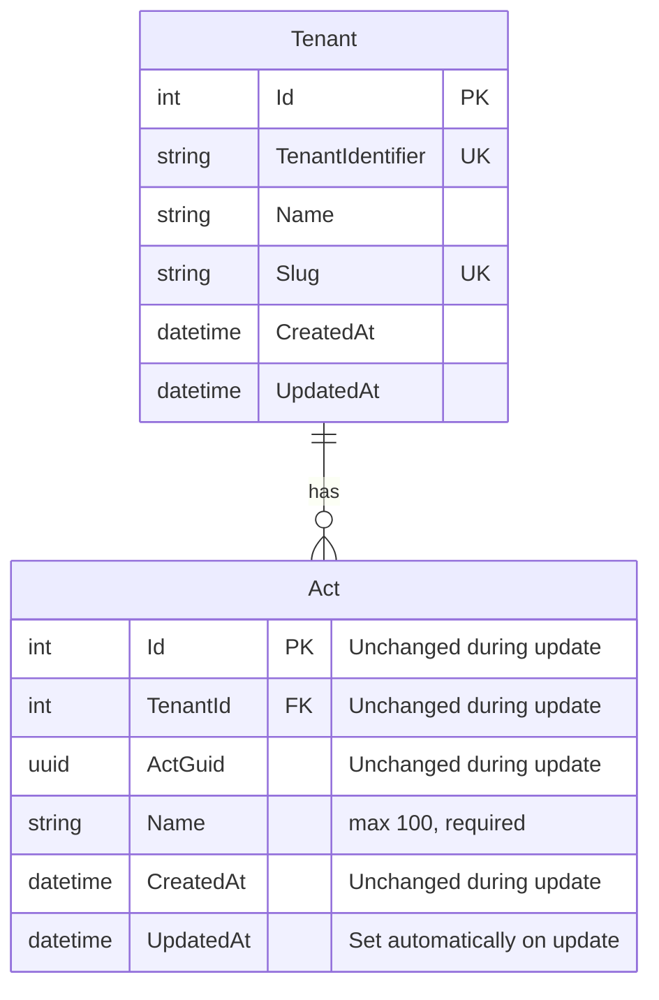

# Edit Act

**Status**: Draft
**Created**: 2025-12-26
**Author**: Claude Code (spec-writer agent)
**Related Stories**: [docs/user-stories/edit-act.md](../user-stories/edit-act.md)

## Executive Summary

This specification defines the technical implementation approach for the Edit Act feature, enabling authorized users to modify existing act records. The implementation leverages the existing `Act` multi-tenant entity, `UpdateActDto`, and EF Core query filters for tenant isolation. The feature provides a pre-populated form interface for updating the act name while preserving data integrity through automatic timestamp tracking.

## Requirements Reference

**User Story**: See [User Story](../user-stories/edit-act.md)

**Acceptance Criteria**: See [Acceptance Criteria](../user-stories/edit-act.md#acceptance-criteria)

This specification focuses on the technical implementation details for the requirements defined in the user story.

## Technical Analysis

### Affected Layers

- **Domain**: `Act` entity (existing, inherits from `MultiTenantEntity`)
- **Application**: `IActService` interface, `UpdateActDto`, `ActDto` (existing)
- **Infrastructure**: `ActService.UpdateAsync()` implementation (existing)
- **API**: `PUT /api/acts/{guid}` endpoint (existing in `ActEndpoints.cs`)
- **Web**: `EditActPage`, `ActForm`, `ActDetailPage` components (existing)

### Multi-Tenancy Considerations

The `Act` entity inherits from `MultiTenantEntity`, which provides:
- `TenantId` property for tenant isolation
- `Tenant` navigation property

**Query Filter**: Applied in `GloboTicketDbContext.OnModelCreating()`:
```
Act is filtered by: _tenantContext.CurrentTenantId == null || a.TenantId == _tenantContext.CurrentTenantId
```

**Update Behavior**:
- The query filter ensures only acts within the current tenant are returned by `GetByGuidAsync()`
- Attempting to edit an act from another tenant results in a 404 Not Found response
- The `TenantId` property is never modified during updates (preserves tenant association)

**Automatic UpdatedAt Assignment**: When `SaveChangesAsync` is called for modified `Entity` instances, the `UpdatedAt` timestamp is automatically set.

### Security Considerations

- **Authentication**: All act endpoints require authentication via `.RequireAuthorization()`
- **Cookie-Based Auth**: Uses `.GloboTicket.Auth` cookie with secure, HTTP-only, SameSite=Strict settings
- **Tenant Context**: `TenantResolutionMiddleware` sets tenant from authenticated user claims
- **Tenant Isolation**: Query filters prevent cross-tenant data access
- **Rate Limiting**: `RateLimitingMiddleware` prevents abuse (note: in-memory, single-server limitation)

### Performance Considerations

**Existing Indexes**:
- Primary key on `Id`
- Index on `ActGuid` for GUID-based lookups
- Composite alternate key on `(TenantId, ActGuid)`

**No Additional Indexes Required**: The existing indexes are sufficient for the update act operation.

## OpenAPI Specification

```yaml
openapi: 3.0.0
info:
  title: GloboTicket API - Edit Act
  version: 1.0.0

paths:
  /api/acts/{guid}:
    get:
      summary: Get act by GUID
      description: Retrieves an act by its unique GUID identifier. Required to pre-populate the edit form.
      tags:
        - Acts
      security:
        - cookieAuth: []
      parameters:
        - name: guid
          in: path
          required: true
          schema:
            type: string
            format: uuid
          description: The act's unique GUID identifier
          example: "550e8400-e29b-41d4-a716-446655440000"
      responses:
        '200':
          description: Act found
          content:
            application/json:
              schema:
                $ref: '#/components/schemas/ActResponse'
        '401':
          description: Unauthorized - user not authenticated
          content:
            application/json:
              schema:
                $ref: '#/components/schemas/ErrorResponse'
        '404':
          description: Act not found (or belongs to different tenant)
          content:
            application/json:
              schema:
                $ref: '#/components/schemas/ErrorResponse'
              example:
                message: "Act with GUID 550e8400-e29b-41d4-a716-446655440000 not found"
        '429':
          description: Rate limit exceeded
          content:
            application/json:
              schema:
                $ref: '#/components/schemas/ErrorResponse'

    put:
      summary: Update an existing act
      description: Updates an existing act in the current tenant's context. Only acts belonging to the authenticated user's tenant can be updated.
      tags:
        - Acts
      security:
        - cookieAuth: []
      parameters:
        - name: guid
          in: path
          required: true
          schema:
            type: string
            format: uuid
          description: The act's unique GUID identifier
          example: "550e8400-e29b-41d4-a716-446655440000"
      requestBody:
        required: true
        content:
          application/json:
            schema:
              $ref: '#/components/schemas/UpdateActRequest'
            examples:
              updateName:
                summary: Update act name
                value:
                  name: "The Rolling Stones - World Tour"
              correctTypo:
                summary: Correct a typo in act name
                value:
                  name: "Coldplay"
      responses:
        '200':
          description: Act updated successfully
          content:
            application/json:
              schema:
                $ref: '#/components/schemas/ActResponse'
        '400':
          description: Invalid request - validation failed
          content:
            application/json:
              schema:
                $ref: '#/components/schemas/ValidationErrorResponse'
              examples:
                missingName:
                  summary: Missing required field
                  value:
                    type: "https://tools.ietf.org/html/rfc7231#section-6.5.1"
                    title: "One or more validation errors occurred."
                    status: 400
                    errors:
                      Name: ["The Name field is required."]
                nameTooLong:
                  summary: Name exceeds maximum length
                  value:
                    type: "https://tools.ietf.org/html/rfc7231#section-6.5.1"
                    title: "One or more validation errors occurred."
                    status: 400
                    errors:
                      Name: ["The field Name must be a string with a maximum length of 100."]
        '401':
          description: Unauthorized - user not authenticated
          content:
            application/json:
              schema:
                $ref: '#/components/schemas/ErrorResponse'
        '404':
          description: Act not found (or belongs to different tenant)
          content:
            application/json:
              schema:
                $ref: '#/components/schemas/ErrorResponse'
              example:
                message: "Act with GUID 550e8400-e29b-41d4-a716-446655440000 not found"
        '429':
          description: Rate limit exceeded
          content:
            application/json:
              schema:
                $ref: '#/components/schemas/ErrorResponse'
        '500':
          description: Internal server error
          content:
            application/json:
              schema:
                $ref: '#/components/schemas/ErrorResponse'

components:
  schemas:
    UpdateActRequest:
      type: object
      required:
        - name
      properties:
        name:
          type: string
          minLength: 1
          maxLength: 100
          description: Name of the performing act (trimmed of leading/trailing whitespace)
          example: "The Rolling Stones"

    ActResponse:
      type: object
      properties:
        id:
          type: integer
          format: int32
          description: Database-generated unique identifier (unchanged during update)
          example: 1
        actGuid:
          type: string
          format: uuid
          description: Client-generated unique identifier (unchanged during update)
          example: "550e8400-e29b-41d4-a716-446655440000"
        name:
          type: string
          description: Name of the act
          example: "The Rolling Stones"
        createdAt:
          type: string
          format: date-time
          description: UTC timestamp when the act was created (unchanged during update)
          example: "2025-12-26T10:30:00Z"
        updatedAt:
          type: string
          format: date-time
          nullable: true
          description: UTC timestamp when the act was last updated (set automatically)
          example: "2025-12-26T14:45:00Z"

    ValidationErrorResponse:
      type: object
      properties:
        type:
          type: string
          example: "https://tools.ietf.org/html/rfc7231#section-6.5.1"
        title:
          type: string
          example: "One or more validation errors occurred."
        status:
          type: integer
          example: 400
        errors:
          type: object
          additionalProperties:
            type: array
            items:
              type: string

    ErrorResponse:
      type: object
      properties:
        message:
          type: string
          description: Error message
          example: "An error occurred while processing your request."

  securitySchemes:
    cookieAuth:
      type: apiKey
      in: cookie
      name: .GloboTicket.Auth
      description: Cookie-based authentication token
```

## Database Schema

### Entity-Relationship Diagram



### Table: Acts (Update Behavior)

| Column | Update Behavior | Description |
|--------|-----------------|-------------|
| Id | Never modified | Primary key remains constant |
| TenantId | Never modified | Tenant association preserved |
| ActGuid | Never modified | Client identifier preserved |
| Name | Updated from request | Required, max 100 chars |
| CreatedAt | Never modified | Original creation timestamp preserved |
| UpdatedAt | Auto-set on save | Set by DbContext.SaveChangesAsync |

### Indexes

Existing indexes remain unchanged. See [Add Act specification](./add-act.md#indexes) for index details.

## User Interface Design

### Page Structure & Navigation

**Pages**:
1. `/acts/:id` - Act detail page (entry point for edit)
2. `/acts/:id/edit` - Edit act page

**Navigation Flow**:
1. User navigates to `/acts/:id` (Act detail page)
2. User clicks "Edit" button
3. User is navigated to `/acts/:id/edit` (Edit Act page)
4. On successful update, user is redirected to `/acts`
5. On cancel, user is returned to `/acts`

### Component Breakdown

#### ActDetailPage

**Location**: `src/GloboTicket.Web/src/pages/acts/ActDetailPage.tsx`

**Purpose**: Displays act information and provides access to edit functionality.

**Edit Button Behavior**:
- Renders "Edit" button with pencil icon
- On click, navigates to `/acts/:id/edit`
- Button uses `variant="secondary"`

#### EditActPage

**Location**: `src/GloboTicket.Web/src/pages/acts/EditActPage.tsx`

**Purpose**: Container page for act editing, handling data fetching and navigation.

**State Management**:
- `act: Act | null` - Loaded act data
- `isLoading: boolean` - Loading state during fetch
- `error: string | null` - Error message if fetch fails

**Data Fetching**:
- Uses `useParams()` to get act GUID from URL
- Calls `getAct(id)` on mount to fetch current act data
- Displays loading spinner while fetching
- Displays error message if act not found or fetch fails

**Child Components**:
- `PageHeader`: Displays "Edit Act" title and description
- `Card`: Container for the form
- `ActForm`: Pre-populated form component (receives `act` prop)
- `Spinner`: Loading indicator during fetch

**Navigation Handlers**:
- `handleSuccess`: Navigate to `/acts` on successful update
- `handleCancel`: Navigate to `/acts` on cancel

**Error States**:
- Loading: Displays centered spinner
- Not found: Displays "Act not found" error in card
- Fetch error: Displays error message in card

#### ActForm (Edit Mode)

**Location**: `src/GloboTicket.Web/src/components/organisms/ActForm.tsx`

**Purpose**: Reusable form component supporting both create and edit operations.

**Props**:
- `act?: Act` - When provided, form operates in edit mode
- `onSuccess?: (act: Act) => void` - Callback on successful submission
- `onCancel?: () => void` - Callback on cancel

**Edit Mode Detection**:
- `isEditMode = !!act` - True when act prop is provided
- Button label changes: "Update Act" vs "Create Act"
- API call changes: `updateAct()` vs `createAct()`

**State Initialization** (edit mode):
- `name`: Initialized from `act.name`

**Validation Rules** (single source of truth for client-side validation):

| Field | Rule | Error Message |
|-------|------|---------------|
| Name | Required, non-whitespace | "Act name is required" |
| Name | Max 100 characters | "Act name must be 100 characters or less" |

**Form Fields**:
1. **Name** (text input)
   - Label: "Act Name *"
   - Placeholder: "Enter act name"
   - maxLength: 100 (enforced at input level)
   - required: true

**API Integration** (edit mode):
- Calls `PUT /api/acts/{actGuid}` via `updateAct()` function
- Does NOT generate new GUID (preserves existing `actGuid`)
- Sends `UpdateActDto` with trimmed name

### Interaction Flows

#### Edit Act Flow

```
1. User clicks "Edit" button on ActDetailPage
   |
2. Navigate to /acts/:id/edit
   |
3. EditActPage fetches act data:
   a. Set isLoading = true
   b. Call getAct(id)
   |-- Fetch fails --> Display error message, no form shown
   |
   +-- Fetch succeeds --> Continue
   |
4. EditActPage renders ActForm with act prop
   |
5. ActForm pre-populates name field with current value
   |
6. User modifies the name field
   |
7. User clicks "Update Act"
   |
8. ActForm validates input:
   |-- Validation fails --> Display error message, stay on form
   |
   +-- Validation passes --> Continue
   |
9. ActForm calls updateAct() API:
   a. Set isLoading = true
   b. Disable form input and buttons
   c. Show loading indicator on submit button
   |
10. API Response:
    |-- Success (200) --> Call onSuccess(), navigate to /acts
    |
    +-- Error (400) --> Display validation error, re-enable form
    |
    +-- Error (404) --> Display "not found" error, re-enable form
    |
    +-- Error (other) --> Display generic error, re-enable form
```

#### Cancel Flow

```
1. User clicks "Cancel" button
   |
2. ActForm calls onCancel() callback
   |
3. Navigate to /acts (no changes saved)
```

#### Act Not Found Flow

```
1. User navigates to /acts/:id/edit with invalid/other-tenant GUID
   |
2. EditActPage fetches act data:
   a. Set isLoading = true
   b. Call getAct(id)
   |
3. API returns 404 Not Found
   |
4. EditActPage displays error state:
   a. Set error = "Act not found" (or error message from response)
   b. Set isLoading = false
   |
5. Page renders error card instead of form
   |
6. User can navigate back to acts list
```

### Accessibility Requirements

- Form input has associated `<label>` element with `htmlFor` attribute
- Required field marked with asterisk (*) in label text
- Error messages announced to screen readers via live region (error container)
- Form input supports keyboard navigation (Tab/Shift+Tab)
- Submit button disabled state communicated via `aria-disabled`
- Loading state indicated visually on submit button
- Focus remains on form after validation error

### Responsive Behavior

- **Desktop (>1024px)**: Form fields full width within card container
- **Tablet (768-1024px)**: Same as desktop
- **Mobile (<768px)**: Single column, stacked layout

## Testing Requirements

### Unit Test Scenarios

#### Domain Layer (ActTests)

Existing tests from Add Act specification apply. No additional domain tests required for edit functionality since the entity structure is unchanged.

#### Application Layer (UpdateActDtoTests)
- [ ] GivenUpdateActDto_WhenNameIsEmpty_ThenValidationFails
- [ ] GivenUpdateActDto_WhenNameIsWhitespaceOnly_ThenValidationFails
- [ ] GivenUpdateActDto_WhenNameExceeds100Characters_ThenValidationFails
- [ ] GivenUpdateActDto_WhenNameIsValid_ThenValidationPasses
- [ ] GivenUpdateActDto_WhenNameIsExactly100Characters_ThenValidationPasses

### Integration Test Scenarios

#### ActService Update Integration Tests
- [ ] UpdateAct_WithValidData_UpdatesActInDatabase
- [ ] UpdateAct_SetsUpdatedAtTimestamp
- [ ] UpdateAct_PreservesCreatedAtTimestamp
- [ ] UpdateAct_PreservesTenantId
- [ ] UpdateAct_PreservesActGuid
- [ ] UpdateAct_PreservesId
- [ ] UpdateAct_WithNonExistentId_ReturnsNull

#### Multi-Tenancy Integration Tests
- [ ] UpdateAct_InTenantA_NotAccessibleToTenantB
- [ ] UpdateAct_ForOtherTenantAct_ReturnsNull
- [ ] GetActByGuid_ForOtherTenantAct_ReturnsNull

#### API Endpoint Integration Tests
- [ ] PutAct_WithValidData_Returns200Ok
- [ ] PutAct_WithValidData_ReturnsUpdatedActInBody
- [ ] PutAct_WithValidData_SetsUpdatedAtTimestamp
- [ ] PutAct_WithMissingName_Returns400BadRequest
- [ ] PutAct_WithEmptyName_Returns400BadRequest
- [ ] PutAct_WithWhitespaceOnlyName_Returns400BadRequest
- [ ] PutAct_WithNameExceeding100Characters_Returns400BadRequest
- [ ] PutAct_WithNonExistentGuid_Returns404NotFound
- [ ] PutAct_WithOtherTenantGuid_Returns404NotFound
- [ ] PutAct_WithoutAuthentication_Returns401Unauthorized
- [ ] PutAct_ExceedsRateLimit_Returns429TooManyRequests
- [ ] GetAct_WithValidGuid_Returns200Ok
- [ ] GetAct_WithNonExistentGuid_Returns404NotFound
- [ ] GetAct_WithOtherTenantGuid_Returns404NotFound

### Frontend Test Scenarios (E2E)

#### EditActPage Tests
- [ ] GivenEditActPage_WhenLoading_ThenDisplaysSpinner
- [ ] GivenEditActPage_WhenActLoaded_ThenDisplaysPrePopulatedForm
- [ ] GivenEditActPage_WhenActNotFound_ThenDisplaysErrorMessage
- [ ] GivenEditActPage_WhenFetchFails_ThenDisplaysErrorMessage

#### ActForm Edit Mode Tests
- [ ] GivenActForm_WhenInEditMode_ThenNameFieldPrePopulated
- [ ] GivenActForm_WhenInEditMode_ThenSubmitButtonSaysUpdateAct
- [ ] GivenActForm_WhenEditSubmitWithEmptyName_ThenShowsError
- [ ] GivenActForm_WhenEditSubmitWithWhitespaceOnlyName_ThenShowsError
- [ ] GivenActForm_WhenEditSubmitting_ThenDisablesInput
- [ ] GivenActForm_WhenEditSubmitting_ThenShowsLoadingIndicator
- [ ] GivenActForm_WhenEditSubmitSucceeds_ThenRedirectsToActsList
- [ ] GivenActForm_WhenEditCancelClicked_ThenRedirectsToActsList

#### ActDetailPage Edit Navigation Tests
- [ ] GivenActDetailPage_WhenRendered_ThenDisplaysEditButton
- [ ] GivenActDetailPage_WhenEditClicked_ThenNavigatesToEditPage

#### End-to-End Edit Flow Tests
- [ ] GivenExistingAct_WhenNameEdited_ThenChangesAppearInActsList
- [ ] GivenExistingAct_WhenTypoCorrected_ThenUpdatedNameDisplayed
- [ ] GivenExistingAct_WhenNavigatedAwayWithoutSaving_ThenNoChangesApplied

## Implementation Notes

### Whitespace Handling

**Requirement**: Leading and trailing spaces should be automatically removed before saving.

**Current Implementation**: The ActForm component calls `name.trim()` before sending to the API. This satisfies the requirement at the client level.

**Recommendation**: Consider adding server-side trimming in `ActService.UpdateAsync()` for defense in depth, in case the API is called directly.

### Data Integrity Guarantees

The following properties are never modified during an update operation:
1. `Id` - Database primary key
2. `ActGuid` - Client-generated identifier
3. `TenantId` - Tenant association
4. `CreatedAt` - Original creation timestamp

This is enforced by the `ActService.UpdateAsync()` method which only modifies specific properties and relies on EF Core change tracking.

### Existing Implementation

The Edit Act feature is already implemented in the codebase. This specification documents the requirements and serves as a reference for:
1. Validation of the existing implementation against acceptance criteria
2. Test coverage verification
3. Future maintenance and modifications
