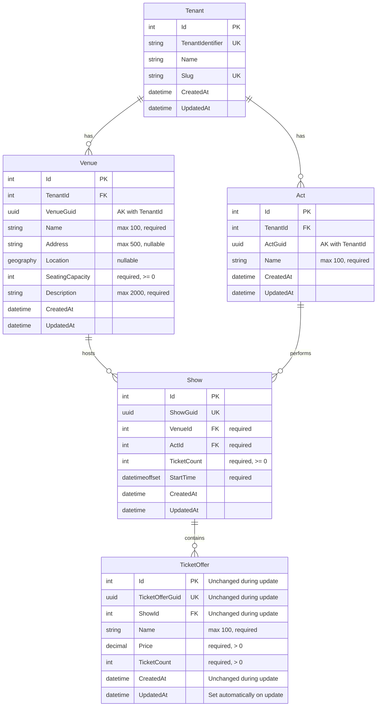

# Edit Ticket Offer

**Status**: Draft
**Created**: 2026-01-11
**Author**: Claude Code (spec-writer agent)
**Related Stories**: [docs/user-stories/edit-ticket-offer.md](../user-stories/edit-ticket-offer.md)

## Executive Summary

This specification defines the technical implementation for updating existing ticket offers. Ticket offers represent distinct ticket types with specific pricing and inventory allocation. The implementation leverages the existing [`TicketOffer`](../../src/GloboTicket.Domain/Entities/TicketOffer.cs) entity as a child entity that inherits tenant context through its relationship with [`Show`](../../src/GloboTicket.Domain/Entities/Show.cs). A critical business rule enforces that when updating ticket count, the total ticket count across all offers for a show cannot exceed the show's available capacity. The feature includes a PUT API endpoint for updating offers and UI components integrated into the show detail page for offer editing.

## Requirements Reference

**User Story**: See [User Story](../user-stories/edit-ticket-offer.md)

**Acceptance Criteria**: See [Acceptance Criteria](../user-stories/edit-ticket-offer.md#acceptance-criteria)

This specification focuses on the technical implementation details for the requirements defined in the user story.

## Technical Analysis

### Affected Layers

- **Domain**: [`TicketOffer`](../../src/GloboTicket.Domain/Entities/TicketOffer.cs) entity (existing, inherits tenant context through Show relationship)
- **Application**: `ITicketOfferService` interface (existing), new `UpdateTicketOfferDto` DTO
- **Infrastructure**: `TicketOfferService.UpdateTicketOfferAsync()` implementation (new method)
- **API**: New `PUT /api/ticket-offers/{ticketOfferGuid}` endpoint in `TicketOfferEndpoints.cs`
- **Web**: New `EditTicketOfferPage`, updates to `ShowDetailPage` to add edit links, updates to `TicketOfferForm` for edit mode

### Multi-Tenancy Considerations

**TicketOffer as Child Entity**: The [`TicketOffer`](../../src/GloboTicket.Domain/Entities/TicketOffer.cs) entity inherits from `Entity` (not `MultiTenantEntity`) because it does NOT store `TenantId` directly. Instead, it inherits tenant context through its relationship with [`Show`](../../src/GloboTicket.Domain/Entities/Show.cs), which in turn inherits tenant context through [`Venue`](../../src/GloboTicket.Domain/Entities/Venue.cs).

**Query Filter Pattern**: Ticket offers are filtered through navigation property chain:
```
TicketOffer is filtered by: _tenantContext.CurrentTenantId == null || to.Show.Venue.TenantId == _tenantContext.CurrentTenantId
```

**Relationship Chain for Tenant Isolation**:
- TicketOffer → Show → Venue → Tenant (via Venue.TenantId)

The Venue relationship is the authoritative tenant source since Venue is required and directly contains the TenantId.

**Update Behavior**:
- The query filter ensures only ticket offers within the current tenant are returned by `GetTicketOfferByGuidAsync()`
- Attempting to edit a ticket offer from another tenant results in a 404 Not Found response
- The ShowId property is never modified during updates (preserves show association)

**Automatic UpdatedAt Assignment**: When `SaveChangesAsync` is called for modified `Entity` instances, the `UpdatedAt` timestamp is automatically set.

### Security Considerations

- **Authentication**: All ticket offer endpoints require authentication via `.RequireAuthorization()`
- **Tenant Isolation**: Query filters ensure users only see and can modify ticket offers from their tenant
- **Show Validation**: When updating a ticket offer, the service must verify that the TicketOffer's Show belongs to the current tenant (enforced by query filters)
- **Rate Limiting**: Existing `RateLimitingMiddleware` applies to ticket offer endpoints

### Performance Considerations

**Existing Indexes**:
1. Index on `TicketOfferGuid` (unique) for efficient GUID-based lookups
2. Index on `ShowId` for efficient filtering by show
3. Composite index on `(ShowId, CreatedAt)` for chronological ordering

**No Additional Indexes Required**: The existing indexes are sufficient for the update operation.

**Query Optimization**:
- Capacity calculation query: Include `Show.TicketOffers` when fetching the ticket offer for update
- Use single transaction for validation and update to prevent race conditions

### Business Rule: Capacity Validation for Updates

**Critical Constraint**: When updating ticket count, the sum of ticket counts across all offers for a show cannot exceed the show's total ticket count. The current offer's ticket count must be excluded from the "already allocated" calculation.

**Validation Logic**:
```csharp
var ticketOffer = await GetTicketOfferWithShowAndOffersAsync(ticketOfferGuid);
var otherOffersTicketCount = ticketOffer.Show.TicketOffers
    .Where(o => o.Id != ticketOffer.Id)
    .Sum(o => o.TicketCount);
var availableCapacity = ticketOffer.Show.TicketCount - otherOffersTicketCount;

if (dto.TicketCount > availableCapacity)
{
    throw new ValidationException($"Ticket count exceeds available capacity. Only {availableCapacity} tickets available for this offer (including its current allocation).");
}
```

**Transaction Requirement**: Capacity validation and offer update must occur within a single database transaction to prevent race conditions when multiple offers are updated simultaneously.

## OpenAPI Specification

```yaml
openapi: 3.0.0
info:
  title: GloboTicket API - Edit Ticket Offer
  version: 1.0.0

paths:
  /api/ticket-offers/{ticketOfferGuid}:
    get:
      summary: Get ticket offer by GUID
      description: Retrieves a ticket offer by its unique GUID identifier. Required to pre-populate the edit form.
      tags:
        - TicketOffers
      security:
        - cookieAuth: []
      parameters:
        - name: ticketOfferGuid
          in: path
          required: true
          schema:
            type: string
            format: uuid
          description: The ticket offer's unique GUID identifier
          example: "aa0e8400-e29b-41d4-a716-446655440001"
      responses:
        '200':
          description: Ticket offer found
          content:
            application/json:
              schema:
                $ref: '#/components/schemas/TicketOfferResponse'
              example:
                id: 1
                ticketOfferGuid: "aa0e8400-e29b-41d4-a716-446655440001"
                showGuid: "550e8400-e29b-41d4-a716-446655440000"
                name: "General Admission"
                price: 50.00
                ticketCount: 600
                createdAt: "2026-01-03T10:00:00Z"
                updatedAt: null
        '401':
          description: Unauthorized - user not authenticated
          content:
            application/json:
              schema:
                $ref: '#/components/schemas/ErrorResponse'
        '404':
          description: Ticket offer not found (or belongs to different tenant)
          content:
            application/json:
              schema:
                $ref: '#/components/schemas/ErrorResponse'
              example:
                message: "Ticket offer with GUID aa0e8400-e29b-41d4-a716-446655440001 not found"
        '429':
          description: Rate limit exceeded
          content:
            application/json:
              schema:
                $ref: '#/components/schemas/ErrorResponse'

    put:
      summary: Update an existing ticket offer
      description: Updates an existing ticket offer's name, price, and/or ticket count. Validates that ticket count does not exceed available capacity.
      tags:
        - TicketOffers
      security:
        - cookieAuth: []
      parameters:
        - name: ticketOfferGuid
          in: path
          required: true
          schema:
            type: string
            format: uuid
          description: The ticket offer's unique GUID identifier
          example: "aa0e8400-e29b-41d4-a716-446655440001"
      requestBody:
        required: true
        content:
          application/json:
            schema:
              $ref: '#/components/schemas/UpdateTicketOfferRequest'
            examples:
              updatePrice:
                summary: Update only the price
                value:
                  name: "General Admission"
                  price: 45.00
                  ticketCount: 600
              updateAllFields:
                summary: Update all fields
                value:
                  name: "Super Early Bird"
                  price: 35.00
                  ticketCount: 250
              increaseTicketCount:
                summary: Increase ticket count
                value:
                  name: "VIP"
                  price: 150.00
                  ticketCount: 300
      responses:
        '200':
          description: Ticket offer updated successfully
          content:
            application/json:
              schema:
                $ref: '#/components/schemas/TicketOfferResponse'
              example:
                id: 1
                ticketOfferGuid: "aa0e8400-e29b-41d4-a716-446655440001"
                showGuid: "550e8400-e29b-41d4-a716-446655440000"
                name: "General Admission"
                price: 45.00
                ticketCount: 600
                createdAt: "2026-01-03T10:00:00Z"
                updatedAt: "2026-01-11T14:30:00Z"
        '400':
          description: Invalid request - validation failed
          content:
            application/json:
              schema:
                $ref: '#/components/schemas/ValidationErrorResponse'
              examples:
                exceedsCapacity:
                  summary: Ticket count exceeds available capacity
                  value:
                    type: "https://tools.ietf.org/html/rfc7231#section-6.5.1"
                    title: "One or more validation errors occurred."
                    status: 400
                    errors:
                      TicketCount: ["Ticket count exceeds available capacity. Only 600 tickets available for this offer (including its current allocation)."]
                missingName:
                  summary: Offer name is required
                  value:
                    type: "https://tools.ietf.org/html/rfc7231#section-6.5.1"
                    title: "One or more validation errors occurred."
                    status: 400
                    errors:
                      Name: ["Offer name is required"]
                invalidPrice:
                  summary: Price must be positive
                  value:
                    type: "https://tools.ietf.org/html/rfc7231#section-6.5.1"
                    title: "One or more validation errors occurred."
                    status: 400
                    errors:
                      Price: ["Price must be greater than zero"]
        '401':
          description: Unauthorized - user not authenticated
        '404':
          description: Ticket offer not found (or belongs to different tenant)
          content:
            application/json:
              schema:
                $ref: '#/components/schemas/ErrorResponse'
              example:
                message: "Ticket offer with GUID aa0e8400-e29b-41d4-a716-446655440001 not found"
        '429':
          description: Rate limit exceeded
        '500':
          description: Internal server error
          content:
            application/json:
              schema:
                $ref: '#/components/schemas/ErrorResponse'

components:
  schemas:
    UpdateTicketOfferRequest:
      type: object
      required:
        - name
        - price
        - ticketCount
      properties:
        name:
          type: string
          minLength: 1
          maxLength: 100
          description: Name of the ticket offer (e.g., "General Admission", "VIP")
          example: "General Admission"
        price:
          type: number
          format: decimal
          minimum: 0.01
          description: Price per ticket in currency units (must be positive)
          example: 50.00
        ticketCount:
          type: integer
          format: int32
          minimum: 1
          description: Number of tickets allocated to this offer (must not exceed available capacity)
          example: 600

    TicketOfferResponse:
      type: object
      properties:
        id:
          type: integer
          format: int32
          description: Database-generated unique identifier (unchanged during update)
          example: 1
        ticketOfferGuid:
          type: string
          format: uuid
          description: Client-generated unique identifier (unchanged during update)
          example: "aa0e8400-e29b-41d4-a716-446655440001"
        showGuid:
          type: string
          format: uuid
          description: GUID of the associated show (unchanged during update)
          example: "550e8400-e29b-41d4-a716-446655440000"
        name:
          type: string
          description: Name of the ticket offer
          example: "General Admission"
        price:
          type: number
          format: decimal
          description: Price per ticket
          example: 50.00
        ticketCount:
          type: integer
          format: int32
          description: Number of tickets allocated to this offer
          example: 600
        createdAt:
          type: string
          format: date-time
          description: UTC timestamp when the offer was created (unchanged during update)
          example: "2026-01-03T10:00:00Z"
        updatedAt:
          type: string
          format: date-time
          nullable: true
          description: UTC timestamp when the offer was last updated (set automatically)
          example: "2026-01-11T14:30:00Z"

    ValidationErrorResponse:
      type: object
      properties:
        type:
          type: string
          example: "https://tools.ietf.org/html/rfc7231#section-6.5.1"
        title:
          type: string
          example: "One or more validation errors occurred."
        status:
          type: integer
          example: 400
        errors:
          type: object
          additionalProperties:
            type: array
            items:
              type: string

    ErrorResponse:
      type: object
      properties:
        message:
          type: string
          description: Error message
          example: "An error occurred while processing your request."

  securitySchemes:
    cookieAuth:
      type: apiKey
      in: cookie
      name: .GloboTicket.Auth
      description: Cookie-based authentication token
```

## Database Schema

### Entity-Relationship Diagram



### Table: TicketOffers (Update Behavior)

| Column | Update Behavior | Description |
|--------|-----------------|-------------|
| Id | Never modified | Primary key remains constant |
| TicketOfferGuid | Never modified | Client identifier preserved |
| ShowId | Never modified | Show association preserved |
| Name | Updated from request | Required, max 100 chars |
| Price | Updated from request | Required, > 0, decimal(18,2) |
| TicketCount | Updated from request | Required, > 0, validated against capacity |
| CreatedAt | Never modified | Original creation timestamp preserved |
| UpdatedAt | Auto-set on save | Set by DbContext.SaveChangesAsync |

### Indexes

Existing indexes remain unchanged. See [Create Ticket Offer specification](./create-ticket-offer.md#indexes) for index details.

## User Interface Design

### Page Structure & Navigation

**Updated Pages**:
1. `/shows/:showId` - Show detail page (add edit links/buttons for each ticket offer)
2. `/ticket-offers/:ticketOfferGuid/edit` - Edit ticket offer page (new)

**Navigation Flow**:
1. User navigates to show detail page
2. User clicks "Edit" button/link for a specific ticket offer
3. User is navigated to `/ticket-offers/:ticketOfferGuid/edit` (Edit Ticket Offer page)
4. On successful update, user is redirected back to `/shows/:showId`
5. On cancel, user is returned to `/shows/:showId`

### Component Breakdown

#### ShowDetailPage (Enhancement)

**Location**: `src/GloboTicket.Web/src/pages/shows/ShowDetailPage.tsx`

**New Features**:
- Add "Edit" button/link for each ticket offer in the TicketOffersList
- Edit button navigates to `/ticket-offers/:ticketOfferGuid/edit`

**Layout Structure** (updates to existing structure):
```
ShowDetailPage
├── Stack (gap="xl")
│   ├── [Existing sections...]
│   └── Card (Ticket Offers)
│       └── Stack (gap="md")
│           ├── Heading ("Ticket Offers")
│           └── TicketOffersList component [UPDATED: add edit buttons]
```

#### TicketOffersList (Enhancement)

**Location**: `src/GloboTicket.Web/src/components/organisms/TicketOffersList.tsx`

**Updates**:
- Add "Edit" button/link for each ticket offer
- Button uses pencil/edit icon
- On click, navigates to `/ticket-offers/:ticketOfferGuid/edit`
- Button uses `variant="ghost"` or `variant="link"` for subtle presentation

#### EditTicketOfferPage (New)

**Location**: `src/GloboTicket.Web/src/pages/ticket-offers/EditTicketOfferPage.tsx`

**Purpose**: Container page for ticket offer editing, handling data fetching and navigation.

**State Management**:
- `ticketOffer: TicketOffer | null` - Loaded ticket offer data
- `show: Show | null` - Associated show for capacity information
- `availableCapacity: number` - Available capacity for validation
- `isLoading: boolean` - Loading state during fetch
- `error: string | null` - Error message if fetch fails

**Data Fetching**:
- Uses `useParams()` to get ticket offer GUID from URL
- Calls `getTicketOffer(ticketOfferGuid)` on mount to fetch current ticket offer data
- Calls `getShowCapacity(showGuid)` to fetch capacity information
- Displays loading spinner while fetching
- Displays error message if ticket offer not found or fetch fails

**Child Components**:
- `PageHeader`: Displays "Edit Ticket Offer" title and show name
- `Card`: Container for the form
- `TicketOfferForm`: Pre-populated form component (receives `ticketOffer` and `availableCapacity` props)
- `Spinner`: Loading indicator during fetch

**Navigation Handlers**:
- `handleSuccess`: Navigate to `/shows/:showId` on successful update
- `handleCancel`: Navigate to `/shows/:showId` on cancel

**Error States**:
- Loading: Displays centered spinner
- Not found: Displays "Ticket offer not found" error in card
- Fetch error: Displays error message in card

#### TicketOfferForm (Edit Mode)

**Location**: `src/GloboTicket.Web/src/components/organisms/TicketOfferForm.tsx`

**Purpose**: Reusable form component supporting both create and edit operations.

**Props**:
- `showGuid: string` - GUID of the show (for create or context)
- `ticketOffer?: TicketOffer` - When provided, form operates in edit mode
- `availableCapacity: number` - Remaining capacity for validation
- `onSuccess?: (offer: TicketOffer) => void` - Callback on successful submission
- `onCancel?: () => void` - Callback on cancel

**Edit Mode Detection**:
- `isEditMode = !!ticketOffer` - True when ticketOffer prop is provided
- Button label changes: "Update Offer" vs "Create Offer"
- API call changes: `updateTicketOffer()` vs `createTicketOffer()`

**State Initialization** (edit mode):
- `name`: Initialized from `ticketOffer.name`
- `price`: Initialized from `ticketOffer.price.toString()`
- `ticketCount`: Initialized from `ticketOffer.ticketCount.toString()`

**Validation Rules** (same as create):

| Field | Rule | Error Message |
|-------|------|---------------|
| Name | Required | "Offer name is required" |
| Name | Max 100 characters | "Offer name cannot exceed 100 characters" |
| Price | Required | "Price is required" |
| Price | Must be positive number | "Price must be greater than zero" |
| Price | Valid decimal format | "Please enter a valid price" |
| Ticket Count | Required | "Ticket count is required" |
| Ticket Count | Must be positive integer | "Ticket count must be a positive number" |
| Ticket Count | Must be <= available capacity | "Ticket count exceeds available capacity. Only {availableCapacity} tickets available for this offer (including its current allocation)." |

**API Integration** (edit mode):
- Calls `PUT /api/ticket-offers/{ticketOfferGuid}` via `updateTicketOffer()` function
- Does NOT generate new GUID (preserves existing `ticketOfferGuid`)
- Sends `UpdateTicketOfferDto` with name, price, and ticketCount
- On success: Invalidate queries `['shows', showGuid, 'ticket-offers']` and `['shows', showGuid, 'capacity']`

### Interaction Flows

#### Edit Ticket Offer Flow

```
1. User clicks "Edit" button on TicketOffersList item
   |
2. Navigate to /ticket-offers/:ticketOfferGuid/edit
   |
3. EditTicketOfferPage fetches data:
   a. Set isLoading = true
   b. Call getTicketOffer(ticketOfferGuid)
   c. Call getShowCapacity(showGuid)
   |-- Fetch fails --> Display error message, no form shown
   |
   +-- Fetch succeeds --> Continue
   |
4. EditTicketOfferPage renders TicketOfferForm with ticketOffer prop
   |
5. TicketOfferForm pre-populates fields with current values
   |
6. User modifies one or more fields (name, price, or ticket count)
   |
7. User clicks "Update Offer"
   |
8. TicketOfferForm validates input:
   |-- Validation fails --> Display error message, stay on form
   |
   +-- Validation passes --> Continue
   |
9. TicketOfferForm calls updateTicketOffer() API:
   a. Set isLoading = true
   b. Disable form input and buttons
   c. Show loading indicator on submit button
   |
10. API Response:
    |-- Success (200) --> Call onSuccess(), navigate to /shows/:showId
    |
    +-- Error (400) --> Display validation error, re-enable form
    |
    +-- Error (404) --> Display "not found" error, re-enable form
    |
    +-- Error (other) --> Display generic error, re-enable form
```

#### Cancel Flow

```
1. User clicks "Cancel" button
   |
2. TicketOfferForm calls onCancel() callback
   |
3. Navigate to /shows/:showId (no changes saved)
```

#### Ticket Offer Not Found Flow

```
1. User navigates to /ticket-offers/:ticketOfferGuid/edit with invalid/other-tenant GUID
   |
2. EditTicketOfferPage fetches ticket offer data:
   a. Set isLoading = true
   b. Call getTicketOffer(ticketOfferGuid)
   |
3. API returns 404 Not Found
   |
4. EditTicketOfferPage displays error state:
   a. Set error = "Ticket offer not found" (or error message from response)
   b. Set isLoading = false
   |
5. Page renders error card instead of form
   |
6. User can navigate back to show page or acts list
```

#### Capacity Exceeded During Update Flow

```
1. User loads edit form for offer with 600 tickets
   |
2. Available capacity shown: 400 (from capacity endpoint)
   |
3. User increases ticket count to 800
   |
4. Client-side validation catches:
   |-- Display error: "Ticket count exceeds available capacity. Only 400 tickets available for this offer (including its current allocation)."
   |-- Prevent form submission
   |
5. User corrects ticket count to 400 or less
   |
6. Form submits successfully
```

### Accessibility Requirements

- All form inputs have associated `<label>` elements with `htmlFor` attribute
- Required fields marked with asterisk (*) in label text
- Error messages announced to screen readers via ARIA live regions
- Form inputs support keyboard navigation (Tab/Shift+Tab)
- Disabled state on submit button communicated via `aria-disabled`
- Loading states have appropriate ARIA labels
- Edit buttons in list have descriptive `aria-label` (e.g., "Edit General Admission offer")
- Focus management: return focus to edit button after canceling

### Responsive Behavior

- **Desktop (>1024px)**: Form fields full width within card container
- **Tablet (768-1024px)**: Same as desktop
- **Mobile (<768px)**: Single column, stacked layout

## Testing Requirements

### Unit Test Scenarios

#### Domain Layer (TicketOfferTests)

Existing tests from Create Ticket Offer specification apply. No additional domain tests required for edit functionality since the entity structure is unchanged.

#### Application Layer (UpdateTicketOfferDtoTests)

- [ ] GivenUpdateTicketOfferDto_WhenNameIsEmpty_ThenValidationFails (validates AC: Offer name is required)
- [ ] GivenUpdateTicketOfferDto_WhenNameExceedsMaxLength_ThenValidationFails (validates AC: Offer name max 100 characters)
- [ ] GivenUpdateTicketOfferDto_WhenPriceIsZero_ThenValidationFails (validates AC: Price must be greater than zero)
- [ ] GivenUpdateTicketOfferDto_WhenPriceIsNegative_ThenValidationFails (validates AC: Price must be positive)
- [ ] GivenUpdateTicketOfferDto_WhenTicketCountIsZero_ThenValidationFails (validates AC: Ticket count must be greater than zero)
- [ ] GivenUpdateTicketOfferDto_WhenTicketCountIsNegative_ThenValidationFails (validates AC: Ticket count must be positive)
- [ ] GivenUpdateTicketOfferDto_WhenAllFieldsValid_ThenValidationPasses

### Integration Test Scenarios

#### TicketOfferService Update Integration Tests

- [ ] UpdateTicketOffer_WithValidData_UpdatesOfferInDatabase (validates AC: Ticket offer is updated successfully)
- [ ] UpdateTicketOffer_SetsUpdatedAtTimestamp (validates AC: UpdatedAt timestamp is set)
- [ ] UpdateTicketOffer_PreservesCreatedAtTimestamp (validates AC: CreatedAt preserved)
- [ ] UpdateTicketOffer_PreservesTicketOfferGuid (validates AC: Unique identifier preserved)
- [ ] UpdateTicketOffer_PreservesShowId (validates AC: Show association preserved)
- [ ] UpdateTicketOffer_PreservesId (validates AC: Primary key preserved)
- [ ] UpdateTicketOffer_UpdatesNameOnly_OtherFieldsUnchanged (validates AC: Supports partial updates)
- [ ] UpdateTicketOffer_UpdatesPriceOnly_OtherFieldsUnchanged (validates AC: Supports partial updates)
- [ ] UpdateTicketOffer_UpdatesTicketCountOnly_OtherFieldsUnchanged (validates AC: Supports partial updates)
- [ ] UpdateTicketOffer_UpdatesAllFields_AllFieldsChanged (validates AC: Supports updating all fields)
- [ ] UpdateTicketOffer_WithTicketCountExceedingCapacity_ThrowsValidationException (validates AC: Capacity validation)
- [ ] UpdateTicketOffer_WithExactAvailableCapacity_UpdatesSuccessfully (validates AC: Can use all available capacity)
- [ ] UpdateTicketOffer_ReducingTicketCount_IncreasesAvailableCapacity (validates AC: Capacity calculation)
- [ ] UpdateTicketOffer_IncreasingTicketCount_DecreasesAvailableCapacity (validates AC: Capacity calculation)
- [ ] UpdateTicketOffer_CapacityCalculationExcludesCurrentOffer_Success (validates AC: Current offer excluded from allocated calculation)
- [ ] UpdateTicketOffer_WithNonExistentTicketOffer_ThrowsNotFoundException
- [ ] UpdateTicketOffer_StoresPriceWithTwoDecimalPlaces (validates AC: Price stored with two decimal places)

#### Multi-Tenancy Integration Tests

- [ ] UpdateTicketOffer_TicketOfferFromDifferentTenant_FailsNotFound (validates AC: Users can only edit offers from their tenant)
- [ ] GetTicketOfferByGuid_TicketOfferFromDifferentTenant_ReturnsNull (validates AC: Cross-tenant access prevented)

#### API Endpoint Integration Tests

- [ ] PutTicketOffer_WithValidData_Returns200Ok (validates AC: Update succeeds)
- [ ] PutTicketOffer_WithValidData_ReturnsUpdatedOfferInBody
- [ ] PutTicketOffer_WithValidData_SetsUpdatedAtTimestamp
- [ ] PutTicketOffer_WithMissingName_Returns400BadRequest (validates AC: Offer name is required)
- [ ] PutTicketOffer_WithEmptyName_Returns400BadRequest (validates AC: Offer name cannot be empty)
- [ ] PutTicketOffer_WithNameTooLong_Returns400BadRequest (validates AC: Offer name max 100 characters)
- [ ] PutTicketOffer_WithZeroPrice_Returns400BadRequest (validates AC: Price must be greater than zero)
- [ ] PutTicketOffer_WithNegativePrice_Returns400BadRequest (validates AC: Price must be positive)
- [ ] PutTicketOffer_WithZeroTicketCount_Returns400BadRequest (validates AC: Ticket count must be greater than zero)
- [ ] PutTicketOffer_WithNegativeTicketCount_Returns400BadRequest (validates AC: Ticket count must be positive)
- [ ] PutTicketOffer_WithTicketCountExceedingCapacity_Returns400BadRequest (validates AC: Validation error when capacity exceeded)
- [ ] PutTicketOffer_WithTicketCountExceedingCapacity_ReturnsSpecificErrorMessage (validates AC: Error message shows available capacity)
- [ ] PutTicketOffer_WithoutAuthentication_Returns401Unauthorized (validates AC: Only authenticated users can edit)
- [ ] PutTicketOffer_WithNonExistentTicketOffer_Returns404NotFound
- [ ] PutTicketOffer_WithOtherTenantTicketOffer_Returns404NotFound (validates AC: Cross-tenant access prevented)
- [ ] GetTicketOffer_WithValidGuid_Returns200Ok
- [ ] GetTicketOffer_WithValidGuid_ReturnsTicketOfferData
- [ ] GetTicketOffer_WithNonExistentGuid_Returns404NotFound
- [ ] GetTicketOffer_WithOtherTenantGuid_Returns404NotFound

### Frontend Test Scenarios (E2E)

#### EditTicketOfferPage Tests

- [ ] GivenEditTicketOfferPage_WhenLoading_ThenDisplaysSpinner
- [ ] GivenEditTicketOfferPage_WhenTicketOfferLoaded_ThenDisplaysPrePopulatedForm (validates AC: Form pre-populated)
- [ ] GivenEditTicketOfferPage_WhenTicketOfferNotFound_ThenDisplaysErrorMessage
- [ ] GivenEditTicketOfferPage_WhenFetchFails_ThenDisplaysErrorMessage

#### TicketOfferForm Edit Mode Tests

- [ ] GivenTicketOfferForm_WhenInEditMode_ThenNameFieldPrePopulated (validates AC: Fields display current values)
- [ ] GivenTicketOfferForm_WhenInEditMode_ThenPriceFieldPrePopulated (validates AC: Fields display current values)
- [ ] GivenTicketOfferForm_WhenInEditMode_ThenTicketCountFieldPrePopulated (validates AC: Fields display current values)
- [ ] GivenTicketOfferForm_WhenInEditMode_ThenSubmitButtonSaysUpdateOffer
- [ ] GivenTicketOfferForm_WhenEditSubmitWithEmptyName_ThenShowsError (validates AC: Validation errors displayed)
- [ ] GivenTicketOfferForm_WhenEditSubmitWithZeroPrice_ThenShowsError (validates AC: Validation errors displayed)
- [ ] GivenTicketOfferForm_WhenEditSubmitWithExceedingTicketCount_ThenShowsError (validates AC: Capacity validation error displayed)
- [ ] GivenTicketOfferForm_WhenEditSubmitting_ThenDisablesInput (validates AC: Input disabled during update)
- [ ] GivenTicketOfferForm_WhenEditSubmitting_ThenShowsLoadingIndicator (validates AC: Loading indicator shown)
- [ ] GivenTicketOfferForm_WhenEditSubmitSucceeds_ThenShowsConfirmation (validates AC: Confirmation message displayed)
- [ ] GivenTicketOfferForm_WhenEditSubmitSucceeds_ThenRedirectsToShowPage (validates AC: Returns to show page)
- [ ] GivenTicketOfferForm_WhenEditCancelClicked_ThenRedirectsToShowPage (validates AC: Cancel returns to show page)
- [ ] GivenTicketOfferForm_WhenEditSubmitFails_ThenRetainsData (validates AC: Form data retained on error)

#### ShowDetailPage Edit Navigation Tests

- [ ] GivenShowDetailPage_WhenTicketOfferDisplayed_ThenDisplaysEditButton (validates AC: Edit button displayed)
- [ ] GivenShowDetailPage_WhenEditClicked_ThenNavigatesToEditPage

#### End-to-End Edit Flow Tests

- [ ] GivenExistingTicketOffer_WhenPriceEdited_ThenChangesAppearOnShowPage (validates AC: Updated values visible)
- [ ] GivenExistingTicketOffer_WhenNameEdited_ThenUpdatedNameDisplayed (validates AC: Updated values visible)
- [ ] GivenExistingTicketOffer_WhenTicketCountReduced_ThenCapacityIncreases (validates AC: Capacity updates correctly)
- [ ] GivenExistingTicketOffer_WhenAllFieldsEdited_ThenAllChangesVisible (validates AC: Multiple fields updated)
- [ ] GivenExistingTicketOffer_WhenNavigatedAwayWithoutSaving_ThenNoChangesApplied

#### Accessibility Tests

- [ ] GivenTicketOfferForm_WhenRendered_ThenAllFieldsHaveLabels
- [ ] GivenTicketOfferForm_WhenRendered_ThenRequiredFieldsMarked (validates AC: Required fields visually indicated)
- [ ] GivenTicketOfferForm_WhenError_ThenErrorAnnounced
- [ ] GivenTicketOfferForm_WhenRendered_ThenSupportsKeyboardNavigation
- [ ] GivenEditButton_WhenRendered_ThenHasDescriptiveLabel

## Implementation Notes

### Capacity Validation Strategy for Updates

**Server-Side Validation** (authoritative):
1. Fetch ticket offer with show and all ticket offers within a transaction
2. Calculate tickets from OTHER offers: `SUM(TicketOffer.TicketCount WHERE Id != currentOfferId)`
3. Calculate available capacity: `Show.TicketCount - otherOffersTicketCount`
4. Compare new ticket count against available capacity
5. If exceeded, return 400 with specific error message including available capacity

**Key Difference from Create**: When editing, the current offer's ticket count is NOT included in the "already allocated" calculation, giving the user the full available capacity including what's currently allocated to this offer.

**Transaction Isolation**: Use a database transaction to ensure capacity validation and offer update are atomic. This prevents race conditions when multiple offers are updated simultaneously.

```csharp
using var transaction = await _dbContext.Database.BeginTransactionAsync(cancellationToken);
try
{
    var ticketOffer = await _dbContext.TicketOffers
        .Include(to => to.Show)
            .ThenInclude(s => s.TicketOffers)
        .Include(to => to.Show.Venue)
        .Where(to => to.TicketOfferGuid == ticketOfferGuid)
        .Where(to => _tenantContext.CurrentTenantId == null || to.Show.Venue.TenantId == _tenantContext.CurrentTenantId)
        .FirstOrDefaultAsync(cancellationToken);
    
    if (ticketOffer == null)
    {
        throw new KeyNotFoundException($"Ticket offer with GUID {ticketOfferGuid} not found");
    }
    
    var otherOffersTicketCount = ticketOffer.Show.TicketOffers
        .Where(o => o.Id != ticketOffer.Id)
        .Sum(o => o.TicketCount);
    var availableCapacity = ticketOffer.Show.TicketCount - otherOffersTicketCount;
    
    if (dto.TicketCount > availableCapacity)
    {
        throw new ArgumentException(
            $"Ticket count exceeds available capacity. Only {availableCapacity} tickets available for this offer (including its current allocation).",
            nameof(dto.TicketCount));
    }
    
    // Update properties
    ticketOffer.Name = dto.Name;
    ticketOffer.Price = dto.Price;
    ticketOffer.TicketCount = dto.TicketCount;
    
    await _dbContext.SaveChangesAsync(cancellationToken);
    await transaction.CommitAsync(cancellationToken);
}
catch
{
    await transaction.RollbackAsync(cancellationToken);
    throw;
}
```

### Price Storage

**Decimal Precision**: Store price as `decimal(18,2)` to ensure two decimal places for currency values (same as create).

**Validation**: Ensure price is greater than zero at both client and server levels.

### Data Integrity Guarantees

The following properties are never modified during an update operation:
1. `Id` - Database primary key
2. `TicketOfferGuid` - Client-generated identifier
3. `ShowId` - Show association
4. `CreatedAt` - Original creation timestamp

This is enforced by the `TicketOfferService.UpdateTicketOfferAsync()` method which only modifies specific properties (Name, Price, TicketCount) and relies on EF Core change tracking.

### Frontend TypeScript Types

Update existing types in `src/GloboTicket.Web/src/types/ticketOffer.ts`:

```typescript
export interface UpdateTicketOfferDto {
  name: string;
  price: number;
  ticketCount: number;
}
```

### API Client Functions

Add to `src/GloboTicket.Web/src/api/client.ts`:

```typescript
/**
 * Get a ticket offer by GUID
 */
export async function getTicketOffer(ticketOfferGuid: string): Promise<TicketOffer> {
  const response = await fetch(`${API_BASE_URL}/api/ticket-offers/${ticketOfferGuid}`, {
    method: 'GET',
    credentials: 'include',
  });
  return handleResponse<TicketOffer>(response);
}

/**
 * Update an existing ticket offer
 */
export async function updateTicketOffer(ticketOfferGuid: string, dto: UpdateTicketOfferDto): Promise<TicketOffer> {
  const response = await fetch(`${API_BASE_URL}/api/ticket-offers/${ticketOfferGuid}`, {
    method: 'PUT',
    headers: { 'Content-Type': 'application/json' },
    credentials: 'include',
    body: JSON.stringify(dto),
  });
  return handleResponse<TicketOffer>(response);
}
```

### Tanstack Query Integration

**Query Keys**:
- Single ticket offer: `['ticket-offers', ticketOfferGuid]`
- Ticket offers by show: `['shows', showGuid, 'ticket-offers']` (existing)
- Capacity: `['shows', showGuid, 'capacity']` (existing)

**Invalidation Strategy**:
- After updating a ticket offer, invalidate:
  - `['ticket-offers', ticketOfferGuid]` - Single offer query
  - `['shows', showGuid, 'ticket-offers']` - Show's offers list
  - `['shows', showGuid, 'capacity']` - Show's capacity info
- This ensures the UI updates with the new offer details and updated capacity information

### Error Handling Strategy

**API Error Responses**:
- 400 Bad Request: Validation failed → Display specific field errors inline
- 401 Unauthorized: User not authenticated → Redirect to login
- 404 Not Found: Ticket offer not found or cross-tenant access → Display "Ticket offer not found" error
- 429 Rate Limit: Too many requests → Display "Please try again later" error
- 500 Server Error: Internal error → Display "Failed to update ticket offer" error

**Frontend Error Display**:
- Use consistent error display patterns (same as other forms)
- Provide clear error messages
- Retain form data on error for correction
- Log errors to console for debugging

### Implementation Priority

**Phase 1: Backend Foundation**
1. Create `UpdateTicketOfferDto` in Application layer
2. Add `UpdateTicketOfferAsync()` method to `ITicketOfferService` interface
3. Implement `UpdateTicketOfferAsync()` in `TicketOfferService` with capacity validation
4. Add validation logic to exclude current offer from allocated count

**Phase 2: API Layer**
1. Add `PUT /api/ticket-offers/{ticketOfferGuid}` endpoint in `TicketOfferEndpoints.cs`
2. Add `GET /api/ticket-offers/{ticketOfferGuid}` endpoint for fetching single offer

**Phase 3: Frontend Components**
1. Add TypeScript types for `UpdateTicketOfferDto`
2. Add API client functions (`getTicketOffer`, `updateTicketOffer`)
3. Update `TicketOfferForm` to support edit mode
4. Create `EditTicketOfferPage` component
5. Update `TicketOffersList` to add edit buttons
6. Update `ShowDetailPage` to link to edit page

**Phase 4: Testing & Polish**
1. Write unit tests for DTOs
2. Write integration tests for service and API layers
3. Write E2E tests for UI components
4. Verify multi-tenancy isolation
5. Test capacity validation edge cases
6. Test concurrent update scenarios
7. Implement accessibility features
8. Add loading and error states

### Existing Implementation Status

**Backend**: Partially implemented
- `TicketOffer` entity exists
- `ITicketOfferService` exists with create method
- `TicketOfferService` exists with create method
- Update method does not exist
- `UpdateTicketOfferDto` does not exist
- PUT endpoint does not exist

**Frontend**: Not implemented
- `UpdateTicketOfferDto` type definition does not exist
- `getTicketOffer()` function does not exist
- `updateTicketOffer()` function does not exist
- `EditTicketOfferPage` component does not exist
- `TicketOfferForm` does not support edit mode
- Edit buttons in `TicketOffersList` do not exist

This specification documents the requirements and serves as a reference for:
1. Implementation of the edit ticket offer feature
2. Test coverage verification
3. Future maintenance and modifications
