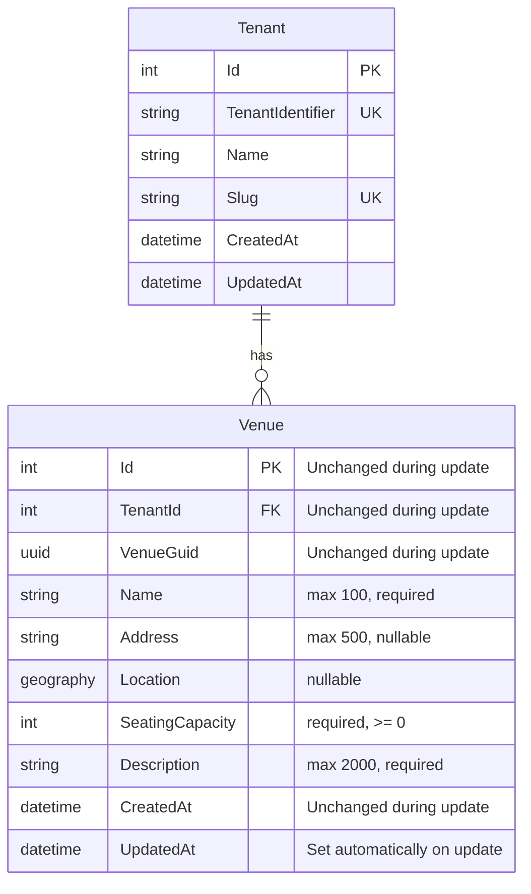

# Edit Venue

**Status**: Draft
**Created**: 2025-12-26
**Author**: Claude Code (spec-writer agent)
**Related Stories**: [docs/user-stories/edit-venue.md](../user-stories/edit-venue.md)

## Executive Summary

This specification defines the technical implementation approach for the Edit Venue feature, enabling authorized users to modify existing venue records. The implementation leverages the existing `Venue` multi-tenant entity, `UpdateVenueDto`, and EF Core query filters for tenant isolation. The feature provides a pre-populated form interface for updating venue properties while preserving data integrity through automatic timestamp tracking.

## Requirements Reference

**User Story**: See [User Story](../user-stories/edit-venue.md)

**Acceptance Criteria**: See [Acceptance Criteria](../user-stories/edit-venue.md#acceptance-criteria)

This specification focuses on the technical implementation details for the requirements defined in the user story.

## Technical Analysis

### Affected Layers

- **Domain**: `Venue` entity (existing, inherits from `MultiTenantEntity`)
- **Application**: `IVenueService` interface, `UpdateVenueDto`, `VenueDto` (existing)
- **Infrastructure**: `VenueService.UpdateAsync()` implementation (existing)
- **API**: `PUT /api/venues/{guid}` endpoint (existing in `VenueEndpoints.cs`)
- **Web**: `EditVenuePage`, `VenueForm`, `VenueDetailPage` components (existing)

### Multi-Tenancy Considerations

The `Venue` entity inherits from `MultiTenantEntity`, which provides:
- `TenantId` property for tenant isolation
- `Tenant` navigation property

**Query Filter**: Applied in `GloboTicketDbContext.OnModelCreating()`:
```
Venue is filtered by: _tenantContext.CurrentTenantId == null || v.TenantId == _tenantContext.CurrentTenantId
```

**Update Behavior**:
- The query filter ensures only venues within the current tenant are returned by `GetByGuidAsync()`
- Attempting to edit a venue from another tenant results in a 404 Not Found response
- The `TenantId` property is never modified during updates (preserves tenant association)

**Automatic UpdatedAt Assignment**: When `SaveChangesAsync` is called for modified `Entity` instances, the `UpdatedAt` timestamp is automatically set.

### Security Considerations

- **Authentication**: All venue endpoints require authentication via `.RequireAuthorization()`
- **Cookie-Based Auth**: Uses `.GloboTicket.Auth` cookie with secure, HTTP-only, SameSite=Strict settings
- **Tenant Context**: `TenantResolutionMiddleware` sets tenant from authenticated user claims
- **Tenant Isolation**: Query filters prevent cross-tenant data access
- **Rate Limiting**: `RateLimitingMiddleware` prevents abuse (note: in-memory, single-server limitation)

### Performance Considerations

**Existing Indexes**:
- Primary key on `Id`
- Index on `VenueGuid` for GUID-based lookups
- Composite alternate key on `(TenantId, VenueGuid)`

**No Additional Indexes Required**: The existing indexes are sufficient for the update venue operation.

## OpenAPI Specification

```yaml
openapi: 3.0.0
info:
  title: GloboTicket API - Edit Venue
  version: 1.0.0

paths:
  /api/venues/{guid}:
    get:
      summary: Get venue by GUID
      description: Retrieves a venue by its unique GUID identifier. Required to pre-populate the edit form.
      tags:
        - Venues
      security:
        - cookieAuth: []
      parameters:
        - name: guid
          in: path
          required: true
          schema:
            type: string
            format: uuid
          description: The venue's unique GUID identifier
          example: "550e8400-e29b-41d4-a716-446655440000"
      responses:
        '200':
          description: Venue found
          content:
            application/json:
              schema:
                $ref: '#/components/schemas/VenueResponse'
        '401':
          description: Unauthorized - user not authenticated
          content:
            application/json:
              schema:
                $ref: '#/components/schemas/ErrorResponse'
        '404':
          description: Venue not found (or belongs to different tenant)
          content:
            application/json:
              schema:
                $ref: '#/components/schemas/ErrorResponse'
              example:
                message: "Venue with GUID 550e8400-e29b-41d4-a716-446655440000 not found"
        '429':
          description: Rate limit exceeded
          content:
            application/json:
              schema:
                $ref: '#/components/schemas/ErrorResponse'

    put:
      summary: Update an existing venue
      description: Updates an existing venue in the current tenant's context. Only venues belonging to the authenticated user's tenant can be updated.
      tags:
        - Venues
      security:
        - cookieAuth: []
      parameters:
        - name: guid
          in: path
          required: true
          schema:
            type: string
            format: uuid
          description: The venue's unique GUID identifier
          example: "550e8400-e29b-41d4-a716-446655440000"
      requestBody:
        required: true
        content:
          application/json:
            schema:
              $ref: '#/components/schemas/UpdateVenueRequest'
            examples:
              fullUpdate:
                summary: Update all venue fields
                value:
                  name: "Madison Square Garden - Updated"
                  address: "4 Pennsylvania Plaza, New York, NY 10001"
                  seatingCapacity: 20789
                  description: "World-famous multi-purpose indoor arena - renovated 2024"
                  latitude: 40.7505
                  longitude: -73.9935
              removeLocation:
                summary: Remove location data
                value:
                  name: "Community Hall"
                  seatingCapacity: 500
                  description: "Local community gathering space"
                  address: null
                  latitude: null
                  longitude: null
      responses:
        '200':
          description: Venue updated successfully
          content:
            application/json:
              schema:
                $ref: '#/components/schemas/VenueResponse'
        '400':
          description: Invalid request - validation failed
          content:
            application/json:
              schema:
                $ref: '#/components/schemas/ValidationErrorResponse'
              examples:
                missingName:
                  summary: Missing required field
                  value:
                    type: "https://tools.ietf.org/html/rfc7231#section-6.5.1"
                    title: "One or more validation errors occurred."
                    status: 400
                    errors:
                      Name: ["The Name field is required."]
                invalidCapacity:
                  summary: Invalid seating capacity
                  value:
                    type: "https://tools.ietf.org/html/rfc7231#section-6.5.1"
                    title: "One or more validation errors occurred."
                    status: 400
                    errors:
                      SeatingCapacity: ["Seating capacity must be zero or positive."]
                invalidCoordinates:
                  summary: Invalid coordinates
                  value:
                    type: "https://tools.ietf.org/html/rfc7231#section-6.5.1"
                    title: "One or more validation errors occurred."
                    status: 400
                    errors:
                      Latitude: ["Latitude must be between -90 and 90."]
        '401':
          description: Unauthorized - user not authenticated
          content:
            application/json:
              schema:
                $ref: '#/components/schemas/ErrorResponse'
        '404':
          description: Venue not found (or belongs to different tenant)
          content:
            application/json:
              schema:
                $ref: '#/components/schemas/ErrorResponse'
              example:
                message: "Venue with GUID 550e8400-e29b-41d4-a716-446655440000 not found"
        '429':
          description: Rate limit exceeded
          content:
            application/json:
              schema:
                $ref: '#/components/schemas/ErrorResponse'
        '500':
          description: Internal server error
          content:
            application/json:
              schema:
                $ref: '#/components/schemas/ErrorResponse'

components:
  schemas:
    UpdateVenueRequest:
      type: object
      required:
        - name
        - seatingCapacity
        - description
      properties:
        name:
          type: string
          minLength: 1
          maxLength: 100
          description: Name of the venue (required, cannot be empty whitespace)
          example: "Madison Square Garden"
        address:
          type: string
          maxLength: 500
          nullable: true
          description: Physical address of the venue (optional)
          example: "4 Pennsylvania Plaza, New York, NY 10001"
        seatingCapacity:
          type: integer
          format: int32
          minimum: 0
          description: Maximum seating capacity (must be zero or positive)
          example: 20000
        description:
          type: string
          minLength: 1
          maxLength: 2000
          description: Description of the venue (required, cannot be empty whitespace)
          example: "World-famous multi-purpose indoor arena"
        latitude:
          type: number
          format: double
          minimum: -90
          maximum: 90
          nullable: true
          description: Latitude coordinate (WGS84)
          example: 40.7505
        longitude:
          type: number
          format: double
          minimum: -180
          maximum: 180
          nullable: true
          description: Longitude coordinate (WGS84)
          example: -73.9935

    VenueResponse:
      type: object
      properties:
        id:
          type: integer
          format: int32
          description: Database-generated unique identifier (unchanged during update)
          example: 1
        venueGuid:
          type: string
          format: uuid
          description: Client-generated unique identifier (unchanged during update)
          example: "550e8400-e29b-41d4-a716-446655440000"
        name:
          type: string
          description: Name of the venue
          example: "Madison Square Garden"
        address:
          type: string
          nullable: true
          description: Physical address of the venue
          example: "4 Pennsylvania Plaza, New York, NY 10001"
        seatingCapacity:
          type: integer
          format: int32
          description: Maximum seating capacity
          example: 20000
        description:
          type: string
          description: Description of the venue
          example: "World-famous multi-purpose indoor arena"
        latitude:
          type: number
          format: double
          nullable: true
          description: Latitude coordinate
          example: 40.7505
        longitude:
          type: number
          format: double
          nullable: true
          description: Longitude coordinate
          example: -73.9935
        createdAt:
          type: string
          format: date-time
          description: UTC timestamp when the venue was created (unchanged during update)
          example: "2025-12-26T10:30:00Z"
        updatedAt:
          type: string
          format: date-time
          nullable: true
          description: UTC timestamp when the venue was last updated (set automatically)
          example: "2025-12-26T14:45:00Z"

    ValidationErrorResponse:
      type: object
      properties:
        type:
          type: string
          example: "https://tools.ietf.org/html/rfc7231#section-6.5.1"
        title:
          type: string
          example: "One or more validation errors occurred."
        status:
          type: integer
          example: 400
        errors:
          type: object
          additionalProperties:
            type: array
            items:
              type: string

    ErrorResponse:
      type: object
      properties:
        message:
          type: string
          description: Error message
          example: "An error occurred while processing your request."

  securitySchemes:
    cookieAuth:
      type: apiKey
      in: cookie
      name: .GloboTicket.Auth
      description: Cookie-based authentication token
```

## Database Schema

### Entity-Relationship Diagram



### Table: Venues (Update Behavior)

| Column | Update Behavior | Description |
|--------|-----------------|-------------|
| Id | Never modified | Primary key remains constant |
| TenantId | Never modified | Tenant association preserved |
| VenueGuid | Never modified | Client identifier preserved |
| Name | Updated from request | Required, max 100 chars |
| Address | Updated from request | Optional, max 500 chars, can be cleared |
| Location | Updated from request | Computed from lat/lng, can be cleared |
| SeatingCapacity | Updated from request | Required, must be >= 0 |
| Description | Updated from request | Required, max 2000 chars |
| CreatedAt | Never modified | Original creation timestamp preserved |
| UpdatedAt | Auto-set on save | Set by DbContext.SaveChangesAsync |

### Indexes

Existing indexes remain unchanged. See [Add Venue specification](./add-venue.md#indexes) for index details.

## User Interface Design

### Page Structure & Navigation

**Pages**:
1. `/venues/:id` - Venue detail page (entry point for edit)
2. `/venues/:id/edit` - Edit venue page

**Navigation Flow**:
1. User navigates to `/venues/:id` (Venue detail page)
2. User clicks "Edit" button
3. User is navigated to `/venues/:id/edit` (Edit Venue page)
4. On successful update, user is redirected to `/venues`
5. On cancel, user is returned to `/venues`

### Component Breakdown

#### VenueDetailPage

**Location**: `src/GloboTicket.Web/src/pages/venues/VenueDetailPage.tsx`

**Purpose**: Displays venue information and provides access to edit functionality.

**Edit Button Behavior**:
- Renders "Edit" button with pencil icon
- On click, navigates to `/venues/:id/edit`
- Button uses `variant="secondary"`

#### EditVenuePage

**Location**: `src/GloboTicket.Web/src/pages/venues/EditVenuePage.tsx`

**Purpose**: Container page for venue editing, handling data fetching and navigation.

**State Management**:
- `venue: Venue | null` - Loaded venue data
- `isLoading: boolean` - Loading state during fetch
- `error: string | null` - Error message if fetch fails

**Data Fetching**:
- Uses `useParams()` to get venue GUID from URL
- Calls `getVenue(id)` on mount to fetch current venue data
- Displays loading spinner while fetching
- Displays error message if venue not found or fetch fails

**Child Components**:
- `PageHeader`: Displays "Edit Venue" title
- `Card`: Container for the form
- `VenueForm`: Pre-populated form component (receives `venue` prop)
- `Spinner`: Loading indicator during fetch

**Navigation Handlers**:
- `handleSuccess`: Navigate to `/venues` on successful update
- `handleCancel`: Navigate to `/venues` on cancel

**Error States**:
- Loading: Displays centered spinner
- Not found: Displays "Venue not found" error in card
- Fetch error: Displays error message in card

#### VenueForm (Edit Mode)

**Location**: `src/GloboTicket.Web/src/components/organisms/VenueForm.tsx`

**Purpose**: Reusable form component supporting both create and edit operations.

**Props**:
- `venue?: Venue` - When provided, form operates in edit mode
- `onSuccess?: (venue: Venue) => void` - Callback on successful submission
- `onCancel?: () => void` - Callback on cancel

**Edit Mode Detection**:
- `isEditMode = !!venue` - True when venue prop is provided
- Button label changes: "Update Venue" vs "Create Venue"
- API call changes: `updateVenue()` vs `createVenue()`

**State Initialization** (edit mode):
- `name`: Initialized from `venue.name`
- `address`: Initialized from `venue.address || ''`
- `seatingCapacity`: Initialized from `venue.seatingCapacity?.toString() || ''`
- `description`: Initialized from `venue.description || ''`
- `latitude`: Initialized from `venue.latitude?.toString() || ''`
- `longitude`: Initialized from `venue.longitude?.toString() || ''`

**Validation Rules** (single source of truth for client-side validation):

| Field | Rule | Error Message |
|-------|------|---------------|
| Name | Required, non-whitespace | "Venue name is required" |
| Name | Max 100 characters | "Venue name must be 100 characters or less" |
| Description | Required, non-whitespace | "Description is required" |
| Description | Max 2000 characters | "Description must be 2000 characters or less" |
| Seating Capacity | Required, non-negative integer | "Seating capacity must be a positive number" |
| Address | Max 500 characters | "Address must be 500 characters or less" |
| Latitude | -90 to 90 | "Latitude must be between -90 and 90" |
| Longitude | -180 to 180 | "Longitude must be between -180 and 180" |

**Form Fields**: See [Add Venue specification](./add-venue.md#venueform) for field definitions.

**API Integration** (edit mode):
- Calls `PUT /api/venues/{venueGuid}` via `updateVenue()` function
- Does NOT generate new GUID (preserves existing `venueGuid`)
- Sends `UpdateVenueDto` without `venueGuid` property

### Interaction Flows

#### Edit Venue Flow

```
1. User clicks "Edit" button on VenueDetailPage
   |
2. Navigate to /venues/:id/edit
   |
3. EditVenuePage fetches venue data:
   a. Set isLoading = true
   b. Call getVenue(id)
   |-- Fetch fails --> Display error message, no form shown
   |
   +-- Fetch succeeds --> Continue
   |
4. EditVenuePage renders VenueForm with venue prop
   |
5. VenueForm pre-populates fields with current values
   |
6. User modifies one or more fields
   |
7. User clicks "Update Venue"
   |
8. VenueForm validates inputs:
   |-- Validation fails --> Display error message, stay on form
   |
   +-- Validation passes --> Continue
   |
9. VenueForm calls updateVenue() API:
   a. Set isLoading = true
   b. Disable form inputs and buttons
   c. Show loading indicator on submit button
   |
10. API Response:
    |-- Success (200) --> Call onSuccess(), navigate to /venues
    |
    +-- Error (400) --> Display validation error, re-enable form
    |
    +-- Error (404) --> Display "not found" error, re-enable form
    |
    +-- Error (other) --> Display generic error, re-enable form
```

#### Cancel Flow

```
1. User clicks "Cancel" button
   |
2. VenueForm calls onCancel() callback
   |
3. Navigate to /venues (no changes saved)
```

#### Venue Not Found Flow

```
1. User navigates to /venues/:id/edit with invalid/other-tenant GUID
   |
2. EditVenuePage fetches venue data:
   a. Set isLoading = true
   b. Call getVenue(id)
   |
3. API returns 404 Not Found
   |
4. EditVenuePage displays error state:
   a. Set error = "Venue not found" (or error message from response)
   b. Set isLoading = false
   |
5. Page renders error card instead of form
   |
6. User can navigate back to venues list
```

### Accessibility Requirements

- All form inputs have associated `<label>` elements with `htmlFor` attribute
- Required fields marked with asterisk (*) in label text
- Error messages announced to screen readers via live region
- Form inputs support keyboard navigation (Tab/Shift+Tab)
- Submit button disabled state communicated via `aria-disabled`
- Loading state communicated via `aria-busy` on form
- Map component has `aria-label` for screen readers
- Focus management: focus moves to error summary on validation failure

### Responsive Behavior

- **Desktop (>1024px)**: Form fields full width, latitude/longitude in 2-column grid
- **Tablet (768-1024px)**: Same as desktop
- **Mobile (<768px)**: All fields single column, stacked layout

## Testing Requirements

### Unit Test Scenarios

#### Domain Layer (VenueTests)

Existing tests from Add Venue specification apply. No additional domain tests required for edit functionality since the entity structure is unchanged.

#### Application Layer (UpdateVenueDtoTests)
- [ ] GivenUpdateVenueDto_WhenNameIsEmpty_ThenValidationFails
- [ ] GivenUpdateVenueDto_WhenNameIsWhitespaceOnly_ThenValidationFails
- [ ] GivenUpdateVenueDto_WhenNameExceeds100Characters_ThenValidationFails
- [ ] GivenUpdateVenueDto_WhenDescriptionIsEmpty_ThenValidationFails
- [ ] GivenUpdateVenueDto_WhenDescriptionIsWhitespaceOnly_ThenValidationFails
- [ ] GivenUpdateVenueDto_WhenDescriptionExceeds2000Characters_ThenValidationFails
- [ ] GivenUpdateVenueDto_WhenSeatingCapacityIsNegative_ThenValidationFails
- [ ] GivenUpdateVenueDto_WhenAddressExceeds500Characters_ThenValidationFails
- [ ] GivenUpdateVenueDto_WhenLatitudeBelow-90_ThenValidationFails
- [ ] GivenUpdateVenueDto_WhenLatitudeAbove90_ThenValidationFails
- [ ] GivenUpdateVenueDto_WhenLongitudeBelow-180_ThenValidationFails
- [ ] GivenUpdateVenueDto_WhenLongitudeAbove180_ThenValidationFails
- [ ] GivenUpdateVenueDto_WhenAllFieldsValid_ThenValidationPasses
- [ ] GivenUpdateVenueDto_WhenOptionalFieldsNull_ThenValidationPasses

### Integration Test Scenarios

#### VenueService Update Integration Tests
- [ ] UpdateVenue_WithValidData_UpdatesVenueInDatabase
- [ ] UpdateVenue_WithNewLocationCoordinates_UpdatesGeographyPoint
- [ ] UpdateVenue_WithNullCoordinates_RemovesGeographyPoint
- [ ] UpdateVenue_SetsUpdatedAtTimestamp
- [ ] UpdateVenue_PreservesCreatedAtTimestamp
- [ ] UpdateVenue_PreservesTenantId
- [ ] UpdateVenue_PreservesVenueGuid
- [ ] UpdateVenue_PreservesId
- [ ] UpdateVenue_WithNonExistentId_ReturnsNull

#### Multi-Tenancy Integration Tests
- [ ] UpdateVenue_InTenantA_NotAccessibleToTenantB
- [ ] UpdateVenue_ForOtherTenantVenue_ReturnsNull
- [ ] GetVenueByGuid_ForOtherTenantVenue_ReturnsNull

#### API Endpoint Integration Tests
- [ ] PutVenue_WithValidData_Returns200Ok
- [ ] PutVenue_WithValidData_ReturnsUpdatedVenueInBody
- [ ] PutVenue_WithValidData_SetsUpdatedAtTimestamp
- [ ] PutVenue_WithMissingName_Returns400BadRequest
- [ ] PutVenue_WithEmptyName_Returns400BadRequest
- [ ] PutVenue_WithMissingDescription_Returns400BadRequest
- [ ] PutVenue_WithInvalidCapacity_Returns400BadRequest
- [ ] PutVenue_WithInvalidLatitude_Returns400BadRequest
- [ ] PutVenue_WithInvalidLongitude_Returns400BadRequest
- [ ] PutVenue_WithNonExistentGuid_Returns404NotFound
- [ ] PutVenue_WithOtherTenantGuid_Returns404NotFound
- [ ] PutVenue_WithoutAuthentication_Returns401Unauthorized
- [ ] PutVenue_ExceedsRateLimit_Returns429TooManyRequests
- [ ] GetVenue_WithValidGuid_Returns200Ok
- [ ] GetVenue_WithNonExistentGuid_Returns404NotFound
- [ ] GetVenue_WithOtherTenantGuid_Returns404NotFound

### Frontend Test Scenarios (E2E)

#### EditVenuePage Tests
- [ ] GivenEditVenuePage_WhenLoading_ThenDisplaysSpinner
- [ ] GivenEditVenuePage_WhenVenueLoaded_ThenDisplaysPrePopulatedForm
- [ ] GivenEditVenuePage_WhenVenueNotFound_ThenDisplaysErrorMessage
- [ ] GivenEditVenuePage_WhenFetchFails_ThenDisplaysErrorMessage

#### VenueForm Edit Mode Tests
- [ ] GivenVenueForm_WhenInEditMode_ThenFieldsPrePopulated
- [ ] GivenVenueForm_WhenInEditMode_ThenSubmitButtonSaysUpdateVenue
- [ ] GivenVenueForm_WhenEditSubmitWithEmptyName_ThenShowsError
- [ ] GivenVenueForm_WhenEditSubmitWithEmptyDescription_ThenShowsError
- [ ] GivenVenueForm_WhenEditSubmitWithInvalidCapacity_ThenShowsError
- [ ] GivenVenueForm_WhenEditSubmitting_ThenDisablesInputs
- [ ] GivenVenueForm_WhenEditSubmitting_ThenShowsLoadingIndicator
- [ ] GivenVenueForm_WhenEditSubmitSucceeds_ThenRedirectsToVenuesList
- [ ] GivenVenueForm_WhenEditCancelClicked_ThenRedirectsToVenuesList

#### VenueDetailPage Edit Navigation Tests
- [ ] GivenVenueDetailPage_WhenRendered_ThenDisplaysEditButton
- [ ] GivenVenueDetailPage_WhenEditClicked_ThenNavigatesToEditPage

#### End-to-End Edit Flow Tests
- [ ] GivenExistingVenue_WhenEdited_ThenChangesAppearsInVenuesList
- [ ] GivenExistingVenue_WhenLocationCleared_ThenLocationRemovedFromVenue
- [ ] GivenExistingVenue_WhenLocationAdded_ThenLocationVisibleOnVenue

## Implementation Notes

### Validation Consistency

**Current State**: Both create and update operations use a maximum length of 100 characters for venue names.

**DTOs Affected**:
- `CreateVenueDto`: `[MaxLength(100)]` for Name
- `UpdateVenueDto`: `[MaxLength(100)]` for Name

**Note**: The user story was updated to align with the existing domain entity constraint of 100 characters.

### Whitespace Handling

**Requirement**: Leading and trailing spaces should be automatically removed before saving.

**Current Implementation**: The VenueForm component calls `name.trim()` and `description.trim()` before sending to the API. This satisfies the requirement at the client level.

**Recommendation**: Consider adding server-side trimming in `VenueService.UpdateAsync()` for defense in depth.

### Data Integrity Guarantees

The following properties are never modified during an update operation:
1. `Id` - Database primary key
2. `VenueGuid` - Client-generated identifier
3. `TenantId` - Tenant association
4. `CreatedAt` - Original creation timestamp

This is enforced by the `VenueService.UpdateAsync()` method which only modifies specific properties and relies on EF Core change tracking.

### Existing Implementation

The Edit Venue feature is already implemented in the codebase. This specification documents the requirements and serves as a reference for:
1. Validation of the existing implementation against acceptance criteria
2. Test coverage verification
3. Future maintenance and modifications
