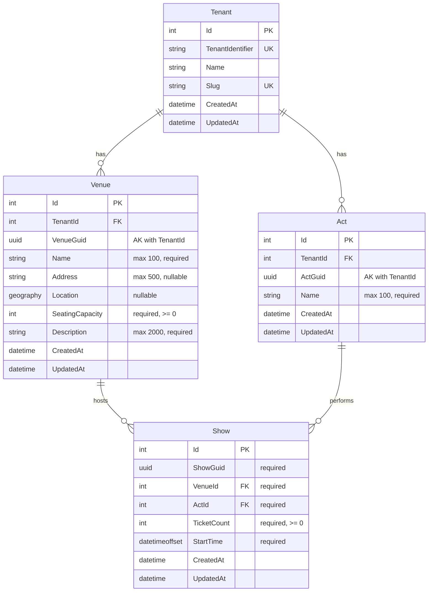

# View Show

**Status**: Draft
**Created**: 2026-01-02
**Author**: Claude Code (spec-writer agent)
**Related Stories**: [docs/user-stories/view-show.md](../user-stories/view-show.md)

## Executive Summary

This specification defines the technical implementation approach for the View Show feature, enabling authorized users to view detailed information about a specific show including the act name, venue name, and start date/time. The implementation leverages the existing [`Show`](../../src/GloboTicket.Domain/Entities/Show.cs) entity, [`ShowDto`](../../src/GloboTicket.Application/DTOs/ShowDto.cs), and the existing [`GET /api/shows/{showGuid}`](../../src/GloboTicket.API/Endpoints/ShowEndpoints.cs:57) endpoint. The feature provides a detail page interface consistent with existing Act and Venue detail pages, displaying show information in a clear, readable format with proper date/time formatting.

## Requirements Reference

**User Story**: See [User Story](../user-stories/view-show.md)

**Acceptance Criteria**: See [Acceptance Criteria](../user-stories/view-show.md#acceptance-criteria)

This specification focuses on the technical implementation details for the requirements defined in the user story.

## Technical Analysis

### Affected Layers

- **Domain**: [`Show`](../../src/GloboTicket.Domain/Entities/Show.cs) entity (existing, inherits tenant context through Venue relationship)
- **Application**: [`IShowService`](../../src/GloboTicket.Application/Interfaces/IShowService.cs) interface, [`ShowDto`](../../src/GloboTicket.Application/DTOs/ShowDto.cs) (existing)
- **Infrastructure**: [`ShowService.GetByGuidAsync()`](../../src/GloboTicket.Infrastructure/Services/ShowService.cs:27) implementation (existing)
- **API**: [`GET /api/shows/{showGuid}`](../../src/GloboTicket.API/Endpoints/ShowEndpoints.cs:57) endpoint (existing)
- **Web**: `ShowDetailPage` component (new), `Show` type definition (new), API client functions (new)

### Multi-Tenancy Considerations

The [`Show`](../../src/GloboTicket.Domain/Entities/Show.cs) entity does not directly inherit from `MultiTenantEntity`. Instead, it inherits tenant context through its relationship with the [`Venue`](../../src/GloboTicket.Domain/Entities/Venue.cs) entity.

**Query Filter**: Applied in `GloboTicketDbContext.OnModelCreating()`:
```
Show is filtered through Venue: _tenantContext.CurrentTenantId == null || s.Venue.TenantId == _tenantContext.CurrentTenantId
```

**Tenant Isolation Mechanism**:
- Shows are filtered through the `Venue` navigation property
- The query filter on `Venue` ensures only venues within the current tenant are accessible
- Since `Show` includes `Venue` via `.Include(s => s.Venue)`, the tenant filter is automatically applied
- Attempting to access a show from another tenant's venue results in a 404 Not Found response

**Data Access Pattern**:
```csharp
var show = await _dbContext.Shows
    .Include(s => s.Act)
    .Include(s => s.Venue)
    .FirstOrDefaultAsync(s => s.ShowGuid == showGuid, cancellationToken);
```

### Security Considerations

- **Authentication**: All show endpoints require authentication via `.RequireAuthorization()`
- **Cookie-Based Auth**: Uses `.GloboTicket.Auth` cookie with secure, HTTP-only, SameSite=Strict settings
- **Tenant Context**: `TenantResolutionMiddleware` sets tenant from authenticated user claims
- **Tenant Isolation**: Query filters through Venue relationship prevent cross-tenant data access
- **Rate Limiting**: `RateLimitingMiddleware` prevents abuse (note: in-memory, single-server limitation)

### Performance Considerations

**Existing Indexes**:
- Primary key on `Show.Id`
- Index on `Show.ShowGuid` for GUID-based lookups
- Foreign key indexes on `Show.VenueId` and `Show.ActId`

**Query Performance**:
- Single show lookup by GUID with two `.Include()` statements (Act and Venue)
- Efficient due to indexed GUID lookup
- Navigation properties loaded in single query via eager loading

**No Additional Indexes Required**: The existing indexes are sufficient for the view show operation.

## OpenAPI Specification

```yaml
openapi: 3.0.0
info:
  title: GloboTicket API - View Show
  version: 1.0.0

paths:
  /api/shows/{showGuid}:
    get:
      summary: Get show by GUID
      description: Retrieves a show by its unique GUID identifier with related act and venue information. Only shows associated with venues in the authenticated user's tenant are accessible.
      tags:
        - Shows
      security:
        - cookieAuth: []
      parameters:
        - name: showGuid
          in: path
          required: true
          schema:
            type: string
            format: uuid
          description: The show's unique GUID identifier
          example: "550e8400-e29b-41d4-a716-446655440000"
      responses:
        '200':
          description: Show found
          content:
            application/json:
              schema:
                $ref: '#/components/schemas/ShowResponse'
              examples:
                standardShow:
                  summary: Show with complete information
                  value:
                    id: 1
                    showGuid: "550e8400-e29b-41d4-a716-446655440000"
                    actGuid: "660e8400-e29b-41d4-a716-446655440001"
                    actName: "The Rolling Stones"
                    venueGuid: "770e8400-e29b-41d4-a716-446655440002"
                    venueName: "Madison Square Garden"
                    venueCapacity: 20000
                    ticketCount: 15000
                    startTime: "2026-03-15T19:30:00-05:00"
                    createdAt: "2026-01-02T10:30:00Z"
                    updatedAt: null
        '401':
          description: Unauthorized - user not authenticated
          content:
            application/json:
              schema:
                $ref: '#/components/schemas/ErrorResponse'
              example:
                message: "Unauthorized"
        '404':
          description: Show not found (or belongs to different tenant)
          content:
            application/json:
              schema:
                $ref: '#/components/schemas/ErrorResponse'
              example:
                message: "Show with GUID 550e8400-e29b-41d4-a716-446655440000 not found"
        '429':
          description: Rate limit exceeded
          content:
            application/json:
              schema:
                $ref: '#/components/schemas/ErrorResponse'
              example:
                message: "Rate limit exceeded"
        '500':
          description: Internal server error
          content:
            application/json:
              schema:
                $ref: '#/components/schemas/ErrorResponse'
              example:
                message: "An error occurred while processing your request."

components:
  schemas:
    ShowResponse:
      type: object
      properties:
        id:
          type: integer
          format: int32
          description: Database-generated unique identifier
          example: 1
        showGuid:
          type: string
          format: uuid
          description: Client-generated unique identifier
          example: "550e8400-e29b-41d4-a716-446655440000"
        actGuid:
          type: string
          format: uuid
          description: GUID of the associated act
          example: "660e8400-e29b-41d4-a716-446655440001"
        actName:
          type: string
          description: Name of the act performing at this show
          example: "The Rolling Stones"
        venueGuid:
          type: string
          format: uuid
          description: GUID of the venue where the show takes place
          example: "770e8400-e29b-41d4-a716-446655440002"
        venueName:
          type: string
          description: Name of the venue where the show takes place
          example: "Madison Square Garden"
        venueCapacity:
          type: integer
          format: int32
          description: Maximum seating capacity of the venue
          example: 20000
        ticketCount:
          type: integer
          format: int32
          description: Number of tickets available for this show
          example: 15000
        startTime:
          type: string
          format: date-time
          description: Show start time with timezone offset (ISO 8601 format)
          example: "2026-03-15T19:30:00-05:00"
        createdAt:
          type: string
          format: date-time
          description: UTC timestamp when the show was created
          example: "2026-01-02T10:30:00Z"
        updatedAt:
          type: string
          format: date-time
          nullable: true
          description: UTC timestamp when the show was last updated
          example: null

    ErrorResponse:
      type: object
      properties:
        message:
          type: string
          description: Error message
          example: "An error occurred while processing your request."

  securitySchemes:
    cookieAuth:
      type: apiKey
      in: cookie
      name: .GloboTicket.Auth
      description: Cookie-based authentication token
```

## Database Schema

### Entity-Relationship Diagram



### Table: Shows

| Column | Data Type | Constraints | Description |
|--------|-----------|-------------|-------------|
| Id | int | PK, Identity | Auto-generated primary key |
| ShowGuid | uniqueidentifier | Required | Client-generated unique identifier |
| VenueId | int | FK, Required | Foreign key to Venues table |
| ActId | int | FK, Required | Foreign key to Acts table |
| TicketCount | int | Required, >= 0 | Number of tickets available |
| StartTime | datetimeoffset | Required | Show start time with timezone offset |
| CreatedAt | datetime2 | Required | Creation timestamp |
| UpdatedAt | datetime2 | Nullable | Last update timestamp |

### Indexes

| Index Name | Columns | Type | Purpose |
|------------|---------|------|---------|
| PK_Shows | Id | Clustered, Unique | Primary key |
| IX_Shows_ShowGuid | ShowGuid | Non-clustered | Fast GUID lookups |
| IX_Shows_VenueId | VenueId | Non-clustered (implicit from FK) | Venue filtering |
| IX_Shows_ActId | ActId | Non-clustered (implicit from FK) | Act filtering |

### Relationships

| From | To | Type | On Delete |
|------|-----|------|-----------|
| Shows.VenueId | Venues.Id | Many-to-One | Cascade |
| Shows.ActId | Acts.Id | Many-to-One | Cascade |

### Tenant Isolation Strategy

**Indirect Tenant Filtering**:
- Shows do not have a direct `TenantId` column
- Tenant isolation is enforced through the `Venue` relationship
- Query filter on `Venue` entity ensures only venues within the current tenant are accessible
- When querying shows with `.Include(s => s.Venue)`, the tenant filter is automatically applied
- This design ensures shows are always associated with venues in the correct tenant context

## User Interface Design

### Page Structure & Navigation

**Pages**:
1. `/acts/:actId` - Act detail page (displays list of shows, entry point for navigation)
2. `/shows/:showId` - Show detail page (new)

**Navigation Flow**:
1. User navigates to `/acts/:actId` (Act detail page)
2. Act detail page displays list of shows for that act
3. User clicks on a show from the list
4. User is navigated to `/shows/:showId` (Show detail page)
5. User can navigate back to acts page using "Back" button or browser back button

### Component Breakdown

#### ShowDetailPage (New)

**Location**: `src/GloboTicket.Web/src/pages/shows/ShowDetailPage.tsx`

**Purpose**: Displays detailed information about a specific show including act name, venue name, and start date/time.

**State Management**:
- `show: Show | null` - Loaded show data
- `isLoading: boolean` - Loading state during fetch
- `error: string | null` - Error message if fetch fails

**Data Fetching**:
- Uses `useParams()` to get show GUID from URL
- Calls `getShow(id)` on mount to fetch show data
- Displays loading spinner while fetching
- Displays error message if show not found or fetch fails

**Child Components**:
- `Button`: Back button with ArrowLeft icon
- `Heading`: Page title and section headers
- `Text`: Display labels and values
- `Card`: Container for show information
- `Stack`: Vertical layout container
- `Row`: Horizontal layout container
- `Spinner`: Loading indicator during fetch

**Layout Structure**:
```
ShowDetailPage
├── Stack (gap="xl")
│   ├── Button (Back to Acts)
│   ├── Page Header Section
│   │   ├── Icon Container (Calendar icon)
│   │   ├── Show Title (Act name at Venue name)
│   │   └── Subtitle (Start date/time)
│   └── Card (Show Information)
│       └── Stack (gap="md")
│           ├── Act Name field
│           ├── Venue Name field
│           ├── Start Date field
│           ├── Start Time field
│           ├── Tickets Available field
│           ├── Created field
│           └── Last Updated field (if exists)
```

**Error States**:
- Loading: Displays centered spinner
- Not found: Displays "Show not found" error in card
- Fetch error: Displays error message in card

**Date/Time Formatting**:
- Start Date: `new Date(show.startTime).toLocaleDateString()` - e.g., "3/15/2026"
- Start Time: `new Date(show.startTime).toLocaleTimeString()` - e.g., "7:30:00 PM"
- Created: `new Date(show.createdAt).toLocaleString()` - e.g., "1/2/2026, 10:30:00 AM"
- Updated: `new Date(show.updatedAt).toLocaleString()` - e.g., "1/2/2026, 2:45:00 PM"

**Navigation Handlers**:
- `handleBack`: Navigate to `/acts` on back button click

#### ActDetailPage (Enhancement)

**Location**: `src/GloboTicket.Web/src/pages/acts/ActDetailPage.tsx`

**Enhancement Required**: Replace "No upcoming shows scheduled" placeholder with actual show list.

**Shows Section**:
- Fetch shows for the act using `getShowsByAct(actGuid)`
- Display list of shows with clickable cards
- Each show card displays:
  - Venue name
  - Start date/time
  - Ticket count
- Clicking a show card navigates to `/shows/{showGuid}`

### Type Definitions (New)

#### Show Interface

**Location**: `src/GloboTicket.Web/src/types/show.ts` (new file)

```typescript
/**
 * Show interface matching the backend ShowDto
 */
export interface Show {
  /** Database-generated unique identifier */
  id: number;
  
  /** Unique GUID identifier for the show */
  showGuid: string;
  
  /** GUID of the associated act */
  actGuid: string;
  
  /** Name of the act performing at this show */
  actName: string;
  
  /** GUID of the venue where the show takes place */
  venueGuid: string;
  
  /** Name of the venue where the show takes place */
  venueName: string;
  
  /** Maximum seating capacity of the venue */
  venueCapacity: number;
  
  /** Number of tickets available for this show */
  ticketCount: number;
  
  /** Show start time with timezone offset (ISO 8601 format) */
  startTime: string;
  
  /** UTC timestamp when the show was created */
  createdAt: string;
  
  /** UTC timestamp when the show was last updated */
  updatedAt?: string;
}
```

### API Client Functions (New)

**Location**: `src/GloboTicket.Web/src/api/client.ts`

**New Functions**:

```typescript
/**
 * Get a single show by GUID
 */
export async function getShow(id: string): Promise<Show> {
  const response = await fetch(`${API_BASE_URL}/api/shows/${id}`, {
    method: 'GET',
    credentials: 'include',
  });
  return handleResponse<Show>(response);
}

/**
 * Get all shows for a specific act
 */
export async function getShowsByAct(actGuid: string): Promise<Show[]> {
  const response = await fetch(`${API_BASE_URL}/api/acts/${actGuid}/shows`, {
    method: 'GET',
    credentials: 'include',
  });
  return handleResponse<Show[]>(response);
}
```

### Interaction Flows

#### View Show Flow

```
1. User is on ActDetailPage viewing act information
   |
2. ActDetailPage displays list of shows for the act
   |
3. User clicks on a show card
   |
4. Navigate to /shows/:showGuid
   |
5. ShowDetailPage fetches show data:
   a. Set isLoading = true
   b. Call getShow(showGuid)
   |-- Fetch fails --> Display error message
   |
   +-- Fetch succeeds --> Continue
   |
6. ShowDetailPage renders show information:
   a. Display act name
   b. Display venue name
   c. Display start date (formatted)
   d. Display start time (formatted)
   e. Display ticket count
   f. Display created/updated timestamps
   |
7. User can navigate back to acts page using back button
```

#### Show Not Found Flow

```
1. User navigates to /shows/:showGuid with invalid/other-tenant GUID
   |
2. ShowDetailPage fetches show data:
   a. Set isLoading = true
   b. Call getShow(showGuid)
   |
3. API returns 404 Not Found
   |
4. ShowDetailPage displays error state:
   a. Set error = "Show not found"
   b. Set isLoading = false
   |
5. Page renders error card instead of show information
   |
6. User can navigate back to acts page
```

#### Loading State Flow

```
1. User navigates to /shows/:showGuid
   |
2. ShowDetailPage mounts and starts fetch:
   a. Set isLoading = true
   b. Call getShow(showGuid)
   |
3. While loading:
   a. Display centered spinner
   b. No show information visible
   |
4. On fetch complete:
   a. Set isLoading = false
   b. Render show information or error
```

### Accessibility Requirements

- Page title uses semantic `<h1>` heading
- Section headers use semantic `<h2>` headings
- All text has sufficient color contrast (WCAG AA)
- Loading state announced to screen readers via `aria-live` region
- Error messages announced to screen readers via `aria-live` region
- Back button has clear label for screen readers
- Focus management: focus moves to main heading on page load
- Keyboard navigation: all interactive elements accessible via Tab/Shift+Tab
- Date/time values use semantic `<time>` elements with `datetime` attribute

### Responsive Behavior

- **Desktop (>1024px)**: Full-width layout with comfortable spacing
- **Tablet (768-1024px)**: Same as desktop
- **Mobile (<768px)**: Single column, stacked layout, reduced spacing

## Testing Requirements

### Unit Test Scenarios

#### Domain Layer (ShowTests)

Existing tests from Add Show specification apply. No additional domain tests required for view functionality since the entity structure is unchanged.

#### Application Layer (ShowDtoTests)
- [ ] GivenShowDto_WhenAllPropertiesSet_ThenAllRetainValues
- [ ] GivenShowDto_WhenActNameProvided_ThenActNameAccessible
- [ ] GivenShowDto_WhenVenueNameProvided_ThenVenueNameAccessible
- [ ] GivenShowDto_WhenStartTimeProvided_ThenStartTimeAccessible

### Integration Test Scenarios

#### ShowService Integration Tests
- [ ] GetShowByGuid_WithValidGuid_ReturnsShowWithActAndVenue
- [ ] GetShowByGuid_WithValidGuid_ReturnsShowDto
- [ ] GetShowByGuid_WithNonExistentGuid_ReturnsNull
- [ ] GetShowByGuid_IncludesActName
- [ ] GetShowByGuid_IncludesVenueName
- [ ] GetShowByGuid_IncludesVenueCapacity
- [ ] GetShowByGuid_IncludesStartTime
- [ ] GetShowByGuid_IncludesTicketCount

#### Multi-Tenancy Integration Tests
- [ ] GetShowByGuid_InTenantA_NotAccessibleToTenantB
- [ ] GetShowByGuid_ForShowInOtherTenantVenue_ReturnsNull
- [ ] GetShowsByActGuid_ReturnsOnlyShowsInCurrentTenantVenues

#### API Endpoint Integration Tests
- [ ] GetShow_WithValidGuid_Returns200Ok
- [ ] GetShow_WithValidGuid_ReturnsShowInBody
- [ ] GetShow_WithValidGuid_IncludesActName
- [ ] GetShow_WithValidGuid_IncludesVenueName
- [ ] GetShow_WithValidGuid_IncludesStartTime
- [ ] GetShow_WithNonExistentGuid_Returns404NotFound
- [ ] GetShow_WithOtherTenantGuid_Returns404NotFound
- [ ] GetShow_WithoutAuthentication_Returns401Unauthorized
- [ ] GetShow_ExceedsRateLimit_Returns429TooManyRequests
- [ ] GetShowsByAct_WithValidActGuid_Returns200Ok
- [ ] GetShowsByAct_WithValidActGuid_ReturnsShowsList
- [ ] GetShowsByAct_WithNonExistentActGuid_Returns404NotFound

### Frontend Test Scenarios (E2E)

#### ShowDetailPage Tests
- [ ] GivenShowDetailPage_WhenLoading_ThenDisplaysSpinner
- [ ] GivenShowDetailPage_WhenShowLoaded_ThenDisplaysActName
- [ ] GivenShowDetailPage_WhenShowLoaded_ThenDisplaysVenueName
- [ ] GivenShowDetailPage_WhenShowLoaded_ThenDisplaysStartDate
- [ ] GivenShowDetailPage_WhenShowLoaded_ThenDisplaysStartTime
- [ ] GivenShowDetailPage_WhenShowLoaded_ThenDisplaysTicketCount
- [ ] GivenShowDetailPage_WhenShowLoaded_ThenDisplaysCreatedTimestamp
- [ ] GivenShowDetailPage_WhenShowLoaded_ThenDisplaysUpdatedTimestamp
- [ ] GivenShowDetailPage_WhenShowNotFound_ThenDisplaysErrorMessage
- [ ] GivenShowDetailPage_WhenFetchFails_ThenDisplaysErrorMessage
- [ ] GivenShowDetailPage_WhenBackClicked_ThenNavigatesToActsPage
- [ ] GivenShowDetailPage_WhenRendered_ThenPageTitleIsCorrect

#### ActDetailPage Enhancement Tests
- [ ] GivenActDetailPage_WhenShowsExist_ThenDisplaysShowsList
- [ ] GivenActDetailPage_WhenShowClicked_ThenNavigatesToShowDetailPage
- [ ] GivenActDetailPage_WhenNoShows_ThenDisplaysEmptyState

#### End-to-End View Flow Tests
- [ ] GivenUserOnActsPage_WhenNavigateToActThenShow_ThenShowDetailsDisplayed
- [ ] GivenUserOnShowPage_WhenBackClicked_ThenReturnsToActsPage
- [ ] GivenUserOnShowPage_WhenBrowserBackClicked_ThenReturnsToActsPage

#### Date/Time Formatting Tests
- [ ] GivenShowDetailPage_WhenStartTimeDisplayed_ThenFormattedAsReadableDate
- [ ] GivenShowDetailPage_WhenStartTimeDisplayed_ThenFormattedAsReadableTime
- [ ] GivenShowDetailPage_WhenCreatedAtDisplayed_ThenFormattedAsDateTime
- [ ] GivenShowDetailPage_WhenUpdatedAtDisplayed_ThenFormattedAsDateTime

#### Accessibility Tests
- [ ] GivenShowDetailPage_WhenRendered_ThenPageTitleIsH1
- [ ] GivenShowDetailPage_WhenRendered_ThenSectionHeadersAreH2
- [ ] GivenShowDetailPage_WhenLoading_ThenLoadingStateAnnounced
- [ ] GivenShowDetailPage_WhenError_ThenErrorMessageAnnounced
- [ ] GivenShowDetailPage_WhenRendered_ThenBackButtonAccessibleViaKeyboard

## Implementation Notes

### Existing API Endpoint

The [`GET /api/shows/{showGuid}`](../../src/GloboTicket.API/Endpoints/ShowEndpoints.cs:57) endpoint already exists and returns the complete [`ShowDto`](../../src/GloboTicket.Application/DTOs/ShowDto.cs) with act name and venue name included. No backend changes are required.

**Existing Implementation**:
```csharp
shows.MapGet("/shows/{showGuid:guid}", async (Guid showGuid, IShowService showService, CancellationToken cancellationToken) =>
{
    var show = await showService.GetByGuidAsync(showGuid, cancellationToken);
    return show == null ? Results.NotFound(new { message = $"Show with GUID {showGuid} not found" }) : Results.Ok(show);
})
.WithName("GetShowByGuid");
```

### ShowDto Already Includes Required Data

The existing [`ShowDto`](../../src/GloboTicket.Application/DTOs/ShowDto.cs) already includes:
- `ActName` (string) - Name of the act
- `VenueName` (string) - Name of the venue
- `StartTime` (DateTimeOffset) - Start date/time with timezone

No DTO modifications are required.

### Date/Time Formatting Strategy

**Client-Side Formatting**:
- Use JavaScript's built-in `Date` object and `toLocaleDateString()`, `toLocaleTimeString()`, and `toLocaleString()` methods
- These methods automatically format dates/times according to the user's browser locale
- The `DateTimeOffset` from the API preserves timezone information

**Example Formatting**:
```typescript
const startDate = new Date(show.startTime).toLocaleDateString(); // "3/15/2026"
const startTime = new Date(show.startTime).toLocaleTimeString(); // "7:30:00 PM"
const created = new Date(show.createdAt).toLocaleString(); // "1/2/2026, 10:30:00 AM"
```

**Alternative Formatting** (for more control):
```typescript
const startDate = new Date(show.startTime).toLocaleDateString('en-US', {
  year: 'numeric',
  month: 'long',
  day: 'numeric'
}); // "March 15, 2026"

const startTime = new Date(show.startTime).toLocaleTimeString('en-US', {
  hour: 'numeric',
  minute: '2-digit',
  hour12: true
}); // "7:30 PM"
```

### Navigation Context

**Entry Point**: The primary entry point for viewing a show is from the Act detail page, which displays a list of shows for that act.

**Navigation Pattern**:
- Acts Page → Act Detail Page → Show Detail Page
- Show Detail Page → Acts Page (via back button)

**URL Structure**:
- Act Detail: `/acts/{actGuid}`
- Show Detail: `/shows/{showGuid}`

### Tenant Isolation Verification

**Backend Verification**:
- The [`ShowService.GetByGuidAsync()`](../../src/GloboTicket.Infrastructure/Services/ShowService.cs:27) method includes the `Venue` navigation property
- The query filter on `Venue` ensures only venues within the current tenant are accessible
- This automatically filters shows to only those associated with venues in the current tenant

**Frontend Verification**:
- No additional tenant checks required on the frontend
- The API endpoint handles all tenant isolation
- 404 responses indicate either non-existent show or cross-tenant access attempt

### Error Handling Strategy

**API Error Responses**:
- 401 Unauthorized: User not authenticated → Redirect to login
- 404 Not Found: Show not found or cross-tenant access → Display "Show not found" error
- 429 Rate Limit: Too many requests → Display "Please try again later" error
- 500 Server Error: Internal error → Display "Failed to load show details" error

**Frontend Error Display**:
- Use consistent error card component (same as Act and Venue detail pages)
- Provide clear error message
- Offer navigation back to acts page
- Log errors to console for debugging

### Implementation Priority

**Phase 1: Core Functionality**
1. Create `Show` type definition
2. Add `getShow()` API client function
3. Create `ShowDetailPage` component
4. Add route for `/shows/:showGuid`
5. Test basic show display

**Phase 2: Navigation Integration**
1. Add `getShowsByAct()` API client function
2. Enhance `ActDetailPage` to display shows list
3. Add navigation from act detail to show detail
4. Test navigation flow

**Phase 3: Polish & Testing**
1. Implement date/time formatting
2. Add loading and error states
3. Implement accessibility features
4. Write E2E tests
5. Verify tenant isolation

### Existing Implementation Status

**Backend**: Fully implemented
- [`Show`](../../src/GloboTicket.Domain/Entities/Show.cs) entity exists
- [`ShowDto`](../../src/GloboTicket.Application/DTOs/ShowDto.cs) exists with act name and venue name
- [`IShowService.GetByGuidAsync()`](../../src/GloboTicket.Application/Interfaces/IShowService.cs:18) exists
- [`ShowService.GetByGuidAsync()`](../../src/GloboTicket.Infrastructure/Services/ShowService.cs:27) exists
- [`GET /api/shows/{showGuid}`](../../src/GloboTicket.API/Endpoints/ShowEndpoints.cs:57) endpoint exists

**Frontend**: Not implemented
- `Show` type definition does not exist
- `getShow()` API client function does not exist
- `ShowDetailPage` component does not exist
- Route for `/shows/:showGuid` does not exist
- Act detail page shows placeholder for shows list

This specification documents the requirements and serves as a reference for:
1. Frontend implementation of the view show feature
2. Test coverage verification
3. Future maintenance and modifications
