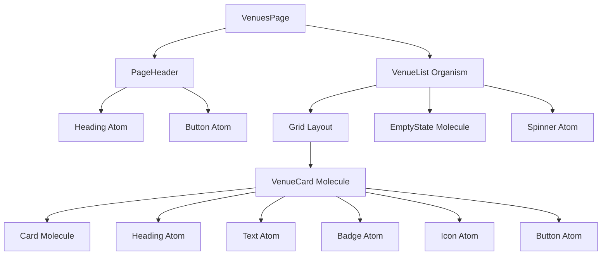
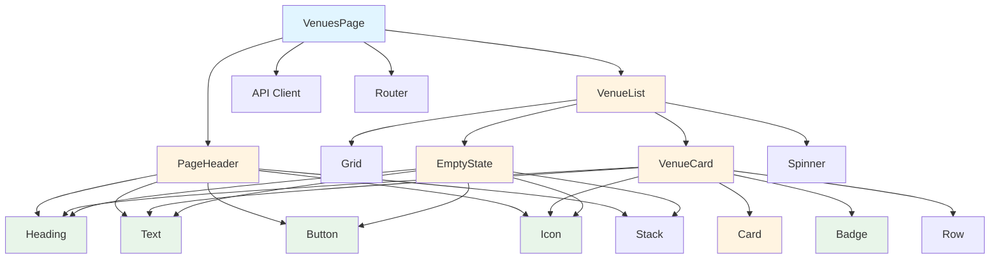

# Venues Page Architecture Design

## Executive Summary

This document provides a comprehensive architectural design for the `/venues` page in the GloboTicket.Web application. The design strictly follows the Atomic Design principles established in the project, ensuring consistency with existing patterns while introducing new components specifically for venue management.

## Table of Contents

1. [Component Hierarchy](#component-hierarchy)
2. [Atomic Design Breakdown](#atomic-design-breakdown)
3. [Data Flow & State Management](#data-flow--state-management)
4. [API Integration](#api-integration)
5. [File Structure](#file-structure)
6. [Component Specifications](#component-specifications)
7. [Implementation Phases](#implementation-phases)

---

## Component Hierarchy



### Page Structure

**VenuesPage** (Page Level)
- Uses [`AppLayout`](../src/GloboTicket.Web/src/components/templates/AppLayout.tsx:15) template
- Composes organisms and handles routing
- Manages data fetching and loading states

**VenueList** (Organism)
- Displays grid of venue cards
- Handles empty states
- Manages loading states

**VenueCard** (Molecule)
- Displays individual venue information
- Composed from existing atoms
- Interactive with hover effects

---

## Atomic Design Breakdown

### Atoms (Reuse Existing)

All required atoms already exist in the design system:

1. **[`Button`](../src/GloboTicket.Web/src/components/atoms/Button.tsx:51)** - For "Add Venue" and card actions
2. **[`Heading`](../src/GloboTicket.Web/src/components/atoms/Heading.tsx:44)** - For page title and card titles
3. **[`Text`](../src/GloboTicket.Web/src/components/atoms/Text.tsx:44)** - For descriptions and metadata
4. **[`Badge`](../src/GloboTicket.Web/src/components/atoms/Badge.tsx:28)** - For capacity indicators
5. **[`Icon`](../src/GloboTicket.Web/src/components/atoms/Icon.tsx:39)** - For visual indicators (MapPin, Users, etc.)
6. **[`Spinner`](../src/GloboTicket.Web/src/components/atoms/Spinner.tsx)** - For loading states

### Molecules (Mix of Existing and New)

**Existing to Reuse:**
1. **[`Card`](../src/GloboTicket.Web/src/components/molecules/Card.tsx:51)** - Base card component
2. **[`EmptyState`](../src/GloboTicket.Web/src/components/molecules/EmptyState.tsx:60)** - For "no venues" state

**New to Create:**
1. **`VenueCard`** - Specialized card for displaying venue information
   - Extends Card molecule
   - Displays: Name, Address, Capacity, Description
   - Interactive with click handler
   - Shows location icon and capacity badge

2. **`PageHeader`** - Reusable page header with title and action
   - Combines Heading + Button
   - Responsive layout
   - Used across all list pages

### Organisms (New)

1. **`VenueList`** - Main venue listing organism
   - Manages venue data display
   - Handles loading, empty, and error states
   - Uses Grid layout primitive
   - Responsive grid (1 col mobile, 2 col tablet, 3 col desktop)

### Layout Primitives (Reuse Existing)

1. **[`Container`](../src/GloboTicket.Web/src/components/layout/Container.tsx:45)** - Page width constraint
2. **[`Grid`](../src/GloboTicket.Web/src/components/layout/Grid.tsx:100)** - Responsive grid layout
3. **[`Stack`](../src/GloboTicket.Web/src/components/layout/Stack.tsx)** - Vertical spacing

---

## Data Flow & State Management

### State Architecture

```mermaid
graph LR
    A[VenuesPage] -->|fetch| B[API Client]
    B -->|VenueDto[]| A
    A -->|venues| C[VenueList]
    C -->|venue| D[VenueCard]
    D -->|onClick| A
    A -->|navigate| E[Router]
```

### State Management Strategy

**Local Component State** (using React hooks)
- `venues: VenueDto[]` - List of venues
- `isLoading: boolean` - Loading state
- `error: string | null` - Error state

**No Global State Required** - Venues page is self-contained with data fetched on mount

### Data Fetching Pattern

Following the pattern established in [`AuthContext`](../src/GloboTicket.Web/src/contexts/AuthContext.tsx):

```typescript
useEffect(() => {
  const fetchVenues = async () => {
    setIsLoading(true);
    try {
      const data = await getVenues();
      setVenues(data);
    } catch (err) {
      setError(err.message);
    } finally {
      setIsLoading(false);
    }
  };
  
  fetchVenues();
}, []);
```

---

## API Integration

### API Client Functions

New functions to add to [`api/client.ts`](../src/GloboTicket.Web/src/api/client.ts:1):

```typescript
// GET /api/venues
export async function getVenues(): Promise<VenueDto[]>

// GET /api/venues/{guid}
export async function getVenue(guid: string): Promise<VenueDto>

// POST /api/venues
export async function createVenue(dto: CreateVenueDto): Promise<VenueDto>

// PUT /api/venues/{guid}
export async function updateVenue(guid: string, dto: UpdateVenueDto): Promise<VenueDto>

// DELETE /api/venues/{guid}
export async function deleteVenue(guid: string): Promise<void>
```

### TypeScript Types

New types to add to `src/types/api.ts`:

```typescript
export interface VenueDto {
  id: number;
  venueGuid: string;
  name: string;
  address: string | null;
  latitude: number | null;
  longitude: number | null;
  seatingCapacity: number;
  description: string;
  createdAt: string;
  updatedAt: string | null;
}

export interface CreateVenueDto {
  name: string;
  address?: string;
  latitude?: number;
  longitude?: number;
  seatingCapacity: number;
  description: string;
}

export interface UpdateVenueDto {
  name?: string;
  address?: string;
  latitude?: number;
  longitude?: number;
  seatingCapacity?: number;
  description?: string;
}
```

### API Endpoints

Backend endpoints already exist in [`VenueEndpoints.cs`](../src/GloboTicket.API/Endpoints/VenueEndpoints.cs:9):
- `GET /api/venues` - List all venues
- `GET /api/venues/{guid}` - Get single venue
- `POST /api/venues` - Create venue
- `PUT /api/venues/{guid}` - Update venue
- `DELETE /api/venues/{guid}` - Delete venue

---

## File Structure

### New Files to Create

```
src/GloboTicket.Web/src/
├── components/
│   ├── molecules/
│   │   ├── VenueCard.tsx          # NEW - Venue display card
│   │   └── PageHeader.tsx         # NEW - Reusable page header
│   ├── organisms/
│   │   └── VenueList.tsx          # NEW - Venue list organism
│   └── [existing files...]
├── pages/
│   └── venues/
│       └── VenuesPage.tsx         # NEW - Main venues page
├── types/
│   └── api.ts                     # MODIFY - Add venue types
└── api/
    └── client.ts                  # MODIFY - Add venue API functions
```

### Routing Integration

Update [`router/index.tsx`](../src/GloboTicket.Web/src/router/index.tsx) to include:

```typescript
{
  path: ROUTES.VENUES,
  element: <ProtectedRoute><VenuesPage /></ProtectedRoute>,
}
```

---

## Component Specifications

### 1. VenueCard Molecule

**File:** `src/components/molecules/VenueCard.tsx`

**Purpose:** Display individual venue information in a card format

**Props:**
```typescript
interface VenueCardProps {
  venue: VenueDto;
  onClick?: (venue: VenueDto) => void;
}
```

**Visual Design:**
- Uses [`Card`](../src/GloboTicket.Web/src/components/molecules/Card.tsx:51) molecule as base
- Interactive hover effect (via Card's `interactive` prop)
- Header: Venue name (Heading h3)
- Body:
  - Address with MapPin icon
  - Capacity badge with Users icon
  - Description (truncated to 2 lines)
- Footer: "View Details" button (ghost variant)

**Styling Approach:**
- All styling via existing atoms and Card molecule
- No custom CSS required
- Uses theme tokens for colors
- Light mode default with dark mode support via tokens

**Example Structure:**
```tsx
<Card interactive onClick={() => onClick?.(venue)}>
  <Stack gap="md">
    <Heading level="h3">{venue.name}</Heading>
    
    {venue.address && (
      <Row gap="sm" align="center">
        <Icon icon={MapPin} size="sm" />
        <Text size="sm" variant="muted">{venue.address}</Text>
      </Row>
    )}
    
    <Row gap="sm" align="center">
      <Icon icon={Users} size="sm" />
      <Badge variant="info">{venue.seatingCapacity} seats</Badge>
    </Row>
    
    <Text variant="muted" className="line-clamp-2">
      {venue.description}
    </Text>
  </Stack>
</Card>
```

---

### 2. PageHeader Molecule

**File:** `src/components/molecules/PageHeader.tsx`

**Purpose:** Reusable header for list pages with title and action button

**Props:**
```typescript
interface PageHeaderProps {
  title: string;
  description?: string;
  actionLabel?: string;
  onAction?: () => void;
  actionIcon?: LucideIcon;
}
```

**Visual Design:**
- Responsive flex layout (column on mobile, row on desktop)
- Left: Title (Heading h1) + optional description
- Right: Action button (primary variant)
- Spacing via Stack and Row layout primitives

**Example Structure:**
```tsx
<div className="flex flex-col sm:flex-row sm:items-center sm:justify-between gap-4">
  <Stack gap="xs">
    <Heading level="h1">{title}</Heading>
    {description && <Text variant="muted">{description}</Text>}
  </Stack>
  
  {actionLabel && onAction && (
    <Button variant="primary" onClick={onAction}>
      {actionIcon && <Icon icon={actionIcon} size="sm" />}
      {actionLabel}
    </Button>
  )}
</div>
```

---

### 3. VenueList Organism

**File:** `src/components/organisms/VenueList.tsx`

**Purpose:** Display grid of venue cards with loading and empty states

**Props:**
```typescript
interface VenueListProps {
  venues: VenueDto[];
  isLoading: boolean;
  error: string | null;
  onVenueClick: (venue: VenueDto) => void;
  onCreateVenue: () => void;
}
```

**State Management:**
- Receives data from parent (VenuesPage)
- No internal state
- Pure presentation component

**Visual Design:**
- Loading state: Centered Spinner
- Error state: Error message with retry option
- Empty state: EmptyState molecule with "Create Venue" action
- Success state: Grid of VenueCard components

**Grid Configuration:**
- Mobile: 1 column
- Tablet (md): 2 columns
- Desktop (lg): 3 columns
- Gap: lg (1rem)

**Example Structure:**
```tsx
{isLoading && (
  <div className="flex justify-center py-12">
    <Spinner size="lg" />
  </div>
)}

{!isLoading && error && (
  <EmptyState
    icon={AlertCircle}
    title="Error loading venues"
    description={error}
    actionLabel="Try Again"
    onAction={onRetry}
  />
)}

{!isLoading && !error && venues.length === 0 && (
  <EmptyState
    icon={MapPin}
    title="No venues yet"
    description="Get started by creating your first venue"
    actionLabel="Create Venue"
    onAction={onCreateVenue}
  />
)}

{!isLoading && !error && venues.length > 0 && (
  <Grid 
    cols={1} 
    gap="lg"
    responsive={{ sm: 1, md: 2, lg: 3 }}
  >
    {venues.map(venue => (
      <VenueCard
        key={venue.venueGuid}
        venue={venue}
        onClick={onVenueClick}
      />
    ))}
  </Grid>
)}
```

---

### 4. VenuesPage

**File:** `src/pages/venues/VenuesPage.tsx`

**Purpose:** Main page component for venues listing

**Responsibilities:**
1. Data fetching via API client
2. State management (venues, loading, error)
3. Navigation handling
4. Composition of PageHeader and VenueList

**State:**
```typescript
const [venues, setVenues] = useState<VenueDto[]>([]);
const [isLoading, setIsLoading] = useState(true);
const [error, setError] = useState<string | null>(null);
```

**Handlers:**
```typescript
const handleVenueClick = (venue: VenueDto) => {
  navigate(routeHelpers.venueDetail(venue.venueGuid));
};

const handleCreateVenue = () => {
  navigate(ROUTES.VENUE_CREATE);
};
```

**Layout:**
- Uses AppLayout template (via Outlet)
- Container with xl size
- Stack layout for vertical spacing
- PageHeader at top
- VenueList below

**Example Structure:**
```tsx
<Stack gap="xl">
  <PageHeader
    title="Venues"
    description="Manage performance venues and locations"
    actionLabel="Add Venue"
    actionIcon={Plus}
    onAction={handleCreateVenue}
  />
  
  <VenueList
    venues={venues}
    isLoading={isLoading}
    error={error}
    onVenueClick={handleVenueClick}
    onCreateVenue={handleCreateVenue}
  />
</Stack>
```

---

## Theme & Styling Compliance

### Light Mode (Default)

All components use theme tokens that define light mode as baseline:

- **Surfaces:** `surface-base`, `surface-elevated`
- **Text:** `text-primary`, `text-secondary`, `text-tertiary`
- **Borders:** `border-default`, `border-subtle`
- **Brand:** `brand-primary`, `brand-secondary`

### Dark Mode (Explicit)

Dark mode is handled automatically via CSS variables defined in the theme:
- No component-level dark mode logic required
- All tokens have explicit dark mode values
- Activated via `class="dark"` on root element

### Accessibility

- All interactive elements have proper ARIA labels
- Color contrast meets WCAG AA standards (enforced by theme)
- Focus states visible in both light and dark modes
- Semantic HTML structure
- Keyboard navigation support

---

## Implementation Phases

### Phase 1: Foundation (Types & API)
**Files to modify:**
1. `src/types/api.ts` - Add VenueDto, CreateVenueDto, UpdateVenueDto
2. `src/api/client.ts` - Add venue API functions

**Acceptance Criteria:**
- TypeScript types match backend DTOs
- API functions handle errors properly
- Credentials included in requests

---

### Phase 2: Molecules
**Files to create:**
1. `src/components/molecules/PageHeader.tsx`
2. `src/components/molecules/VenueCard.tsx`
3. Update `src/components/molecules/index.ts` with exports

**Acceptance Criteria:**
- Components follow atomic design principles
- No custom CSS, only composition
- Props properly typed
- Examples in JSDoc comments

---

### Phase 3: Organism
**Files to create:**
1. `src/components/organisms/VenueList.tsx`
2. Update `src/components/organisms/index.ts` with export

**Acceptance Criteria:**
- Handles all states (loading, error, empty, success)
- Uses existing EmptyState molecule
- Responsive grid layout
- No business logic, pure presentation

---

### Phase 4: Page & Routing
**Files to create:**
1. `src/pages/venues/VenuesPage.tsx`
2. `src/pages/venues/index.ts`

**Files to modify:**
1. `src/router/index.tsx` - Add venues route
2. `src/pages/index.ts` - Export VenuesPage

**Acceptance Criteria:**
- Data fetching on mount
- Error handling
- Navigation to detail page
- Protected route (requires auth)
- Integrates with AppLayout

---

### Phase 5: Testing & Polish
**Tasks:**
1. Manual testing in browser
2. Test light/dark mode switching
3. Test responsive breakpoints
4. Test loading states
5. Test error states
6. Test empty state
7. Verify navigation works

**Acceptance Criteria:**
- All states render correctly
- No console errors
- Smooth transitions
- Accessible via keyboard
- Works in both themes

---

## Design Decisions & Rationale

### 1. Why VenueCard as a Molecule?

**Decision:** Create VenueCard as a specialized molecule rather than using Card directly in the page.

**Rationale:**
- Encapsulates venue-specific layout logic
- Reusable across different contexts (list, search results, etc.)
- Maintains single responsibility principle
- Easier to test and modify

### 2. Why PageHeader as a Reusable Molecule?

**Decision:** Extract page header pattern into reusable component.

**Rationale:**
- Same pattern will be used for Acts and Shows pages
- DRY principle - define once, use everywhere
- Consistent UX across all list pages
- Easy to update globally

### 3. Why No Custom Hooks?

**Decision:** Use standard React hooks directly in VenuesPage.

**Rationale:**
- Simple data fetching doesn't warrant custom hook
- Keeps code straightforward and readable
- Can extract to custom hook later if pattern repeats
- Follows YAGNI principle

### 4. Why Local State Instead of Context?

**Decision:** Manage venues state locally in VenuesPage.

**Rationale:**
- Venues data not needed elsewhere in app
- Avoids unnecessary complexity
- Easier to reason about data flow
- Can refactor to context if requirements change

### 5. Why Grid Instead of Flexbox?

**Decision:** Use Grid layout primitive for venue cards.

**Rationale:**
- CSS Grid better for equal-width cards
- Built-in responsive configuration
- Consistent gaps between items
- Follows existing layout primitive pattern

---

## Future Enhancements

### Short Term
1. **Search & Filter** - Add search bar and filter options
2. **Sorting** - Sort by name, capacity, date created
3. **Pagination** - Handle large venue lists
4. **Skeleton Loading** - Replace spinner with skeleton cards

### Medium Term
1. **Map View** - Show venues on interactive map
2. **Bulk Actions** - Select multiple venues for batch operations
3. **Export** - Export venue list to CSV/PDF
4. **Advanced Filters** - Filter by capacity range, location, etc.

### Long Term
1. **Venue Analytics** - Show usage statistics per venue
2. **Venue Availability** - Calendar view of bookings
3. **Venue Comparison** - Compare multiple venues side-by-side
4. **Venue Recommendations** - Suggest venues based on criteria

---

## Appendix: Component Dependency Graph



**Legend:**
- 🔵 Blue: Page Level
- 🟡 Yellow: Organism/Molecule Level
- 🟢 Green: Atom Level

---

## Summary

This architecture design provides a complete blueprint for implementing the Venues page following strict Atomic Design principles. The design:

✅ **Reuses existing components** - Leverages 90% of existing atoms and molecules
✅ **Follows established patterns** - Mirrors LoginPage and AppLayout structure
✅ **Maintains separation of concerns** - Clear boundaries between atoms, molecules, organisms, and pages
✅ **Supports light/dark modes** - Uses theme tokens exclusively
✅ **Enables future growth** - PageHeader and VenueCard reusable for Acts and Shows
✅ **Provides clear implementation path** - Phased approach with acceptance criteria

The design is ready for handoff to Code mode for implementation.